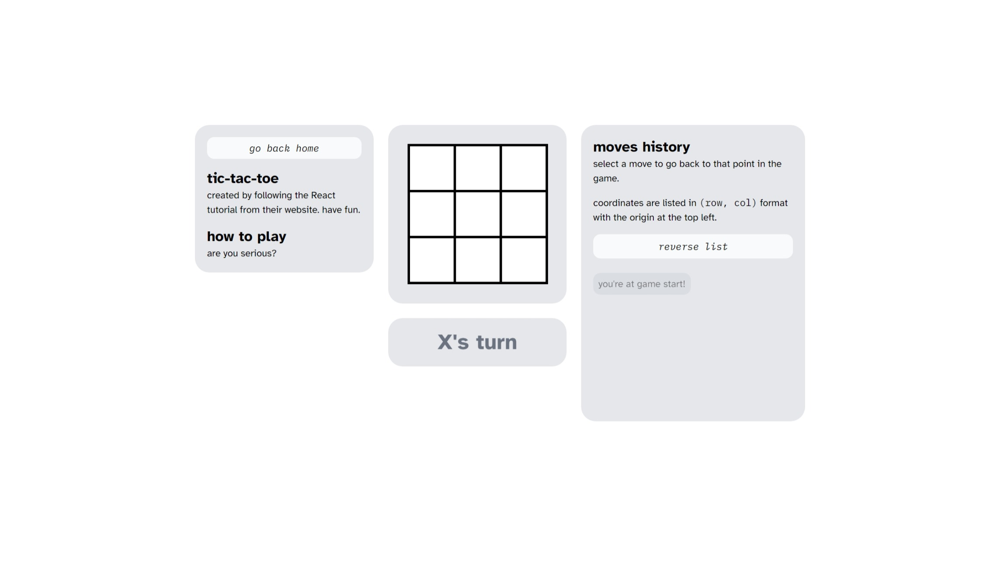

## Tic-tac-toe

It's birthday week for America, and I've been learning React through their [tic-tac-toe tutorial](https://react.dev/learn/tutorial-tic-tac-toe). I'm new to web dev so this seemed like a good place to start. I'm also trying out something called Tailwind CSS, because it seems easier than writing actual CSS.

<figure>
  
  <figcaption>**Tic-tac-toe.** My precious child.</figcaption>
</figure>

I've spent the past few days polishing the game, which I've shortened to just "ttt" because typing the full name out is really tiresome (only half joking).

Across 35+ commits (that I should have merged together in a PR or something) I've changed just about everything. Here is a laundry list of changes:

- Added TypeScript, because I really missed types
- Redesigned the look and layout of the game. I really put Tailwind to the test, and I like it. I've also tried making the page more mobile friendly.
- The game state is now tracked via a simple state machine.
- Renamed the route to `/ttt`
- Generally reduced complexity and redundant code.

Definitely a bit overkill, but I'm glad I spent so much time trying out things because it really helped me understand what React wanted me to do, and why. Plus, hacking on the base code was really fun.

> **From the future:** `/ttt` is gone now, but if you would like to see what it looked like, it's currently live at [ttt.charleszw.com](https://ttt.charleszw.com). So grab a friend and play a game or two! Or, you could play against yourself. I respect that too.
