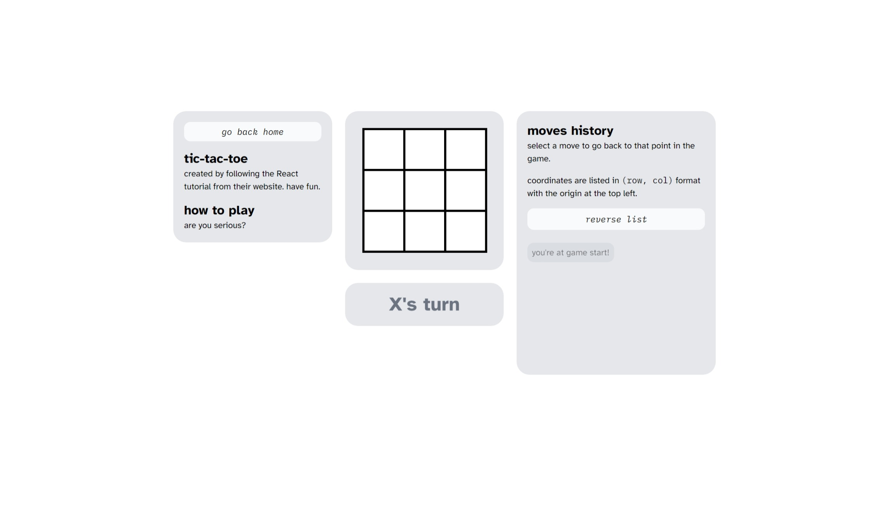

It's birthday week for America, and I spent it finalizing my tic-tac-toe game, which I've renamed to "ttt" because typing all those letters is really tiresome (only half joking).

Across 35+ commits (that I should have merged together in a PR but didn't) I updated just about everything. Here is a laundry list of changes:

- Add TypeScript, because I really miss types
- Redesigning the overall look and layout of the game. I was really putting those Tailwind classes to the test.
- Attempting to make it mobile friendly. For my first ever attempt, I think it turned out pretty well.
- Keeping track of game state via a simple state machine
- Renaming the route to `/ttt`
- Generally reducing complexity and redundant code

Definitely overengineered and overkill for a TTT game, but I'm glad I spent so much time trying out things because it really helped me understand React's way of thinking.

> **From the future:** `/ttt` is gone now but if you would like to see what it looked like, it's live at [ttt.charleszw.com](https://ttt.charleszw.com). So go grab a friend and play a game or two. Or if you're like me, you can play against yourself.
