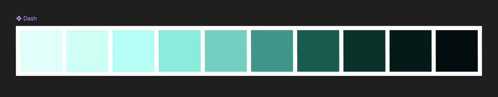

import VideoGif from "@/components/video-gif.astro";

It's been a little over a month since the last update. I've been busy!

First, I spent some time prototyping a color scheme for the website as well as some potential designs for the layout. I've settled on the following.

Some designers use a logo to represent themselves. I liked that idea, so I recreated and digitized something that I've been drawing for a few years now.

<figure>
  
  <figcaption>
    **Digitized logo inside Figma.** The graphic on the right is my attempt to use it in a profile
    picture.
  </figcaption>
</figure>

To somewhat give an explanation, it's supposed to symbolize an eye. Whenever I draw people, I draw two of these on their faces, similar to what [KAWS](https://duckduckgo.com/?q=kaws&iax=images&ia=images) does. It's simple and easy to remember; but, the best part is that the symbol is part of Unicode: ⦻, or `U+29BB`.

> **From the future:** the site looks nothing like the picture anymore, but I think I got a lot of the fundamentals right. The logo and font choice have all survived to present day.

I've decided to keep using Tailwind, and so the color palette has been added to my config. As for the logo, I've exported it as a SVG from Figma.

## aczw.dev

I've picked a domain name for my site: `aczw.dev`. I use "aczw" everywhere online; it's basically a combination of my name and some other stuff. Also, I'm a dev or something so. Yeah. Anyway take a look at what I've built have so far.

> **From the future:** this version of the site is still live at [old.charleszw.com](https://old.charleszw.com). Why? I dunno. Nostalgia. :FeelsGoodMan:

The layout of the site is split into two: the fixed sidebar on the left, and the actual content on the right. The idea is that the sidebar will hold important things that should be on the screen at all times, and then the content on the right is scrollable.

## Learning more CSS

CSS is _amazing_. I can't believe I can animate almost anything, and how simple it is. I'm using it here on the border radius of these cards. This allows me to do this cool animation on hover, and make the transition look seamless. Everything just _works_.

<VideoGif content={{ collection: "changelog", folder: "v0.4.0" }} name="img-hover" />

Currently it's just a placeholder, but I eventually want to be able to click on the image, and make it expand to fill the whole screen.

## Todo

I still need to fill in the design section with actual content.

As a sort of easter egg, I'm going to let you switch themes on the site by clicking the logo. I already have the color palette ready...

<figure>
  
  <figcaption>
    **"Dash" color palette.** As the name implies, it is partially inspired by Geometry Dash.
  </figcaption>
</figure>

Finally, I want to do more with music (e.g. showing off my playlists or what I've listened to recently. I know that Last.fm has an API that I can use).
