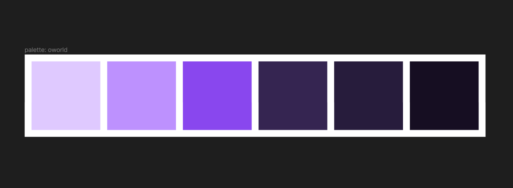
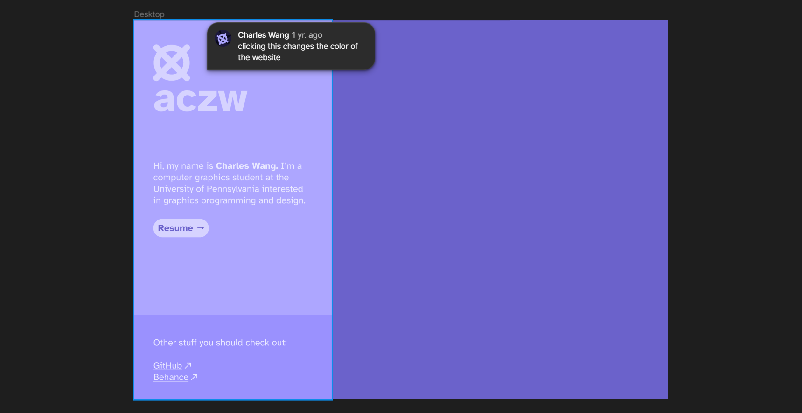
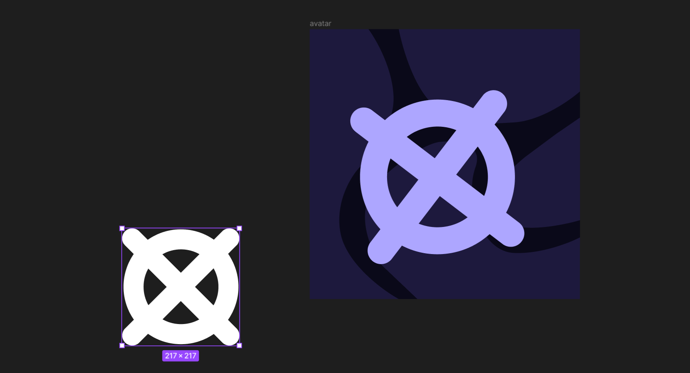

## Color palette and logo

Spent a few days prototyping the main color scheme as well as some potential layouts and designs for the website.

I know some designers who have created a logo to represent themselves. I liked that idea so I recreated and digitized something that I've been drawing for a few years now.

<figure>
  
  <figcaption>
    **Digitized logo made in Figma.** The thing on the right is my attempt to turn it into a profile
    picture.
  </figcaption>
</figure>

To somewhat give an explanation, it's supposed to be an eye. Whenever I draw people, I draw two of these on their faces for their eyes. It's definitely partly inspired by [KAWS](https://duckduckgo.com/?q=kaws&iax=images&ia=images). I think the best part is that a very similar looking symbol is part of Unicode: ⦻, or `U+29BB`. The thing on the right is my attempt to make it a profile picture.

The color palette has been added as custom colors in my Tailwind config, and the logo has been imported as a `<svg />` element.

> **From the future:** the site looks nothing like the screenshot above, but I got a lot of the fundamentals right, I think. The colors, logo, font, and an obsession with letting people know what song I last listened to have all survived to the present day.
