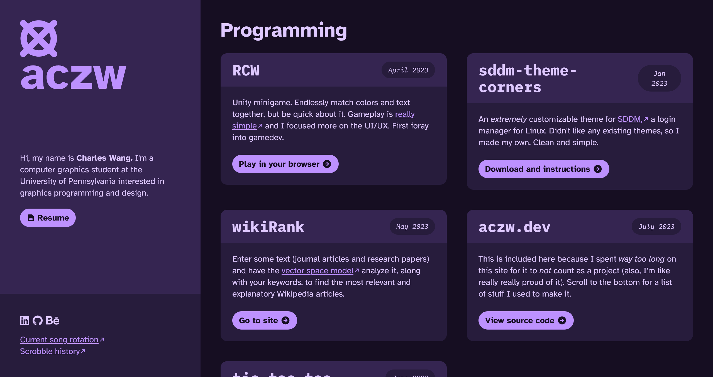
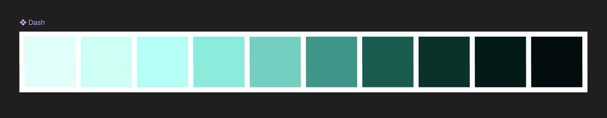

import VideoGif from "@/components/video-gif.astro";

## aczw.dev

> **From the future:** this is the last prerelease before v1! It's still live at [old.charleszw.com](https://old.charleszw.com). Why? I dunno. Nostalgia. :FeelsGoodMan:

I've picked a domain name for my site: `aczw.dev`. "aczw" has a long history but it's basically the handle that I use everywhere online. Also I'm a dev or something so. Yeah. Anyway take a look at what I have so far.

The layout of the site is split into two: the fixed sidebar on the left, and the actual content on the right. The idea is that the sidebar will hold important things that should be on the screen at all times, and then you could scroll the content on the right.

<VideoGif content={{ collection: "changelog", folder: "v1.0.0" }} name="img-hover" />

It's not done, but I really enjoy the animation when you hover over the cards under Design. Theoretically I would showcase my portfolio here, but I haven't decided what to put... Eventually I want to be able to click on the image, and it expands to fill the whole screen.

I really like how the border radius of the buttons change when you hover over them. Like the rest of the site, it was largely inspired by Material You. A similar effect can be seen [on their website](https://m3.material.io/); try clicking one of their buttons.

## v0.5.0 and beyond

I still need to fill in the Design section with actual content.

As a sort of easter egg, I'm going to let you switch theme colors on the site by clicking the logo. I already have the color palette ready...

I need to somehow tell the browser that my site is eternally in dark mode though.

Finally, I want to do more with music (e.g. showing off my playlists or what I've listened to recently). I can't wait to get started~
