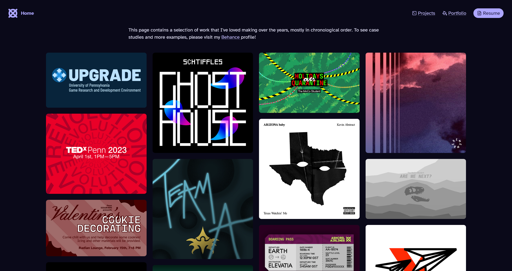

## charl.sh

Welcome to the v1 release! I've changed a lot of things since last time, from the framework I'm using to the domain itself. Let me explain.

### Overcomplicated tech stack

Now that I have used [Create T3 App](https://create.t3.gg) for a bit, I can confidently say that bootstrapping my website with it was not the best decision.

- I wasn't trying to build an _app_, I was trying to build a _personal website_. (Sometimes they're the same, but not for me.) T3 is a great and powerful solution for the first goal, but pretty overkill for the second.
- I completely ignored most of the integrations, such as tRPC, Prisma, and NextAuth.js.
- On a certain level, Next.js too felt overkill. This is definitely more subjective, but I wanted something simpler and lighter for my needs.
- While I appreciated React's abstractions (like `onClick` and hooks), they were still React-isms. I wanted to explore other approaches to web dev as well.

All that said, T3 has been great to use. I learned many universal web dev concepts and fundamentals. In addition, there were many features I didn't want to give up, including React's JSX syntax, T3's Tailwind integration, and Next.js' file-based routing.

Whatever I chose to use next gets extra brownie points if these were available as well.

> See what I did there? Foreshadowing.

### Inflexible layout

While my website layout is definitely _unique_, that doesn't mean that it was _good_. As time passed, I increasingly felt that it was too busy and limiting to work with.

- The sidebar was unnecessary. For example, my bio doesn't need to be visible at all times, because at most you read it once or twice. Also, it didn't need to take up ~1/4 of my screen space at all times.
- I really wanted to share my music stuff! But, I couldn't find a suitable place to yap about it. In the end I put it in the sidebar, but it never felt right...
- Cramming every project/portfolio piece inside those cards was very restricting. Originally it was because I wanted to keep my site a one-pager, but it turns out that I really like talking about my own passion projects. _Who knew._ (I didn't.)

### Stylistic choices

As I worked with the color palette, I realized it was very limited. I only chose 6 varying shades, with too much difference between any two adjacent colors. This made it hard to style elements; it was either too light or too dark. I found myself often adjusting the opacity as a cheap way to give myself additional colors.

The base font size I chose was also way too big. Waaaaaay too big. I guess I made my Figma prototype relatively large and translated it over 1:1.

Finally, I didn't like the hue of purple I picked. It was more pink than purple :\(

## Switching frameworks

Finding solutions to the problems above led me down a very different path. First thing I did was switch frameworks.

### The case for Astro

Around this time I stumbled upon [Astro](https://astro.build/), which advertised itself as a framework for content-driven websites. This immediately caught my eye, and after some research I made the switch. Here are some reasons:

- React-like components using JSX syntax
- File-based routing with dynamic route support (like `[...slug]`)
- Easy integrations with popular libraries like Tailwind and hosts like Vercel
- First-class support for transpiling Markdown/MDX files to HTML. This interested me because I'm looking to start a blog.
- Ability to use multiple different UI frameworks. This meant I could gradually learn Astro syntax while transferring everything over from React. It also enables cool performance features like [component islands](https://docs.astro.build/en/concepts/islands/).
- A built-in way to manage written content and data via [Content Collections](https://docs.astro.build/en/guides/content-collections/).

Having made the switch, I once again [completely deleted everything](https://github.com/aczw/personal-website/commit/1eaafc382b2bcd085272c8bd36f815cce41b1a7c) and began anew.

## Building blocks

I now turned to addressing my issues with the previous design. I experimented with condensing key components of my site into their own chunks. I started grouping related topics into individual "blocks."

<figure>
  
  <figcaption>
    **Various versions of the homepage.** Prototyped in Figma. Very much inspired by the large
    shapes and border radii of Material You.
  </figcaption>
</figure>

I like how it contained the chaos a bit more. Depending on the screen size, the blocks would collapse as well, which I found interesting. The grid layout, which centers itself in the available screen space, lended to more structure overall.

I also chose to add a dedicated projects and portfolio page. There was just no way I was going to fit everything in one page.

<figure>
  
  <figcaption>
    **"Sweater" color palette.** An expanded version of the previous palette, now with four more
    colors.
  </figcaption>
</figure>

Finally, I spent some time updating the limited color palette I was working with. I chose a wider range of purples that were... less pink.

> I was greatly inspired by, and continue to be inspired by the way Material You handles colors and applications of them.

## I really need you to know what I last listened to.

Bit of background: I use [Last.fm](https://last.fm) to track my music listening history. This is because I don't want to wait until Spotify Wrapped to see my music stats, and also because it's platform agnostic: I have scrobbles from Spotify, Apple Music, and even my Plex server.

Leveraging its API, I now fetch live music data about my Last.fm profile, including whether I am currently listening to a song, right now. Live. ~~Yes, I'm insane.~~

To do this, I use [SWR](https://swr.vercel.app) to manage data fetching, revalidation, and focus states. The library makes it really easy to type the response and conditionally render UI based on the current status. It's consumed as a React hook, so my Last.fm component looks something like this:

```tsx
import useSWR from "swr";

interface LastFmResponse {
  recenttracks: {
    track: {
      /* ...continue declaring the response type... */
    }[];
  };
}

let key = "https://ws.audioscrobbler.com/2.0/...";
let fetcher = (url: string) => fetch(url).then((res) => res.json());

// arrow syntax ftw
const LastFm = () => {
  const { data, isLoading } = useSWR<LastFmResponse>(key, fetcher);

  // check if we're still fetching data, and return if so
  if (isLoading) return <p>Loading...</p>;

  // otherwise, we're free to consume the data and use it.
  // at this point, TypeScript knows that `data` definitely exists
  return (
    <div>
      <p>I'm listening to this song right now!</p>
      <p>{data.recenttracks.track[0]}</p>
    </div>
  );
};
```

My favorite feature is that if the browser tab loses focus and then you refocus it, SWR will automatically refetch and update data if necessary. This means you'll always see a live view of what I'm currently listening to. I know you want to.

## Some other fun facts

I found this incredible monospaced font called [Maple Mono](https://github.com/subframe7536/Maple-font) and now I'm using it in literally everything, like headings. I _love_ that it becomes cursive when italicized.

v0.4.0 used [Heroicons](https://heroicons.com/) for my icon needs, but I've discovered another icon set called [Lucide](https://lucide.dev/) that I prefer more. That's what you see now.

I bought another domain name: `charl.sh`. Sometimes my friends call me that and I liked the .sh TLD cuz, you know, shell scripts. Also, I thought a URL that more closely matched my real name might be a bit easier to remember.

### Moving forward

This whole ordeal took ~2 months to complete. I still can't believe it actually works and is publicly accessible and everything. For now, I'm going to let it sit for a bit and see if I change my mind on anything. That said, I already have some plans:

- Still haven't done theme switching, still wanna do it.
- The links on the projects page just go to a repo or video. Eventually I wanna publish write-ups for each of them.

Thanks for reading. Feedback is appreciated!

> **From the future:** here are screenshots of what `/`, `/projects`, and `/portfolio` looked like respectively.
>
> 
>
> 
>
> 
>
> Also, I just realized that "Portfolio" in the header isn't highlighted when you're on that page (like it is when you're on the projects page). Oh well.
