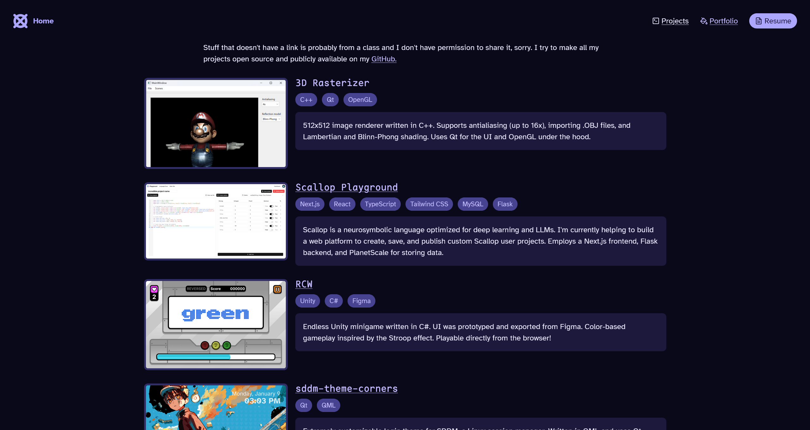
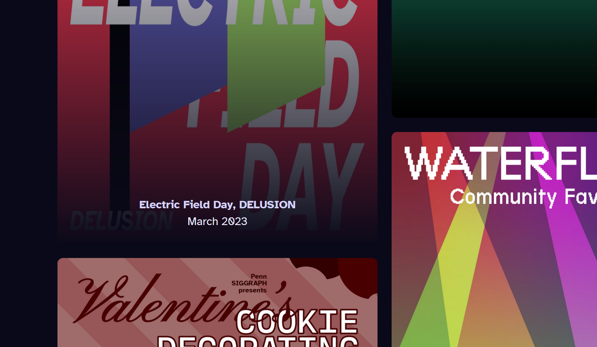

import VideoGif from "@/components/video-gif.astro";

Previously, the images on the projects page could have any size. Theoretically, a really _tall_ image would completely take up all the space on the screen. So I've clamped the image height.

I've also removed the background for each project. They look distinct enough on their own to not need any visual separation.

> **From the future:** what it looked like.
>
> 

On the portfolio page, you now get info about the piece upon hover, including its name and when it was made. And the max number of columns is now 3, to let them be bigger.

> **From the future:** definitely not the most mobile-friendly feature, but I didn't care as much back then. Definitely bit me in the ass eventually. What it looked like:
>
> 

## Entry animations

I was ~~stalking~~ visiting [tlshaw.me](https://tlshaw.me) when I noticed a really nice, subtle animation when elements come into view. The way they implemented it is also very cool. We first define a few CSS keyframes to work with. I did mine inside my Tailwind config.

We can then define our own CSS animation. I'm again adding it to my Tailwind theme, because this generates a `animate-*` utility with the name I choose, e.g. `animate-fade-in`.

```js
const config = {
  /* ...rest of the config*/
  keyframes: {
    slide: {
      "0%": { transform: "translateY(25px)" },
      "100%": { transform: "translateY(0px)" },
    },
    fade: {
      "0%": { opacity: "0" },
      "100%": { opacity: "1" },
    },
  },
  animation: {
    appear:
      "slide 0.3s ease-out var(--animation-delay) backwards, fade 0.25s ease-out var(--animation-delay) backwards",
    "fade-in": "fade 0.25s ease-out backwards",
  },
};

export default config;
```

We can now plop these animations onto any HTML element we want. They fire as soon as the HTML element is rendered, so they're played on entry. Furthermore, via variables like `--animation-delay`, we can further customize each element by setting different values.

```tsx
<ul>
  {listOfStuff.map((item, index) => (
    <li class="animate-appear" style={{ "--animation-delay": `${index * 50}ms` }}>
      {item}
    </li>
  ))}
</ul>
```

Here, the value of `--animation-delay` depends on the index of the list item that we're rendering, so it will look like they're sliding in one after the other, instead of all at once.

> **From the future:** what it looked like. Also, stream Blue Lips.
>
> <VideoGif content={{ collection: "changelog", folder: "v1.1.0" }} name="entry-anims" />
