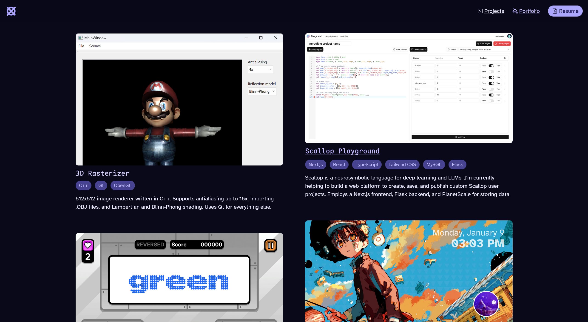
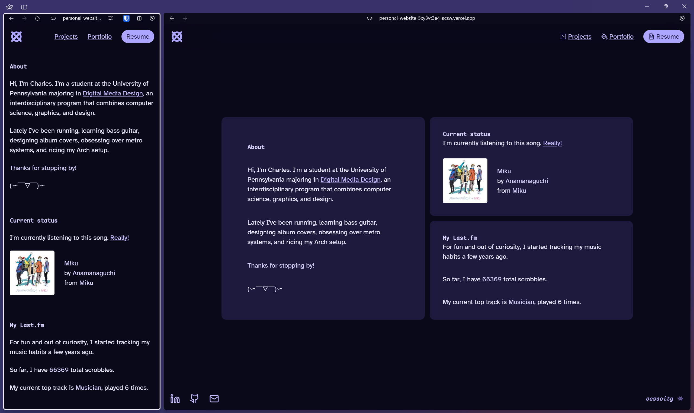
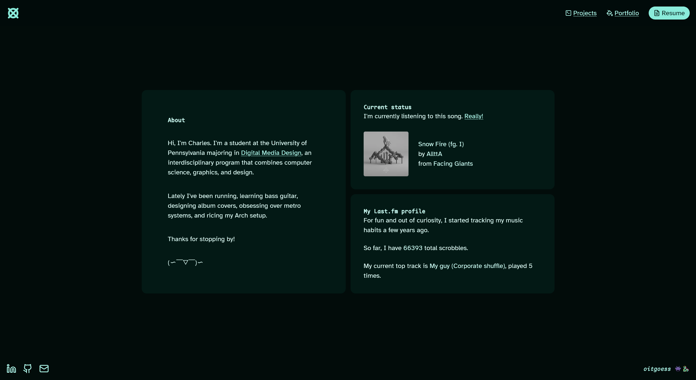

## General changes

- Update my bio and writing on a lot of pages.
- Added a .ico favicon (previously I only had PNG and SVG versions).
- _Finally_ fix interop between Prettier and Astro. I don't have to manually run the formatter anymore! The Prettier VS Code extension formats on save now.
- Alt text for images is now italic. Only shown when the image fails to load.
- Make headings use the monospace font by default. This is being done using Tailwind's `@layer` directive.
- General reordering of projects and portfolio pieces.

### Portfolio page

- I removed the weird hover action that showed the title and link if applicable. It was just too jank for me, and didn't even show up on mobile.
- I've grouped my pieces into three different sections: graphic design, art, and music related. I also directly link to my Behance now.

### Projects page

- Add a distinction between _prominent_ and _lowkey_ projects, and display them differently. Prominent projects are higher effort and get more details.
- The page now uses a two-column layout. This really lets the images and project blurbs stand out more.

> **From the future:** here it is.
>
> 

## Collapsing the grid on mobile

I found that the grid layout on the homepage is a little... awkward when the screen conditions aren't perfect. How I'm currently solving it is reducing the number of grid columns. However, this leads to some _interesting_ results.

<figure>
  
  <figcaption>
    **Testing display sizes.** Two weird-looking results on less than ideal screens.
  </figcaption>
</figure>

I used to justify it to myself by saying something like, the four colored squares are interesting to look at, and it's being done on purpose. In reality, I just had no idea how to handle screen sizes between 640px and 1080px.

So I did the normal, sane thing (for once), which is to collapse to a more standard layout when space gets tight. Look, I want people to actually be able to _read things_, thank you.

<figure>
  
  <figcaption>**What it looks like now.** Miku!</figcaption>
</figure>

As part of these changes, I've set my prose width to 670px (and added it as a width utility in Tailwind). This seems to be around the max width that most people use.

> I didn't realize up until now that the reason websites maintain a max width for writing is because reading across longer lines strains the eyes and is harder to scan. It's such an _obvious_ reason once you realize it.

## Randomized scrolling text

Instead of the hardcoded "soitgoes" phrase, I now select from a list of phrases, pick one, and render it. This is done client side so the phrase can change every time you refresh the page (if we did picked the phrase on the server, then it's chosen _once_ during build time and that's it). I then use the same script as before to actually animate it.

> Would this work with React? I know that during strict mode every component is rendered twice to check if things change.

The current lineup:

- `soitgoes`
- `aczw`
- `newfaces`
- `doitagain`
- `tilinfinity`
- `suboptimal`
- `theendisnever`
- `promiseme`
- `allitcosts`

They come from games, song titles, lyrics, and general quotes that I like. I wonder how many you'll recognize!

## Theming! For, like, a few minutes

Behold! Unfortunately, I will not be releasing it. In its current form, anyway.

<figure>
  
  <figcaption>**The homepage.** Steeped in the "Dash" color palette.</figcaption>
</figure>

The original idea was this: you could switch colors via the little Space Invaders alien and dragon emoji. However, the theme that you choose should be remembered by the browser; that is, it shouldn't reset to purple everytime you visit the site.

So what I did was try adapting a little snippet from [this Astro guide](https://docs.astro.build/en/tutorial/6-islands/2/#add-client-side-interactivity), which uses and reads from the browser's local storage. It then sets the theme, which is done by attaching a data attribute to the root element, which the CSS will read from.

```astro
<script is:inline>
  const localTheme = localStorage.getItem("theme");

  let theme = "";
  if (typeof localStorage !== "undefined" && localTheme) {
    theme = localTheme;
  } else {
    theme = document.documentElement.dataset.theme;
  }

  document.documentElement.dataset.theme = theme;
  localStorage.setItem("theme", theme);
</script>
```

Unfortunately, the page would always flash white or purple for a split second, _and then_ switch over to green (if that is the current theme). There is something about the order in which the script is processed that is affecting the outcome, and I can't figure it out.

> **From the future:** the funniest part about this is that I literally cannot replicate this bug right now. So I feel like I'm lying to myself.

So yeah, I admit defeat for now. I'll try revisiting it again sometime in the future. The thing is that this is not the most important thing I should be focusing on right now, and I've already wasted so much time debugging it.

But you know what they say, lose the battle and win the war. Or something. 🏳️
