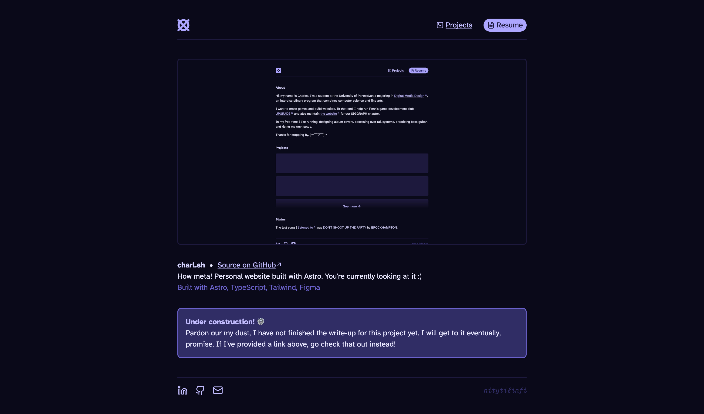
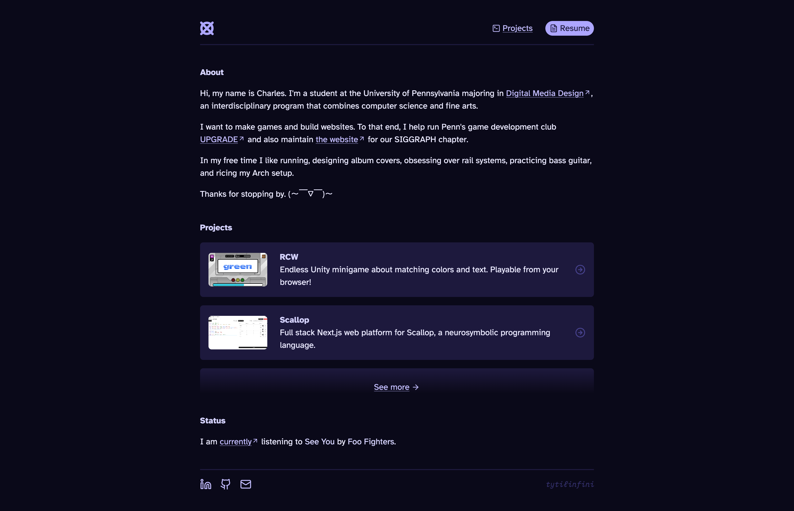
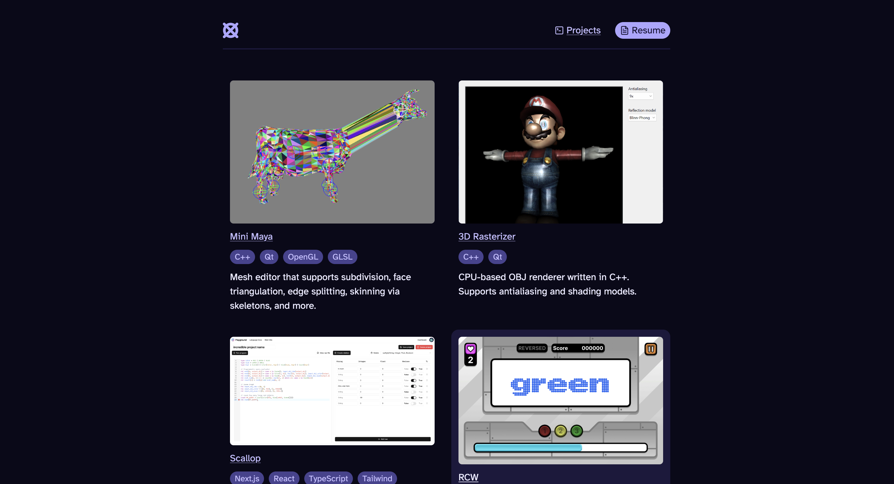

import VideoGif from "@/components/video-gif.astro";

Welcome to charl.sh, version 2.0.0.

This time around, the name of the game was about _refinements_, not wild redesigns; it's nothing like the [v1 release](/changelog/1.0.0). A lot of the changes are not immediately noticeable.

v2 was designed and built very quickly. I began work [on the 11th](https://github.com/aczw/personal-website/pull/7/commits/9d65dc205b9a94105da293b04ee21dbf40589f58), meaning I finished everything in ~3 days. The difference this time around is that I had a _clear vision_ about what stuff I wanted to keep, and what to discard. It also helps that a lot of the changes were simply removing extraneous stuff or simplifying components.

But why do another redesign, especially so soon? ~~Well, I had nothing better to do.~~ There were some issues with the previous version that I wanted to address in a website-wide refresh.

## Rethinking what I want

_What did I want out of my site? What did I want other people to see when they visit?_ These were my guiding questions throughout the process.

Answering both questions satisfyingly _is hard_. They're naturally at odds with one another, with one favoring my own desires, and the other favoring the audience's. Often, the answer to one question conflicted with the other. Examples below.

### Last.fm music profile

To put it lightly, it's gone a bit too far. Like, I'm really using half of my homepage to display arguably useless info to the visitor? I could use that space to talk a bit more about myself and what I do, which is more important.

### Unnecessary client-side code

The more I used Astro, the less I relied on other UI frameworks (e.g. React). Given my site's purpose, these frameworks were sending more JS to the visitor than I would've liked (meaning, a full stack app has more reason to use them, because the benefits are more obvious). The only reason I depended on React is because of [SWR](https://swr.vercel.app/), whose sole purpose was to handle the Last.fm API calls. That's it?? _That's it._

> I've always been aware that Astro has more natural ways of [data fetching](https://docs.astro.build/en/guides/endpoints) that are better integrated with the framework. I just never invested the time to learn them.

### Bento boxes

While I called them "blocks" last time around, the term ["bento box layout"](https://bentogrids.com/) has grown in popularity recently, and it describes my homepage design pretty well.

> I need someone to confirm: I think it was Apple who made it popular when they first used it in the [summary screen](https://apple-summary-slides.vercel.app/) for their OS updates? It's now my favorite part of WWDC.

It was difficult making the sections look good on all screen sizes. The layout was weird on specific dimensions, which I tried to fix... [by removing it entirely](/changelog/1.3.0#collapsing-the-grid-on-mobile). When the solution to your problem is to _remove the feature entirely_, then something is probably wrong.

## Seeking inspiration and reflections

I wanted to see how other people interpreted the idea of a "personal website." I visited many places, too many to fully list, but here's a nonexhaustive one:

- [paco.me](https://paco.me)
- [nexxel.dev](https://nexxel.dev)
- [rauno.me](https://rauno.me)
- [nezu.world](https://nezu.world)
- [tlshaw.me](https://tlshaw.me)
- [elyssachou.com](https://elyssachou.com)
- [This blog post from udara.io](https://udara.io/reinventing-this-blog)

They range from random strangers all the way to fellow people in DMD. I wanted to see what was possible, what they chose to focus on, and how they decided to carry things out.

After accepting that everyone else is literally built different, I realized that what I needed was not more things, but less. Don't overwhelm people, and focus on crafting a design that expresses my personality in subtler ways.

- Use a more standard page layout. My projects and writing get more space to exist; _I_ get more space to exist.
- Deemphasize the live music updates because it wasn't the main reason people came to my site. It's mostly for my own enjoyment, anyway.
- A sticky navbar was not necessary. I don't have that many links to show. All it did was take up space.

After a slight identity crisis, I decided to combine my projects page and portfolio page. The "portfolio" distinction never made much sense; my programming and design stuff are often one and the same. Plus, there are more established sites that I should be using instead, e.g. Behance or ArtStation.

With an established goal now in mind, I started writing code.

## How not to fetch data

As I mentioned earlier, I used SWR to make requests to the Last.fm API. SWR explicitly depends on React and is consumed as a hook in a client component. For this component to access my API key, I had to make it _publicly available_ (in Astro this is done by prefixing it with `PUBLIC_`). I thought that was fine because my API key is defined as a environment variable in my `.env` file, and not hardcoded in the component itself.

What I didn't realize is that, for the React component to access it on the client, it had to embed the API key within the file. Which essentially hardcodes it. And this file is sent over the network to be run client side. Which means...

Oh no.

Anyone who visited my site in the past could find my key by going to the Sources tab in the inspector, and searching for it. To prove this was possible, I did it myself:

<figure>
  
  <figcaption>
    **My API key, censored in red.** It was as simple to find as a Ctrl+F search. 🤦
  </figcaption>
</figure>

Was I seriously expecting anyone to steal the key and use it maliciously? No, but it reflected my inexperience with data fetching and keeping things secure on the web.

### Astro 100%

I know better now. And the fix was simple: perform the data fetching on the server (in my case, Vercel). I switched to using [server side rendering](https://docs.astro.build/en/guides/server-side-rendering/), which allowed me to create an API endpoint for myself to invoke in my Astro components. And because the page is rendered on request, and not statically built, my listening history stays _live_.

From the [Astro docs on API endpoints:](https://docs.astro.build/en/guides/endpoints/#server-endpoints-api-routes)

> _"This unlocks new features that are unavailable at build time, and allows you to build API routes that listen for requests and securely execute code on the server at runtime."_

Wow. _"Securely execute code on the server at runtime."_ Incredible.

As a result of this refactoring, I've been able to get rid of the dependencies on React and SWR. This means that this project is now _completely built with Astro._ I think that alone deserves a major version bump. We've come a long way since the `create-t3-app` days.

## Implementing the design changes

A good chunk of the changes to the site layout have been mentioned above, so there's not much else to say here except that I did, in fact, make those changes.

In particular, everything is now constrained within a 750px width, including the header and footer. This was done by specifying a max width and then setting the x-margin to be auto, which keeps everything centered on window resizing.

### Animating background gradients

The more conventional header-content layout also allows me to showcase two of my projects right on the redesigned homepage. It was here that something surprising tripped me up: you can't [animate CSS gradients](https://stackoverflow.com/questions/17952468/css-background-gradient-transition-not-working) in the traditional, `transition-property` way.

As a workaround, I absolutely positioned two identical gradients on top of each other, one with a lighter gradient color. I then faked the transition by animating one of the element's opacity value on hover. The resulting code looks very messy for how simple the design is:

<div style="border-width:5px;border-radius:0.5rem;border-color:#1D193D">
  <VideoGif content={{ collection: "changelog", folder: "v2.0.0" }} name="gradient-hover" />
</div>

```tsx
<a href="/projects" class="group">
  <div class="from-sweater-9 relative z-[-2] mt-[1rem] flex h-12 items-end justify-center rounded-t-md bg-gradient-to-b">
    <div
      class="from-sweater-8 absolute inset-0 z-[-1] rounded-t-md bg-gradient-to-b opacity-0 transition-opacity group-hover:opacity-100"
      aria-hidden="true"
    ></div>
    <span class="...">
      See more <ArrowRight />
    </span>
  </div>
</a>
```

## Project write-ups!

I'm now taking advantage of Astro's [Content Collections](https://docs.astro.build/en/guides/content-collections/). The linked page explains it the best, but in essence it allows me to write a project write-up in Markdown/MDX, query it in a typesafe way from any Astro component, and render it to HTML on any page I want.

I can also add custom metadata to the Markdown/MDX file via frontmatter, and validate the values via Zod schemes that I feed to Astro. This also enables a typesafe way to utilize this metadata within my components, e.g. keeping track of the date a write-up was posted, and displaying it on the write-up page.

In fact, the GitHub link, project blurb, tech stack, and even cover image that you see below were all specified in the MDX file that this write-up comes from!

<figure>
  <div style="border-width:5px;border-radius:0.5rem;border-color:#1D193D">
    
  </div>
  <figcaption>**Write-up page for how this site came to be.** Trippy.</figcaption>
</figure>

I talked about wanting to do this all the way back in v1.0.0, so it's cool that this is finally done. All my project write-ups are currently under construction, but I hope to fix that soon.

## Conclusion

I walk away from this release feeling refreshed and motivated to do more work. (It helps that I only spent 3 days on it.) I'm sure there will be another redesign some day down the road, but for now I'm really, _really_ happy about how things turned out.

With each iterative update, I'm refining my website, chipping away at unnecessary things, and revealing its true essence. I can't ask for more than that. Until next time~

> **From the future:** screenshots.
>
> 
>
> 
