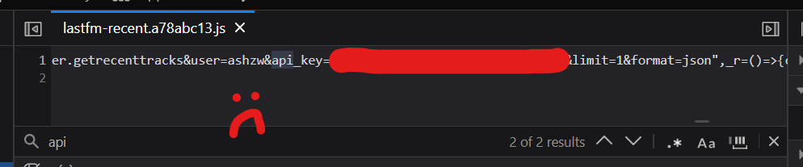

Welcome to v2 of charl.sh.

It's a much less dramatic jump than from v0.4.0 to v1. This time around, the name of the game was about _refinements_, not wild redesigns. A lot of the changes are much more subtle and not immediately noticeable. I kept many, many things the same, removed everything else that didn't fit, and cranked the remaining stuff to a 11.

The actual time it took to build v2 was very short. In fact, I [began work on the 11th](https://github.com/aczw/personal-website/pull/7/commits/9d65dc205b9a94105da293b04ee21dbf40589f58), meaning I finished everything in ~3 days. I think the difference this time around is that I had a _clear vision_ about what stuff I wanted to keep, and what I wanted to discard. It helps that a lot of the changes were simply removing extraneous stuff or simplifying components, so not much new construction was needed.

Just like the [previous major update](/changelog/1.0.0), I'll first explain my issues with the previous version, and then what I did to address them.

## Rethinking what I want

_What did I want out of my site? What did I want other people to see when they visit?_ These were the guiding questions that led me throughout the process.

Answering both questions satisfyingly _is hard_. They are naturally at odds with one another, with one favoring my own desires, while the other favoring the audience's. Often, the answer to one question conflicted with the other. Examples below.

### Music obsession

Simply put, it's gone a little bit too far. Like, I'm really using half of my homepage to display arguably useless info to the visitor? I could use that space to talk a bit more about myself and what I do, which is probably what they wanted to learn when they visited.

### Unnecessary client-side code

The more I used Astro, the less I wanted to rely on other UI frameworks (e.g. React). Many features that I grew accustomed to doing in these libraries were easily replacable with a less framework-y, more "web standard" way.

For the purposes of my site, sending this much JS to the client also felt _unnecessary_. For example, in v1.3.1 the only reason I was pulling in the React and [SWR](https://swr.vercel.app/) dependencies was because of my Last.fm API calls... which seems like a really dumb and overkill way to do it. There must be a simpler way of fetching data.

> Foreshadowing.

### Bento boxes

While I called them "blocks" last time around, the term ["bento box layout"](https://bentogrids.com/) has grown in popularity recently, and it describes my previous site pretty well.

> I need someone to confirm: I think it was Apple who made it popular when they first used the layout as a [summary screen](https://apple-summary-slides.vercel.app/) for their OS updates. It's my favorite part of WWDC.

It seemed fine on paper, but in practice it was difficult making the sections look good on all screen sizes. There were weird layouts on specific dimensions, which I tried to fix... [by removing it entirely.](/changelog/1.3.0#collapsing-the-grid-on-mobile) When the solution to your problem is to _remove the feature entirely_, then something is probably wrong.

## Doing some research and reflection

To aid my redesign, I wanted to see how other people interpreted the idea of a personal website. This included fellow people from DMD, my friends, and other websites that I found intriguing.

I realize now that what I need is _simplification_. I don't want to overwhelm any visitors with extraneous info. I've seen how you can show off your personality with constraint and in more subtle ways. Instead, I focused on crafting a design that I truly wanted people to see first.

- Instead of the weird bento box layout for the homepage, use a more standard layout. Text gets more space to exist, and I get to display sneakpeeks of my projects/posts.
- I liked the live music updates but deemphasized it, because it wasn't the main reason I directed people to my site. It's mostly for my own enjoyment, anyway.
- The header took up too much space, so I made it non-sticky. I don't have that much content to require an always visible nav bar.
- After a slight identity crisis, I combined `/projects` and `/portfolio`. The "portfolio" label never made much sense. My programming and design stuff are often one and the same.

I keep everything at fixed widths now. This was an intentional choice I took from the other sites I was ~~stalking~~ taking inspiration from. Reading becomes much easier when your eyes don't have to scan across a large horizontal distance.

## How not to correctly fetch data

As I mentioned earlier, I used SWR to make requests to the Last.fm API, which implicitly depends on React. SWR is consumed as a React hook, which runs on the client. For this React component to access my API key, I had to make it publicly available (in Astro this is done by prefixing it with `PUBLIC_`).

Theoretically, anyone visiting my site could simply Ctrl+F it. Actually, I'll just show it:

Was I seriously expecting anyone to steal the key and use it maliciously? No, but it reflected my inexperience with data fetching and keeping things secure on the web.

> Another thing: I was also relying on React, a UI library, to fetch data. This was also inexperience on my part. Frameworks like Astro provide clean, native ways to [fetch data](https://docs.astro.build/en/guides/data-fetching/) irregardless of the UI you build.

I know better now. All the data fetching is performed on the server, which my API key will never leave. I use Astro's API routes to perform a `GET` request that separates the work from the component that is displaying it. This does mean you have to mark the pages that display this data as SSR only.

### Astro 100%

I've gotten rid of the dependency on React and SWR. As a consequence, this means this project is completely using Astro components now.

## Fixed width design

mx-auto, max-w-content

## Updated header and footer

- not sticky anymore
- uses a simple border to make distinction from content

## More conventional Header-content layout

## Redesigned homepage

- previews two projects

## Completely delete portfolio section

- identity crisis resolved! merged with projects, basically.
