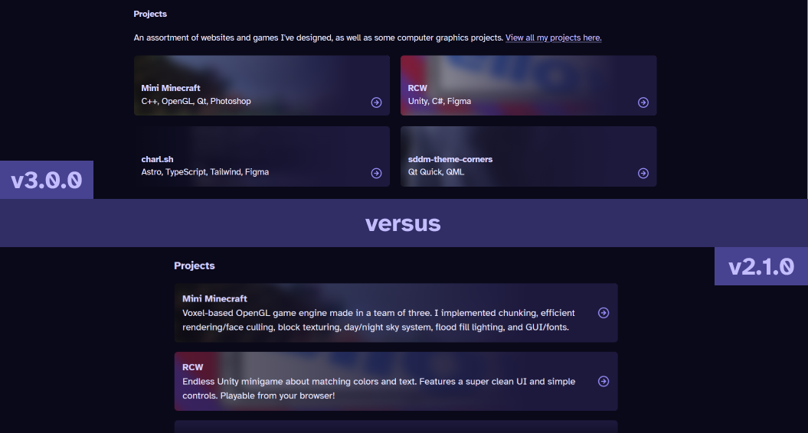

import Border from "@/components/mdx/border.astro";
import VideoGif from "@/components/video-gif.astro";

What? Another major version bump? So soon? But we only had one minor release for v2!

Well. Between v2.1.0 and this release, more than two months have passed.

> Happy _very belated_ new year, by the way. Hope things are off to a good start for everyone.

I've started treating these major releases as a sort of spring cleaning. The more time passes after the previous major update, the more random crap I tend to add. You see, I often use this site as a playground, testing stuff out and seeing what I can and can't build. And I really do love having a space to mess around and do whatever.

But, stuff piles up. Gets out of hand. And it annoys me. So I'm here today to clean it up.

## charleszw.com

I changed the site URL again. It's now charleszw.com. What can I say? I feel that this was inevitable. It looks official, it's my actual name, and it gets the job done. Now, I've also bought another domain: czw.sh. This is sorta the _opposite._ I'll probably attach subdomains to it in the future for projects I want to showcase.

Anyways. If nothing else, a domain change itself probably demands a major version bump.

## Berkeley Mono

One tiny thing: this site now uses [Berkeley Mono](https://berkeleygraphics.com/typefaces/berkeley-mono/) for its monospaced font. I've been eyeing this font for _months_ because it looks so fucking good. I was never able to justify the price tag though, mostly because I've never bought a font before...

But while making this release, I downloaded the trial version and, just as a test, replaced my current font (Maple Mono) on the site.

I bought it within ten minutes. Look, if I use this font on everything for the forseeable future, it will have been worth it.

> **From the future:** it was worth it.

## Failed experiment: image carousels

Sometimes in my writing, I want to display many images in a row. For example, a slideshow of screenshots for a particular project. Displaying them vertically one by one takes up too much space. So I decided to try building an image carousel that scrolled horizontally.

<figure>
  <Border>
    <VideoGif content={{ collection: "changelog", folder: "v3.0.0" }} name="image-carousel" />
  </Border>
  <figcaption>**Image carousel.** It worked until it didn't.</figcaption>
</figure>

Making the MVP wasn't too difficult. Some JavaScript, button event listeners, and programmatic scrolling based on the width of the current image.

And they served a legitimately useful purpose: inside write-ups, they allowed me to show many pictures successively. For projects that didn't have write-ups yet, I was able to provide some screenshots for the viewer to scroll through.

<figure>
  <Border>
    <VideoGif content={{ collection: "changelog", folder: "v3.0.0" }} name="carousel-projects" />
  </Border>
  <figcaption>
    **Screenshots for my projects.** Watch me click-drag on the image to try and scroll. Oops.
  </figcaption>
</figure>

But I realized that I just did not _like_ it. Firstly, it didn't even work too well. The arrows would either over or under scroll, and the current image counter often broke.

Granted, I could have spent some more time polishing it and fixing the issues. But at the end of the day, it was just an experiment. It didn't live up to my standards of something that was used so much across the site.

So yeah. I still gotta figure out how to display many images at once. But I would rather have nothing for now than this. Plus, I have some other ideas that are much cooler.

## Mass simplification

### ...of components

I generally tried removing Astro components and custom logic where possible. Less passing of props, less elements to render. That sort of stuff.

### ...of my existing write-ups

I have this tendency to read and re-read everything I've published. It's a bad habit for sure—I should have just proofread it in the first place, and I keep trying to make it _perfect_—and it leads me to finding all sorts of issues I want to fix.

So I spent some time rewriting many parts of all four write-ups. Wait, did I say four? That's right, because during this period I also released a post about a [voxel game engine](/posts/mini-minecraft) I helped make, and a [Linux login theme I created.](/posts/sddm-theme-corners)

### ...of the homepage

I've simplified things where they didn't need to be complicated, and complicated things that should have more attention. Part of that is moving the Last.fm status to the footer, and changing the look of projects to a grid layout so more can be seen at once. I've switched the blurb to just the tags though because it started to look like a word salad.

<figure>
  <Border></Border>
  <figcaption>**Comparison.** More projects in the same amount of space.</figcaption>
</figure>

As a test, I've also moved the socials to the header, to make them more prevalent. Consequently I removed the projects link. I've seen a few people do this, linking it somewhere else on the homepage. I think contact info is more important? Still on the fence.

I "complicated" things though by adding a quote to the homepage that means a lot to me. 💜
