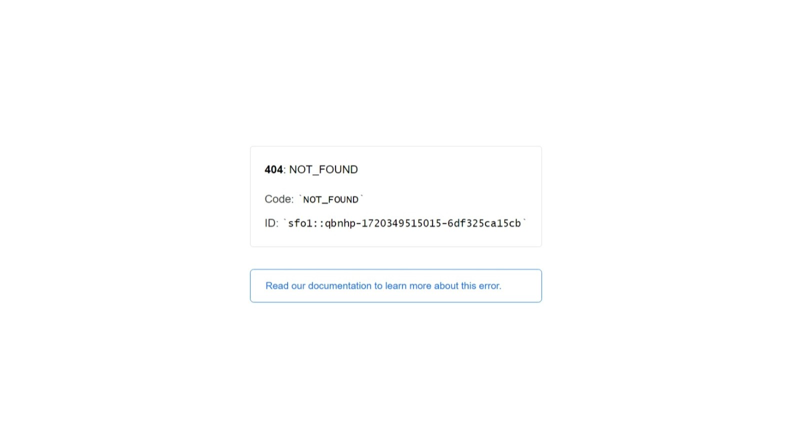
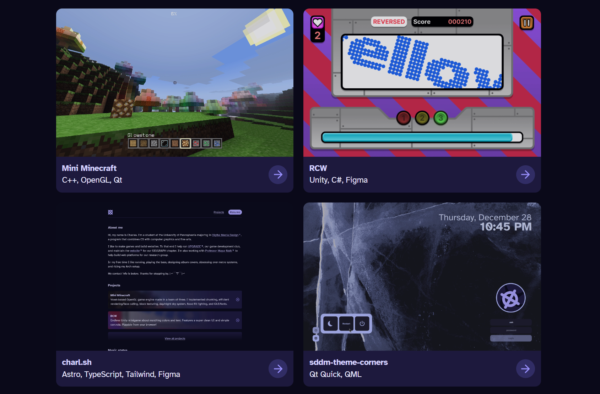

import Border from "@/components/mdx/border.astro";
import VideoGif from "@/components/video-gif.astro";

## SSR and 404

One thing that I didn't mention in the previous release log was that I switched the whole site to use SSR by default. This was because the Last.fm status is now in the footer, which... is rendered on every page. So now everything needs to be dynamic.

> In the whole history of this site's existence, this stupid thing has brought nothing but pain.

What I didn't know is that SSR has affected the way my 404 page would be rendered. Well, actually, my 404 page _stopped_ rendering. I was greeted with this friendly sight instead:

<figure>
  
  <figcaption>
    **Vercel's default 404 page.** The only bad thing about this screen is that it's in light mode.
    I mean, given that your whole brand identity is centered around black... (Only half joking.)
  </figcaption>
</figure>

It seems to do with the fact that Vercel is much bigger than Astro—meaning, it needs to handle other frameworks or sites that may not provide fallback HTML for a 404. So now the question becomes, should Astro modify Vercel's response (which legitimately provides useful data), or leave it be? Both seem like the right choice.

Seems like others have faced similar issues. Following their advice, I've now created a "catch all" page that

1. manually sets the response header and error code to `404`, and
2. renders my custom error page component.

This way, the routing stays within the Astro framework. For example, this can be the custom 404 component:

```astro
---
import Layout from "@/layouts/layout.astro";

// Manually set response headers
Astro.response.status = 404;
Astro.response.statusText = "Page not found";
---

<Layout>
  <main>
    <h2>404</h2>
    <p>Page not found</p>
  </main>
</Layout>
```

Then create a catch all slug file in the pages folder. That is, the path for this file would be `src/pages/[...any]/index.astro`:

```astro
---
return Astro.redirect("/404");
---
```

That's it. Problem is, this also changes the URL to `/404`, because I'm redirecting to that page. This technically isn't right; the URL should stay `/dqwldqwjd` or whatever, and render my custom 404 HTML on _that_ URL. So the issue isn't 100% solved. I'll keep looking.

### Also see

- https://github.com/withastro/astro/issues/4164#issuecomment-1497444976
- https://github.com/withastro/astro/issues/4164#issuecomment-1492652365
- https://github.com/withastro/astro/issues/4635

## New projects view!

Previously, the cover images for each project was hidden behind a blur effect that only cleared up upon hover. I say, screw that! If anything should take up more space on my homepage, it should be my posts. So now they're fully shown.

<Border></Border>

To keep the grid nice looking, I maintain a 16:10 aspect ratio on the images. The cool thing is, I can enforce this within Astro as well. In the Astro collection schema for my posts, I check the width and height of the cover image.

```ts
import { defineCollection, z } from "astro:content";

const posts = defineCollection({
  type: "content",
  schema: ({ image }) => z.object({
      /* ...other fields... */
      cover: z.object({
        img: image().refine(
          (img) => {
            const ratio = img.width / img.height;
            const epsilon = 0.01;

            // sometimes we can't get an exact aspect ratio
            // and that's okay within epsilon
            if (Math.abs(ratio - 1.6) <= epsilon) return true;

            return false;
          },
        ),
        alt: z.string(),
      }),
      /* ...other fields... */
    });
});
```

Anyway. Have I told you how much I love Astro (and Zod)?

Oh yeah, I also deleted the projects route for now. I don't have that many posts (the four you see in the screenshot above are my only ones), so it wasn't necessary... I plan to introduce a redesigned version later.

### Renaming write-ups to posts

Okay, whoop, big deal. But it marks a shift in how I want to approach my writing in the future: I want to expand beyond just posts about my projects; I want to do _more_. You know, like a traditional blog. I should have just done the normal thing from the beginning. Sigh.

### Deleting the other projects

If I'm going to show them on my website, I want to do them justice. Simple blurbs and screenshots aren't enough.

## Experiment: blurb drawers

I kind of missed having blurbs accompanying each project on the homepage. But I don't want to clutter it by default. So I tried something else out.

<Border>
  <VideoGif content={{ collection: "changelog", folder: "v3.1.0" }} name="blurb-drawer-single" />
</Border>

And in action on the homepage:

<Border>
  <VideoGif content={{ collection: "changelog", folder: "v3.1.0" }} name="blurb-drawer" />
</Border>

It turns out that animating an element to expand upwards [is not trivial](https://www.google.com/search?q=css%20height%20grow%20upwards). What made it harder is that none of the answers I found online were exactly what I was looking for; a "simple flexbox" wasn't going to cut it.

> Unless it does. Please let me know.

Instead, I had to absolutely position the bottom bar to be below the image. The issue is, on window resize the image size, and therefore height, changes. So the absolute height has to be recalculated to stay positioned correctly.

The best way I found how to do that is to use JavaScript. Using an event listener, we hook into the window resize event, and update the bar height accordingly.

```ts
const posts = document.querySelectorAll<HTMLElement>("#post");

function updateBarHeights() {
  // first get the max post title height from all posts
  const maxTitleHeight = Math.max(
    ...[...posts].map((post) => {
      return post.querySelector<HTMLElement>("#post-title")!.getBoundingClientRect().height;
    }),
  );

  posts.forEach((post) => {
    // if the max height title is less than the arrow icon, use
    // the arrow container's size instead, which is 35.25px
    const contentHeight = Math.max(maxTitleHeight, 35.25);

    // because we apply p-4 padding, which is 1rem
    post.style.setProperty("--bar-height", `calc(${contentHeight}px + 2rem)`);
  });
}

// initially call it once on window load, then add event listener to window
updateBarHeights();
addEventListener("resize", () => updateBarHeights());
```

In addition, I have to manually update the height on mouse enter and leave.

```ts
posts.forEach((post) => {
  const bar = post.querySelector<HTMLElement>("#bottom-bar")!;
  const blurbHeight = bar.querySelector<HTMLElement>("#blurb")!.getBoundingClientRect().height;
  bar.style.setProperty("--blurb-height", `${blurbHeight}px`);

  post.addEventListener("mouseenter", () => {
    // this has to be recalculated every mouseenter because we may have resized the window
    const blurbHeight = bar.querySelector<HTMLElement>("#blurb")!.getBoundingClientRect().height;
    bar.style.setProperty("--blurb-height", `${blurbHeight}px`);
  });

  post.addEventListener("mouseleave", () => {
    bar.style.setProperty("--blurb-height", "0px");
  });
});
```

It's not a good solution. There are some bugs on first load, and hooking into the resize event feels so _jank_. Also, the whole _absolutely positioning_ the bottom bar...

But it looks so good!!!!

One last thing: while the effect only activates on hover, it's fine because the blurb is shown on the post page itself, so they're not missing out on anything, even if the hover is desktop only.

## Dynamic routes in sitemap

I know I just praised Astro above, but one limitation of the [sitemap integration](https://docs.astro.build/en/guides/integrations-guide/sitemap/#why-astro-sitemap) is that it doesn't generate links for dynamic routes when using SSR. Makes sense, I guess; Astro literally doesn't know which paths are legit.

Other people have faced similar issues. [This answer](https://github.com/withastro/astro/issues/3682#issuecomment-1492468918) is a good solution if your setup is really simple like mine. Essentially we are crawling through the files in our content folder, and we provide those names to Astro, which has an option to pass in additional entries to the sitemap generation. Thank you, @modelorona.

```ts
import { existsSync, readdirSync } from "node:fs";
import path from "node:path";
import { fileURLToPath } from "node:url";

function projectRoutes() {
  const __filename = fileURLToPath(import.meta.url);
  const __dirname = path.dirname(__filename);

  const directoryPath = path.join(__dirname, "src", "content", "posts");
  if (!existsSync(directoryPath)) {
    throw new Error(
      `projectRoutes(): The path '${directoryPath}' does not exist. If you renamed something, make sure to update the path here as well.\n`,
    );
  }

  const files = readdirSync(directoryPath);
  const urls = files.map((file) => {
    const fileName = file.split(".")[0];
    return `https://charleszw.com/${fileName}`;
  });

  return urls;
}
```
