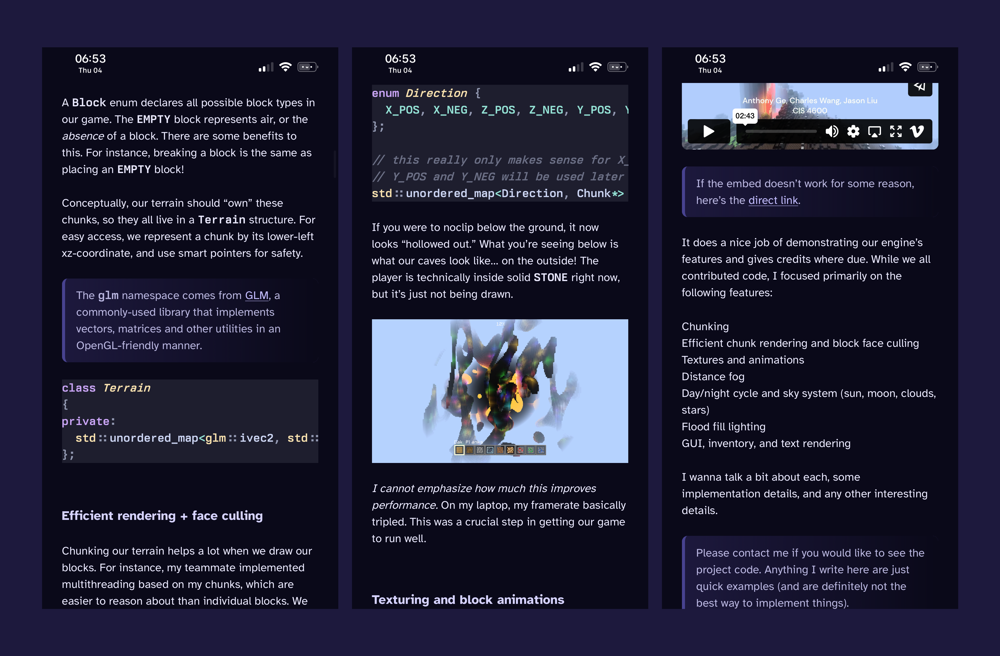
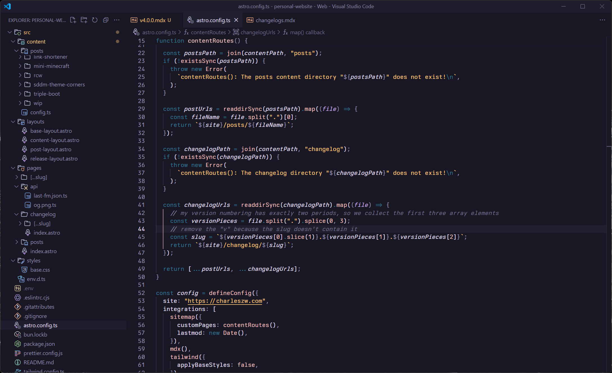

import Border from "@/components/mdx/border.astro";
import VideoGif from "@/components/video-gif.astro";

Hey! We're on v4 now. Welcome.

Some major changes have occurred, but at the same time, it feels like nothing has really happened. Seems to be the trend for the past few updates. I'm finding less and less things I want to change with each release.

I've also gotten pretty tired of constantly updating this site (this one took a month to finish). I want to focus on writing more and building _new_ stuff instead of remaking _old_ things.

Onwards to building cool new shit!

## Website changelog

I've added a new section to my site, listing all the changes I've made to it, ever. You're currently reading it. These are the release notes for version 4.0.0.

This is the short version of the story. [I made a little post](/posts/changelogs) that goes into more detail, including the inspiration for the idea, how I set it up, and other stuff that doesn't belong in a changelog. So go read the post to learn more.

## One new post and one "new" post

So that's the new post for this release. As for the "new" post...

I used to have a post discussing this website and the many changes it has undergone. It was one of the [first things I published.](/changelog/2.1.0) Usually by now, I would be busy updating rewriting it with the newest reflections and changes, but that is not possible anymore.

That's because I _**Deleted**_ it. Completely. Utterly. Yeah

Lemme explain. I've never known what to do with it. I updated it everytime I changed something. Turns out, treating a post as a live document is very exhausting and annoying. It's one of the reasons why I created this changelog, whose sole purpose is to discuss updates.

Speaking of, the changelog largely supersedes that post. So after some <span aria-hidden="true" aria-label="deep thinking">𝓭𝓮𝓮𝓹 𝓽𝓱𝓲𝓷𝓴𝓲𝓷𝓰</span>, I've replaced it with [something new](/posts/wip). I told myself that this will be the last time I'll ever touch it, but... it's me I'm talking about.

## Using more direct CSS

I've started utilizing Tailwind `@layer` directives more. A lot of unruly in-component classes have been moved to a CSS file. And while Tailwind discourages complicated CSS classes, I've found a few of them to be very helpful.

For example, Berkeley Mono defines its weight range from 100 to 150. Since `font-weight: regular` is 400, I always had to specify `font-[100]` after `font-mono` to keep Berkeley from becoming too thick by default. I also prefer my monospaced fonts slightly smaller than normal, so I had a `font-[13px]` or something in there too. I did this everytime I wanted to use the monospaced font. Now a simple `berkeley` class envelops all of that.

> I realize how dumb this sounds; this is literally CSS 101. But for someone who's used Tailwind since they started learning web dev, this is new to me. So please humor me.

I've also added a `subtitle` class. Sometimes standard text feels a bit too bright for what I'm trying to convey, so subtitles are slightly colored and have their opacity set to 90%.

### Nested CSS and how jailbreaking finally caught up to me

So for background, I have an iPhone 13 Pro, and I've semi-jailbroken it using [Bootstrap](https://github.com/RootHide/Bootstrap) and [Serotonin](https://github.com/mineek/Serotonin) (it's only a "semi"-jailbreak for reasons that fly over my head). What this means is that I have to stay on a lower version of iOS, on 16.6.1 to be exact.

Well, as I was rewriting as many MDX components to just use CSS as I could, I noticed some styling issues that only appeared on my phone, and not on desktop:

<figure>
  
  <figcaption>**Missing styles.** Peep the jailbroken status bar.</figcaption>
</figure>

I thought that was weird. Some stuff, including lists, images, and codeblocks weren't styled at all, while headings, callouts, and links were. I realized that the elements not being styled were those that I moved to using CSS only. So I took a look at my CSS file.

I wrap all my posts and changelogs in an `<article>`, so I figured I match that. This way, styles I use for Markdown content won't clash with stuff I might do on other parts of the site (like images, for example). [CSS nesting](https://developer.mozilla.org/en-US/docs/Web/CSS/CSS_nesting/Using_CSS_nesting) is perfect for this, keeping stuff scoped and organized.

```css
/* Only style elements rendered from Markdown*/
article {
  img {
    /* ...whatever... */
  }

  code {
    /* ...whatever... */
  }
}
```

Turns out, nested scoping without using a selector symbol like `&` was only introduced in [Safari 17.2](https://caniuse.com/css-nesting). iOS 17 has been out for more than 9 months at this point and [more than 75% of iPhone users](https://developer.apple.com/support/app-store/) have updated, so I'm not too worried about others. But it looks bad for _myself!_

> Stuff like this makes me appreciate how quick Apple users update their software. It also makes me sympathize more for Android's infamous fragmentation.

The solution is to, of course, specify the `&` selector in my styles:

```css
/* Now everything renders correctly on my phone! */
article {
  & img {
    /* ...whatever... */
  }

  & code {
    /* ...whatever... */
  }
}
```

Honestly, up until this point jailbreaking has been a great experience. Apart from the occasional random reboots, I haven't had any weird issues or blockers (e.g. apps detecting my jailbreak). So it's _hilarious_ to me that this is the first issue that I've experienced.

## New post layout and table of contents

I've slightly increased the site width, to 850px. The smaller post width has always bothered me when contrasted with the wider header, so I figured the extra space might go to something useful like a table of contents.

> This is perfect because if I were to render the Markdown content at full width it would be a bit uncomfortable to read. [I've talked about this before.](/changelog/1.3.0#collapsing-the-grid-on-mobile)

<Border>
  <VideoGif content={{ collection: "changelog", folder: "v4.0.0" }} name="toc-demo" />
</Border>

One thing I like in particular is that if there's not enough vertical screen space, the table of contents will overflow and gain a scrollbar. I spent a painstakingly long time getting the headings to smoothly fade in and out at the top and bottom.

I also use an `IntersectionObserver` to change the color of headings that scroll into the visible viewport. This works both up and down.

> I've noticed other sites get rid of the TOC entirely on mobile, so I'm following suit. But I do wonder if there's a way to sneak it in somewhere else e.g. at the top, right before the content.

I've also gotten rid of tags entirely. They served no purpose and were not useful. simply for deocration. I don't have enough posts to use them effectively (e.g. for filtering).

## In rapid succession

I have a lot of smaller stuff to yap about and this section is dedicated to quick thoughts on other stuff I've changed.

### MEWO cursor

If you're on desktop, try hovering over the quote on the homepage. You should see MEWO replace your cursor as long as it remains on the quote.

Honestly, after adding the previous text animation, I wasn't too sure what else to do with it. I figured that since I removed the quote author, I might as well add it back some other way.

Unfortunately MEWO has black fur, so she's a bit hard to see. More reason to add a sitewide light mode, I guess. I might also add sound effects in the future when you click on her.

Also, I've made the MEWO cursor a simple CSS class that you can apply anywhere.

```css
.mewo-quote {
  cursor:
    url("/src/assets/mewo.webp") 32 32,
    not-allowed;
}
```

So to add MEWO to an element, simply add `mewo-quote` to the class. Wonderful. ~~I'm soooo going to abuse this. Someone stop me.~~

> To build on the point earlier about inlined Tailwind not exactly being pleasant to read: this is how you would directly apply it.
>
> ```html
> <p class="cursor-[url('../assets/mewo.webp')_32_32,_not-allowed]">Incredible quote.</p>
> ```
>
> I would rather have `mewo-quote`, y'know?

### Pill component

Another moment where I realized I could replace a HTML element with pure CSS. Originally a `<div>` with classes applied to it, I simplified it down to a single `pill` class that I can apply without having to add an additional DOM element.

<figure>
  <div class="grid grid-cols-2 rounded-lg bg-sweater-9/20 p-3.5">
    <div class="subtitle col-span-1 flex flex-col items-center">
      Without `data-quiet` <div class="pill mt-3 w-fit leading-none">Pill 1</div>
    </div>
    <div class="subtitle col-span-1 flex flex-col items-center">
      With `data-quiet`{" "}
      <div class="pill mt-3 w-fit leading-none" data-quiet>
        Pill 2
      </div>
    </div>
  </div>
  <figcaption>**Demo.** Try inspecting the HTML for this section!</figcaption>
</figure>

Taking advantage of `data-*` attributes, I change the pill's appearance when the HTML element contains a `data-quiet` attribute.

```css
/* This is using Tailwind layers and directives */
@layer components {
  .pill {
    @apply rounded-full bg-red-500; /* etc */
  }

  /* Additional specifier to make colors more muted */
  .pill[data-quiet] {
    @apply bg-red-100;
  }
}
```

### ?uwu=true mode

There was this trend going on a while back where websites switched to kawaii-inspired versions of their logos when you added a `?uwu` to the URL parameters.

> See [React?uwu](https://react.dev/?uwu), [Vite?uwu](https://vitejs.dev/?uwu), and [Vue?uwu](https://vuejs.org/?uwu). And [many more.](https://github.com/SAWARATSUKI/KawaiiLogos)

~~Being the bandwagoner that I am~~ I decided to add it to my 404 page. Checking for it is fairly easy, because there's a built-in API for it.

```ts
let requestUrl = new URL(Astro.request.url);
let params = requestUrl.searchParams;
const hasUwu = params.has("uwu");
```

Check it out: the [normal 404 page](/this-page-does-not-exist) and [?uwu mode.](/this-page-does-not-exist?uwu=true)

### Hello, Rosé Pine

I've been a Catppuccin Mocha enjoyer for a very, very long time. I originally switched over to it from Tokyo Night, and I enjoyed how they supported a lot of different applications.

However, recently I've been sort of obsessed with [Rosé Pine](https://rosepinetheme.com/), and I've switched this site's syntax highlighting over to it. I mean, look at how gorgeous this looks:

<figure>
  
  <figcaption>**VS Code, dipped in Rosé Pine.** I could stare at this all day.</figcaption>
</figure>

> I'm using a brighter version called Rosé Pine Moon on the website because it compliments the site colors a bit better, I think.

I've realized I prefer themes that use a very small selection of colors. That's probably why I also enjoy looking at [Vesper](https://github.com/raunofreiberg/vesper), which only consists of 4 colors, two of which are white and grey.

## Laundry list

Even more, smaller changes.

- Adjusted spacing for everything, in posts and across the site.
- Rewrote my bio on the homepage. Added more about my school clubs and interests :\)
- As part of the new `/changelog/*` route, I've added dynamic Open Graph (OG) image generation for it. Also updated OG image generation for posts because they don't have tags anymore; now it shows the date.
- Added more stuff in the head, including more OG metadata and browser hints about my site preferring dark mode over light. I _really_ should make a light mode.
- Added captions underneath certain images to give them additional context. Using `<figure>` and `<figcaption>` to scope styling.
- Deleted the `<NotFound />` component because I realized you could directly import entire Astro pages as a component! So I can just import and use my site-wide 404 page in everything else.
- Reverted `<MewoQuote />` back from being a web component. It was kinda pointless. But I've learned a lot more about them!
- Specify EST timezone for all dates on the site because I'm an East Coast native.
- Clamp the song name in the footer to one line. Looks kind of weird now, so we'll see.
