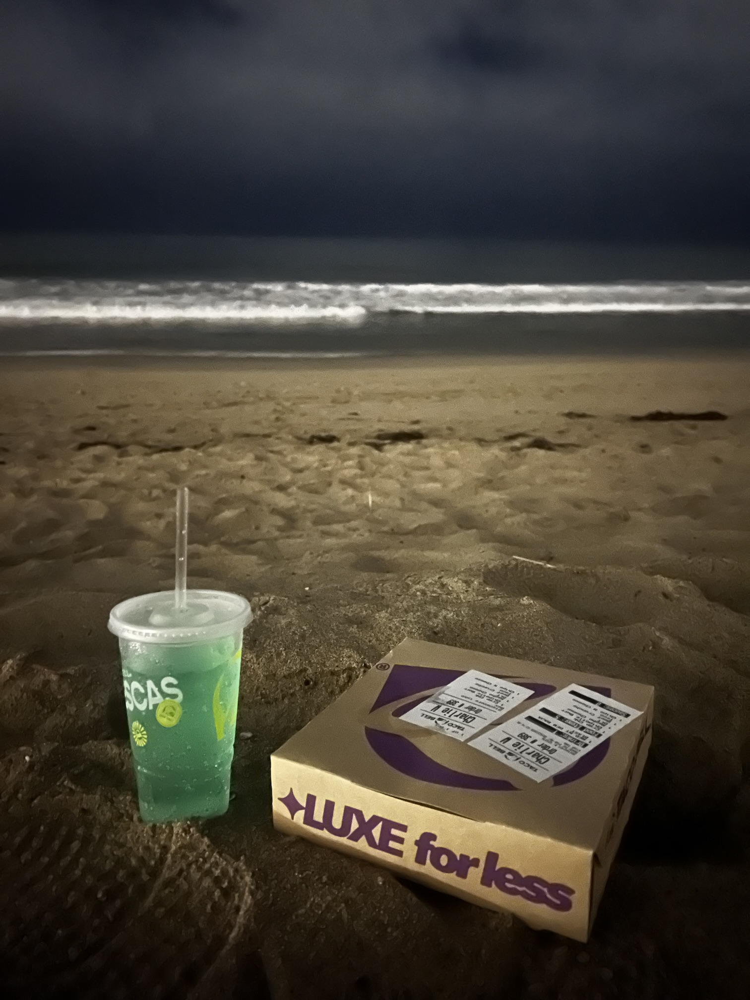
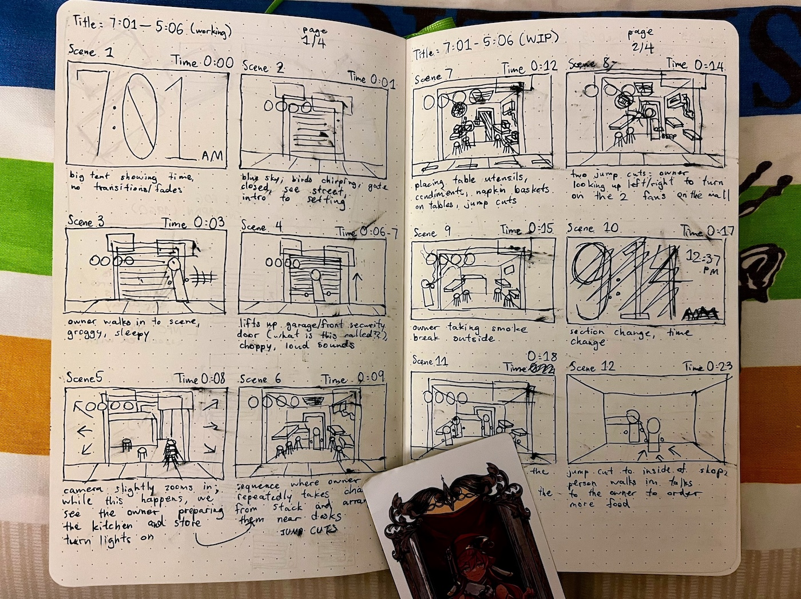

Well. The [first one](https://charleszw.com/posts/reflections-2024) is always the hardest, so thank you, past me. Guess I gotta keep this going.

Statistically, no one will ever read this. That's a little comforting. On the other hand, the people that _do_ know me are likely to find this. That does not spark joy. Sometimes I forget I have a face and voice and am perceived.

Let's start by saying that this year was better than the last, by a pretty good amount. [Here's a video to celebrate this.](https://www.youtube.com/watch?v=rUT2mVgFYPs)

I have some thoughts. (Seemingly more than last time.) And I want to express them. So. Here we go. A preliminary "why spend your precious time reading this" and "but also, thank you" as well.

## On being neutral

> _My biggest takeaway from this experience is that nothing can make me feel worse than being depressed, and this has changed how I prioritize a lot of things._
>
> —Mu-An Chiou, [Depression (CW)](https://muan.co/posts/depression)

I think I have an unusual perspective on things. The issue is that my default state is to simply accept things. I don't like judging; you don't know the other person. I don't like having opinions; you might be on the wrong side. I don't like being fierce about things; it might alienate you from others.

But you know what's worse? Feeling absolutely nothing about everything that you see and experience!

Last year, I wrote about how I gave up on myself. Lemme add to that now: I fucking hate myself for doing it. Given that the original purpose was probably some form of self-protection, it is incredibly ironic that most of the negativity[^1] has come from within me.

Anyways. It sort of bleeds into everything that you're doing, which is a problem when you're trying to apply for jobs, learn new things, meet new people, sleep, eat, etc. You wonder when it will end, but you're the one perpetuating the cycle.

It's a little scary to realize that this has been my world view for a while now. What have I missed out on? What am I behind on? I don't know how I should answer these, or if they're even worth answering (I'm leaning towards no).

What's more important, I think, is learning how to express myself again, writing about it (like right now!), and accepting it.

## On feeling good (letting go)

It has felt _so_ good letting go of things. One way I experienced this was during the summer, when I felt the most carefree[^2] and Young Adult™ than I've ever been.

I just _did_ things. I'm pretty sure I took more photos in those 3 months than in the past 2 years combined. There is a real chance that I know the surrounding neighborhood of my Airbnb better than my hometown. And there were doubts, there will always be doubts, but for once they didn't stop me from doing things.

Let's do that. I would like more of that.

Good things are relative to what you consider are bad things. It's what makes them meaningful. So being happy all the time is literally _impossible_. Bad things happen all the time naturally, but I would like to stop artificially adding to that load.

Someone once told me that I deserved to be happy. What a weird phrase! I've probably told myself "I don't deserve anything" hundreds of times before, but never considered saying the opposite. It feels greedy. I think a little greed is okay.

## On graduating

After four years of college and a total of 12+ years in the education system, I just realized that I'm like, not a good student. Objectively I had less time this summer but somehow did more things.

I think it has to do with expectations. When I returned home from work, my head wasn't filled with the assignments I was avoiding and the job applications I was procrastinating on and the LinkedIn that I wasn't networking with.

But it's not like I stop having responsibilities once I graduate. So there must've been something else. As I begin my final semester in the next few weeks, I would like to figure that out and enjoy what's left.

### On unlocking everything

Internally I've referred to it as “finishing the tutorial” and wow it sounds so dumb writing it out. But hear me out.

- I'm about to finish school (elementary, middle, high, college (this was never optional for me))
- I'm legally allowed to do all the things now (driver's license, voting rights, alcoholism, conscription)

After that, who cares what you do? Find a job, be homeless, eat dirt, become a hikikomori, blow your brains out. I know this isn't true, but sometimes it feels like it doesn't matter.

I find that I don't deal with freedom very well. And I think that's because it's always followed by, what do you want to do with yourself? Attempting to answer this question means that I have to define myself, and as we've established I am Not Very Good at doing that. I find myself sitting in analysis paralysis.

Too bad time doesn't care nor stop. It passes regardless of what choices I end up making. And if it's going to just keep ticking, then I should stop caring and do whatever interests me.

## On being patient

> _Technology has a history of making effortful things effortless, and there is sometimes a hidden loss in that advancement._
>
> —Ty, [Our efforts, in part, define us](https://weakty.com/posts/efforts)

I'm trying to be better at being bad at things; at wasting time on unimportant stuff; on doing things over and over; being wrong; not worrying about accomplishing a task first try; planning things beforehand; revisiting old books; stop treating everything as a checklist.

What this entails is being patient with myself. I feel like the past 2 years I've been rushing because a big chapter of my life is ending. Things are always ending though, everyday, and more importantly things are always beginning as well. If I spend my whole life preparing for things to end, then I haven't really lived.

I know I've always been able to do this, but for the first time in a long time I'm trying to take the time for myself to do things. If I fail, so what? I would rather be unfinished than put out more sloppy and unsatisfying work. How could I not when I've only been giving myself one chance[^3] to do everything?

With that said, I'm looking forward to flailing on the bass, running extremely slowly, making shitty Blender models, and drawing bad human anatomy.

## On being hopeful

I reread last year's ~~rant~~ thoughts and cringed at a lot of stuff. I think this is a good sign? Something about how it means you've grown and changed and see things differently now. I sure hope so.

My hope is that by the end of next year, I'll be rereading this and feeling the same way. That's the ultimate goal I think.

It's this stupid, unfounded, deranged optimism that I was missing for the longest time, I think. I needed a “light at the end of the tunnel” to justify the daily life, or to make sense of it, or to have a reason. I have that now, and I'm very very very very very very very grateful for it.

I wish I knew what sparked it.[^4] I am a little terrified of if/when it disappears, what I'll do. And I wish I had the answer to maintaining it. But I know things will be okay! [I'll be alive next year.](https://www.youtube.com/watch?v=PuMz4v5PYKc)

I want to share one last thing.

<iframe
  data-testid="embed-iframe"
  style="border-radius:12px"
  src="https://open.spotify.com/embed/playlist/1dfHkaWMioz6lA6hWF1t6d"
  width="100%"
  height="352"
  frameBorder="0"
  allowfullscreen=""
  allow="autoplay; clipboard-write; encrypted-media; fullscreen; picture-in-picture"
  loading="lazy"
></iframe>

In lieu of a [/now page](https://nownownow.com/) here's a playlist containing my current music rotation. They usually capture what I'm feeling pretty well. I made three this year, but I probably enjoy this one the most.

Happy holidays, and I hope everyone has a good new year.

[^1]: I'm pretty blessed to be surrounded by and constantly meet incredibly chill and kind people. Shout out friends.

[^2]: This is a lie, I definitely felt the same way in my childhood, and for much longer. Too bad I don't remember anything from before quarantine.

[^3]: I think this is another part of figuring myself out. If I just do everything once then it's kind of hard to claim it.

[^4]: I stopped taking it right before college, but I find myself remembering what my psychiatrist told me when I first got Prozac, and that it's an external stimuli to help me start producing my own again. I wonder if it's related to that.
