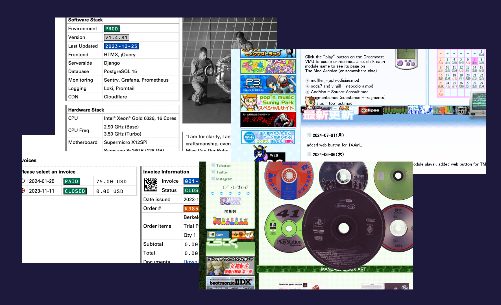
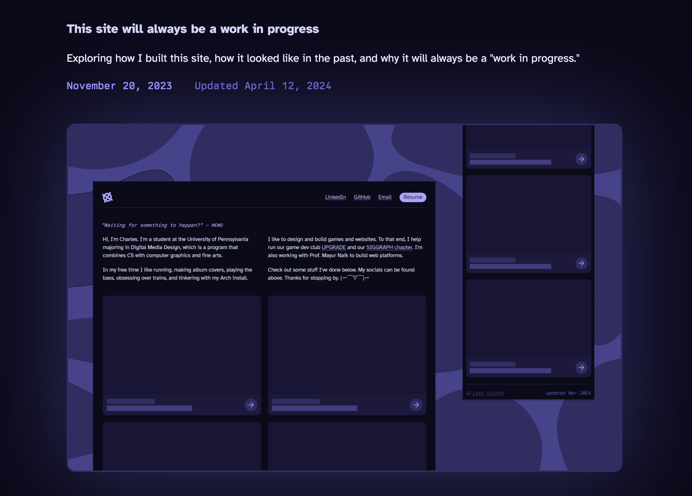

import VideoGif from "@/components/video-gif.astro";
import Border from "@/components/mdx/border.astro";

What do the websites of [United States Graphics Company](https://berkeleygraphics.com/engineering/) (formerly Berkeley Graphics, creator of Berkeley Mono) and [moya.cafe](https://moya.cafe) have in common? They both track information about themselves. The former via a version number, the latter via a changelog.

<figure>
  
  <figcaption>
    **Two wildly different sources of inspiration.** But hey. Both. Both are good.
  </figcaption>
</figure>

I was drawn towards this, probably because I also like tracking things: of my running activity, of my music listening history, of the anime and manga I've consumed, of my game save files, of bookmarks, of restaurants I've visited, of lecture notes, of tasks I've completed, of phone contacts. But it's not the data alone; I like seeing how it's changed _over time._

So I think it's natural for me to keep track of how this website has evolved and changed. And I did! I used to maintain a post on this site detailing additions and removals as they came. It was great. But it was exhausting too. I would have to rewrite the entire post when something changed, because suddenly it was _out of date._

<figure>
  <Border></Border>
  <figcaption>
    **Cover image for the website post.** Updated 5+ months after being published...
  </figcaption>
</figure>

After seeing the two websites above, I realized what was wrong: the format in which I was writing about
the changes. I didn't want a post; I wanted _release notes._ I wanted a _changelog_ where it's inherently
implied that previous releases were out of date.

## Designing a changelog system

As I played around with the idea, things started falling into place, maybe even a bit too well. Maybe it was proof that I should have done this a long time ago.

- At first I was worried about missing information. Then I realized Git has naturally been tracking every little thing I've done, ever. I can just read my commits.
- I can reuse the MDX components and CSS styles from my posts.
- A content collection is _perfect_ for this job. I quickly whipped up the following:

```ts
import { defineCollection, z } from "astro:content";

const changelog = defineCollection({
  type: "content",
  schema: z.object({
    version: z.string().regex(/^v[0-9]+\.[0-9]+\.[0-9]+$/g, {
      message: "Version numbers should follow semantic versioning!",
    }),
    date: z.date(),
    commit: z.string().length(40).optional(),
  }),
});
```

You know what sealed the deal? As I started planning out individual release notes, I was often able to copy entire chunks of text from the website post, and directly insert it with minimal tweaks. This told me it's always been in the wrong place.

### Correct mindset

I'm thinking of these changelogs as public journaling. For whoever is brave/bored/interested enough to learn from me and read what I have to say, they'll be able to see past mistakes I've made and my thought process for making changes.

Other ways you can interpret this project:

- A timeline of how my website has changed
- A time machine to see how things have evolved
- A way for me to yap about interesting things I learned while making this site
- Things that I should proably have made a Twitter account for and posted about

I now have two methods of writing on this site: via posts, or via the changelog. I think both are necessary and fill different niches.

Posts are for more permanent, evergreen ideas and projects. Meanwhile, a changelog is for more temporary things in the sense that it can quickly become out of date and, in fact, expects it. Every new update is _supposed_ to void the previous one, by design.

### Semantic versioning

To differentiate releases, I decided to use [semver](https://semver.org/). But what would it mean in the context of my site? This wasn't a library that people would consume; there are never going to be breaking API changes to warn users of. So I developed some guidelines:

- Above all, changes I write about should be _interesting._ So if nothing of value has happened, don't update the version. I'm playing fast and loose with the definition of a "changelog" here. I'm not trying to meticulously track every detail I change.
- Major version changes include complete redesigns, changes that greatly affected the codebase, or general layout updates.
- Minor versions include smaller changes and experiments within larger layouts. They only modify a small part of the site. Only when I have 3-5 of these changes will I write a collective changelog about them.
- Patches should be rare because they're only meant for bugfixes. So I would only write about them if something _catastrophic_ has happened (read: if I majorly fucked up and it's really funny to talk about).
- Posts will not get a version bump because they don't modify the website per se.

## Rewriting history

With everything planned out, I sat down and started assigning version numbers. This proved to be harder than expected. You see, I've been casually assigning them to commits and nonchalantly incrementing the count when I felt like it. Now I'm facing the consequences.

For example, what I've always referred to as v1 shouldn't actually be the first stable version, because I never finished it. I restarted in the middle, so nothing was finalized. According to semver, this means it's in the v0.x.x territory.

This meant I had to shift _everything_ back. What was referred to as v1 in my commit history is now [v0.3.0](/changelog/0.3.0), my v2 commit is now actually [v1.0.0](/changelog/1.0.0), and so on. I don't really want to go back and change the commit names, so I'll just live with it.

I made this change in the middle of writing the changelogs. At that point, this very release was still referred to as v5.0.0. But now it's v4.

> I think I'm the first person in history to release a new version with a _smaller_ number than the previous release.
>
> I don't really want this achievement.

## Technical stuff

### Sticky sidebar

The trickiest part was getting the version, date, and commit hash to be sticky. Adding `align-items: flex-start` solved the issue. This [StackOverflow answer](https://stackoverflow.com/a/66416972) explains it pretty well: the reason is that

Lo and behold, it is also the solution that the Linear changelog uses. Below, notice how "May 30, 2024" becomes sticky as soon as we align items using `flex-start`.

<VideoGif content={{ collection: "posts", folder: "changelogs" }} name="flex-start" />

And yes, I'm committed to the bit. I wrote over 10+ release notes and backfilled all previous releases, assigning version numbers to things that didn't have any.

Anyway, that post has essentially been [completely replaced](/posts/wip). For the better!

Whenever I updated this site, I've always kept track of an internal version number in my head. This number showed up as version updates in my package.json, and sometimes I would also name commits after these versions (for example, here's [v4.4.0](https://github.com/aczw/personal-website/commit/d830237fb29a615b9789640f4db8eab8b5614b36), which is actually v3.4.0. Long story). To anyone else, these numbers would look clinically insane, as I've never explained them; but they were there to allow me to keep track of things. It also made it feel like I was working on an actual app that required updates, which felt nice.

Once again, Astro made everything really easy to do. I was largely able to reuse the preexisting code I had for my posts, because each of these changelogs is a MDX file.

You know how weird it was to write in present tense about everything that I did in the past? Yeah anyways. Sometimes I almost forgot and wrote about future stuff that didn't exist yet.

> On some level, all of this was probably not the best idea.

> The one place that I broke time and space is with my Last.fm status, which displayed songs and albums that haven't even been _released_. But that was on purpose.

Writing these changelogs has really made me question my knowledge of the English language. I haven't written this much content in a very, very long time. I learned two things: stop worrying about the placement of every single little word. And that I need to write more.

### Updating package.json with the current version

It's not like I will ever publish the codebase as a NPM package, but the benefit to this is that I have a single source of truth for the current version of the site.

This comes in handy when I want to reference it in my footer, for example. I first saw this in [Quartz's own `<Footer />` component](https://github.com/jackyzha0/quartz/blob/244801af65b9e628927c1f1b2518ae62ca2e354f/quartz/components/Footer.tsx#L3), where you can literally import the `version` field from `package.json` and reference it like a regular string:

```astro
---
import { version } from "../../package.json";
---

<a href="/changelog">v{version}</a>;
```

Earlier I said that I was casually updating the version number whenever I felt like it. This is where I was doing it. So, I actually had to _downgrade_ the package.json version to correct my mistakes. Thank god this package is not public.

## Tangent: thoughts on writing and passion

Honestly, I really struggled to write all the changelogs. It was just so much _content_ to write and it felt like I was overloading my site. I mean, this was just supposed to be a fun side project. Why have I written more changelogs than actual posts? It helps that the entire thing is still limited to a single link in the footer.

But... why was I writing so much? Was it even worth it? What makes it _worth_ it? The fact that other people will see it? The fact that most likely, _no one_ will see it? Does that make this pointless to do?

Well, you're seeing this now so I've finished it. For two reasons:

- Sunk cost fallacy.
- More importantly... I stopped writing for myself, and writing in general a long time ago.

This project became an exercise in _doing shit_ to _do shit._ Literally, note to self, publicly: _stop caring._ Not everything needs to be shown off and flaunted.

I constantly struggle with doing things just to have fun, to satiate an inner curiosity, or to learn things that maybe won't help me with finding _internships_ or _jobs_. Because then it's obviously a _waste of time_, right? Grind never stops?

<figure class="mx-auto max-w-[450px]">
  
  <figcaption>
    **Basically TL;DR.** Asking myself permission to start something, knowing it won't help my
    _career_ or whatever.
  </figcaption>
</figure>

I often forget that the coolest stuff I've done started off innocent enough, with no end goal in mind. Only when I'm done do I realize "wait, putting this on my resume would actually be pretty cool." Currently, I have it backwards, and I would really like to change that. This mindset has been very detrimental and I want to change it for my mental health and sanity.

Anyways. Changelogs are
