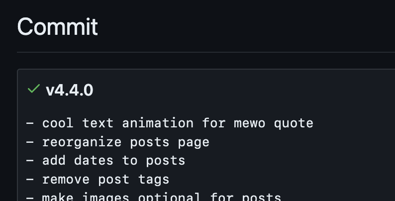

import VideoGif from "@/components/video-gif.astro";
import Border from "@/components/mdx/border.astro";

If there's one thing you should know about me, it's that I like collecting data about myself.

I already track my running activity, my music listening history, the anime and manga I've consumed, cool websites I found, food places I've visited, lecture notes I've taken, journal entries I've written, the tasks I've completed, etc.

But it's not just about the data itself; I like seeing how it's changed _over time._ I'm fascinated by the trends that can only emerge over long periods, and I like seeing differences between, say, two versions of the same data across time.

This is why GitHub pull requests are my favorite thing in the world; just earlier I was browsing through [this PR in Rollup](https://github.com/rollup/rollup/pull/5073/files) and studying the changes that has occurred across hundreds of files. There's something... mesmerizing? about seeing it all laid out before you.

## Motivation

It should then come as no surprise that I once wrote a post discussing how this website has evolved and changed throughout its lifetime. It went into great technical detail on the additions and removals as they happened, and I shared my thought process on the whole experience.

<figure>
  <Border></Border>
  <figcaption>
    **Cover image for the website post.** Most recently updated a whole _five months_ after it was
    first published...
  </figcaption>
</figure>

I liked reflecting on the changes, but it was exhausting to maintain! This is because when something significant changed, it would became _out of date_, and that meant I had to rewrite it. In a way, I was trying to add new data to the post, but very inefficiently.

### Sources of inspiration

I was still trying to find a solution to my problem when I accidentally stumbled upon [moya.cafe](https://moya.cafe). I love how much personality it has and how well it mimics the design language of early 2000s Asian websites. But the most interesting part to me was the inclusion of a changelog that tracked notable changes to itself.

This made me remember [United States Graphics Company's website](https://berkeleygraphics.com/engineering/) (formerly Berkeley Graphics, creator of Berkeley Mono). In the header there is a version number indicating which iteration of the site you're currently viewing.

<figure>
  
  <figcaption>
    **Connecting the dots.** Two wildly different websites, linked together by a common thread.
  </figcaption>
</figure>

Gears started turning in my head. I suddenly realized what was wrong with my post: it wasn't the content, but rather the _format_ in which I was writing it in! I didn't want a post; I wanted _release notes_. I wanted a _changelog_ where I could freely talk without having to worry whether it would become outdated within a week.

## Designing a changelog system

As I started playing around with this idea, the pieces started falling into place. Perhaps it's a sign that I should've done this a long time ago, because the pieces fit a little _too_ well.

Initially I was worried about missing information. As I rewrote the website post over and over, many things were removed. I certainly didn't remember every single change I've made. But Git has! It has been doing _remembering_ since the very beginning. And I could just do my favorite activity—commit surfing—to find everything I need.

On the technical side, everything also fit together perfectly. I can reuse the MDX components and CSS styles from my posts (and I should anyway, for cohesion), and Astro's content collections are the _perfect_ man for this job. I figured I should keep track of three things in the frontmatter: version number, release date, and commit hash.

```ts
import { defineCollection, z } from "astro:content";

const changelog = defineCollection({
  type: "content",
  schema: z.object({
    version: z.string().regex(/^v[0-9]+\.[0-9]+\.[0-9]+$/g, {
      message: "Version numbers should follow X.Y.Z format!",
    }),
    date: z.date(),
    commit: z.string().length(40).optional(),
  }),
});
```

You know what sealed the deal? As I started planning out individual release notes, I was often able to copy entire chunks of text from the post, and directly use it with minimal tweaks. This told me that it's been in the wrong place from the start.

### Correct mindset

My original motivations were fine, but I wanted to further justify adding all of this to the site. With the inclusion of changelogs, I now have two methods of writing, the other being posts. I feel that both are necessary and fill different niches.

Posts are for more permanent, evergreen ideas and projects. Meanwhile, a changelog is for more temporary things in the sense that it can quickly become out of date and, in fact, expects it. Every new update is _supposed_ to void the previous one, by design.

But what exactly do I write about? I view these changelogs as a form of public journaling. For whoever is brave/bored/interested enough to learn and read what I have to say, they'll be able to see my thought process as well as mistakes I've made along the way.

Some other ways you can interpret this project:

- A time machine to see how the site has grown
- A timeline of how _I've_ changed
- Content that I should probably have made a Twitter account for and tweeted about over there instead

### Semantic versioning

To differentiate releases, I decided to use [semver](https://semver.org/). But what would it mean in the context of my site? This wasn't a library that people would consume; there are never going to be breaking API changes to warn users of. So I developed some guidelines:

- Major changes include complete redesigns, things that greatly affect the codebase, or general layout updates.
- Minor updates include smaller changes and experiments within larger layouts. They only modify a small part of the site. Only when I have 3-5 of these changes accumulated will I write a collective changelog about them.
- Patches should be rare because they're only meant for bugfixes. Bugfixes aren't usually noteworthy, so I would only write about absolutely _catastrophic_ things (read: if I majorly fucked up and it's really funny to talk about).

> Posts will not get a version bump because they don't modify the website per se.

Above all, things I write about should be _interesting_ (at least to me). So if nothing of value has happened, _don't update._ I'm playing fast and loose with the definition of a changelog here; I'm not trying to meticulously track every single little detail.

## Rewriting history

With everything planned out, I began assigning version numbers. This proved to be harder than expected. You see, before all this I was _already_ using an internal version scheme. This number showed up in my package.json and sometimes in commit names.

<figure class="mx-auto max-w-[400px]">
  
  <figcaption>
    **Version 4.4.0.** I think I'm the first person in history to release a new version with a
    _smaller_ number than the previous.
  </figcaption>
</figure>

I've been haphazardly assigning versions to commits and nonchalantly incrementing the count when I felt like it. Now I'm facing the consequences.

For example, what I've always referred to as v1 shouldn't actually be the first stable version, because I never finished it; I restarted in the middle, and nothing was finalized. According to semver, this means it's in the v0.y.z territory.

As a consequence I shifted everything _back._ What I referred to as v1 in my commits is now [v0.3.0](/changelog/0.3.0), my v2 commit became [v1.0.0](/changelog/1.0.0), and so forth. I'm too lazy to go back and change the actual commit names on GitHub though.

> I had to downgrade the package.json version to correct my mistakes. Thank goodness this isn't an actual NPM package or anything.

## Technical stuff

As I said I was able to reuse a lot of my existing setup so there's nothing groundbreaking going on here.

### Sticky sidebar

After [introducing a table of contents](/changelog/4.0.0#new-post-layout-and-table-of-contents) for my posts, I wanted something similar for release notes. I tried porting the TOC over but most of the changelogs were too short for it to be really useful.

I still wanted a sidebar for the same reason I originally added a TOC: to fill up the horizontal space created by the smaller width of the changelog content. In the end I chose to display the changelog's metadata and an ever-helpful "back to top" link.

### Updating package.json with the current version

The benefit to this is that I'll have a single source of truth for the current version of the site.

A trick (which is obvious now in retrospect!) that benefits from this is that since it's a JSON file, you can import the `version` field and directly use its value inside files. For example, if I want to reference it in my footer:

```astro
---
import { version } from "../../package.json";
---

<a href="/changelog">v{version}</a>;
```

## On the writing process

I must talk about my experience with writing the changelogs because it basically gave me an existential crisis.

I thought about many things while writing each release note. For instance, it was really weird to write in present tense about everything that I did in the past. Sometimes I forgot and started mentioning future stuff that hadn't existed yet.

> The one place that I purposefully violated spacetime was my current music status. That's why you may see screenshots containing songs that wouldn't come out for another few months. I thought it would be a fun easter egg.

Writing these changelogs has really made me question my knowledge of the English language. I learned two things about myself:

1. I love enhancing nouns with redundant adjectives. It wasn't just placement, it was _precise_ placement. It wasn't just knowledge, but _limited_ knowledge. These are vestigial habits from my high school days when my essays needed to reach the word limit, but now they're just getting in the way.
2. I really need to write more. My current writing sounds just like how I text, which is in a very insane and incoherent manner.

### Commitment

Going into this I knew that for the project to be considered completed, I would have to write. A lot. Every version I decided on needed an accompanying changelog. And while I knew it would get tedious, I didn't think it would become _this_ bad.

In total I wrote 14 changelogs. While the content from the website post was helpful at first, it didn't nearly cover everything on the level of detail that, let's say, a changelog _dedicated_ to the changes would. So most of my writing is 100% new.

Often I found myself not writing at all, just jumping between commits and taking notes on potentially interesting changes. I pulled several all nighters, during each of which I hoped to _finally_ finish everything. But I seriously, severely underestimated the time it would take.

Ever since entering college I've been writing less and less long-form content, and I've forgotten how time consuming it can be. Because "writing" is more than just slamming fingers into keyboard: you can quickly splurt out a draft, but it takes multiple rereads and a lot of thinking to get it to the place where you want it to be.

Point is, everything started feeling less like a side project and more like actual _work._

### Tangent: passion and wasting time

I had some other fears too. It felt like I was overloading my site with unnecessary distractions [once again](/changelog/2.0.0#lastfm-music-profile). Like, at this point why have I _written more changelogs than actual posts?_ Whose existence is more important for this site?

> In my head, it helps to know that the only way to discover all of this is via a single inconspicuous link located in the footer. And now I guess through this post.

I'll be the first to admit that everything quickly grew out of scope. I wanted to release everything all at once, but now this would take much longer. It blocked me from doing other things. I came home from my internship everyday just to _do more work._

Why... waste all this time?

Why write so much? Was it even worth it? What _makes_ it worth it? That other people will see it? Or actually, that most likely _no one_ will see it? Does that make this pointless?

Well, you're seeing this now so I've finished it. For two reasons:

- Sunk cost fallacy.
- More importantly... I stopped writing for myself, and writing in general a long time ago.

This project became an exercise in _doing shit_ to _do shit._ Literally, note to self, publicly: _stop caring._ Not everything needs to be shown off and flaunted.

I constantly struggle with doing things just to have fun, to satiate an inner curiosity, or to learn things that maybe won't help me with finding _internships_ or _jobs_. Because then it's obviously a _waste of time_, right? Grind never stops?

<figure class="mx-auto max-w-[450px]">
  
  <figcaption>
    **Basically TL;DR.** Asking myself permission to start something, knowing it won't help my
    _career_ or whatever.
  </figcaption>
</figure>

I often forget that the coolest stuff I've done started off innocent enough, with no end goal in mind. Only when I'm done do I realize "wait, putting this on my resume would actually be pretty cool." Currently, I have it backwards, and I would really like to change that. This mindset has been very detrimental and I want to change it for my mental health and sanity.
