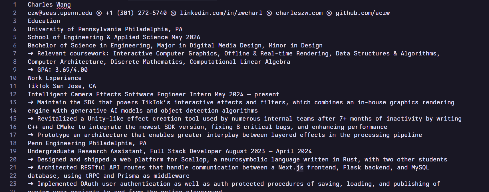
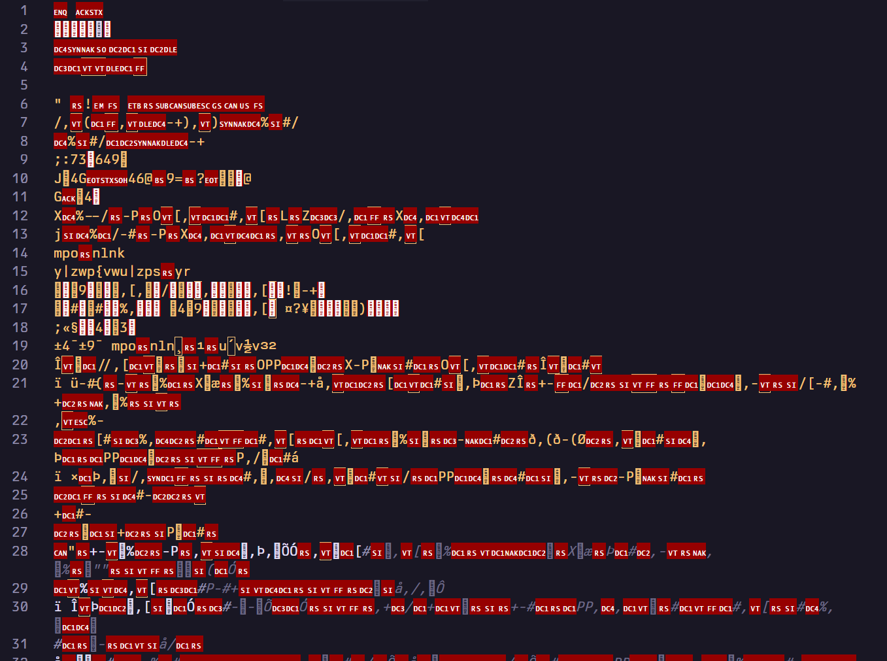
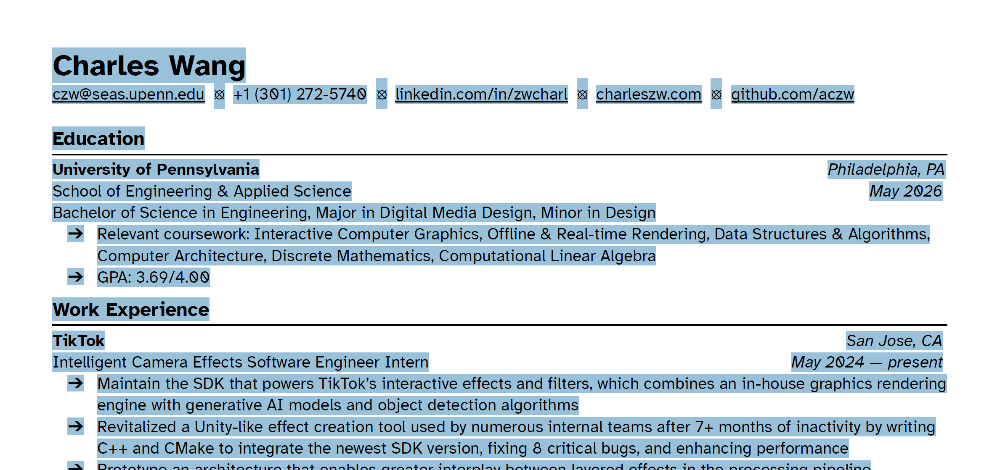
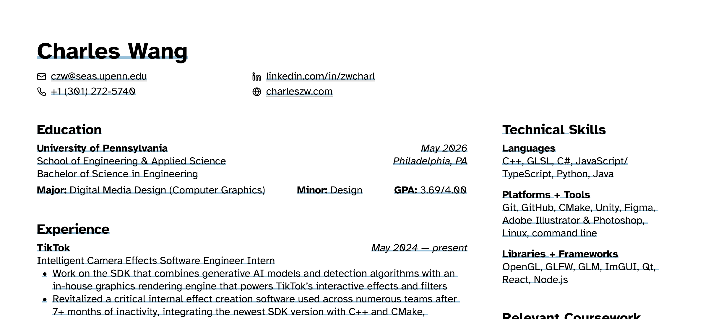

I used to make my resumes like any other person, using Google Docs (or Microsoft Word if you're that kinda guy).[^1] I'm gonna go out on a limb and say that _no one_ likes the formatting and layout step—I can't believe it's 2024 and the general advice is to "press tab until the right side of your text aligns with the right side of the page."

While trying to come up with a better solution, I realized that a tool already exists for automating layouts and structure: it's called Figma. And other people have also realized the same thing, because it turns out many people have already [made templates!](https://www.figma.com/community/search?resource_type=files&sort_by=relevancy&query=resume&editor_type=all&price=all&creators=all) In fact, [this one](https://www.figma.com/community/file/777098881940669714/cv-resume) has been used by over 75,000 people.

So when I was remaking my resume, I switched over to Figma. I immediately reaped the benefits of being able to make certain content fill space, other content hug themselves, auto-spacing, auto-justifying, etc. It made my job _so_ much easier. However, I was still facing one rather annoying problem: I have multiple resumes, and some stuff is obviously repeated/the same. If I wanted to make a change in one of them, I would have to repeat it for _all_ of them, manually.

Wouldn't it be nice if you had a set of predefined components that you could pull from a library of sorts, and reuse across different resumes? I'm thinking of it like React components you know, a button which you can reuse wherever it is needed. In addition, you can pass in configuration options to customize it depending on the context.

Turns out that you can do something very similar in Figma. If I what I described above sounds a lot like Figma components, then you've basically got it. This post is about how I exactly did it, and the decisions I made along the way.

## Disclaimer: don't actually use this

Figma was not designed to make resumes. As such, the standard PDF export is _not_ optimized for text. This makes it really, really hard for an ATS to accurately process your resume. I suspect Figma converts the text into shapes, but they do not actually contain any _semantic_ meaning behind it.

### File size

There are some signs that Figma is doing something funky when exporting. In a non-optimized version of my Figma resume, the file size was _1.45 megabytes_. Even after compressing it, it was still ~1.2 MB. What's the file size of my Google Docs version? 44 kilobytes. This is roughly _27.7× times smaller_.

Google Docs' file size makes more sense here. It does not take that much storage to store ~500 words of content.

### Notepad.exe test

A quick way to check whether Figma is producing something legible is to Ctrl+A, Ctrl+C the contents of the resume, and paste it into a standard `.txt` document. If everything remains readable, good job, that means the machine will probably be able to read it too. But if it's garbled, well, don't expect a machine to be able to process it either.

Anyway, here's what the Google Docs version looks like.

This is what Figma spits out.

Yeah that's, uh, that's just not readable. That's not good.

Another small thing I noticed was _how_ the highlight looked like in Adobe Acrobat when I selected everything.

This is from Google Docs:

And Figma:

In Figma, it barely looked like _anything_ was getting selected! Just those weird underlines under everything. Meanwhile, the highlight looks exactly how you expect it to look in the Docs version. I realize that these weren't the most scientific tests but I think they both point to a larger issue that's going on with Figma's PDF exports. They simply aren't producing semantic text.

### At the end of the day, who knows

Honestly, I have no idea whether a resume made in Figma makes a difference or not. There doesn't seem to be a consensus online, and it's all based on testimony and personal experiences. I don't know whether it's affected me—honestly, I don't really wanna think about the opportunities I may have missed—but I'm going to err on the side of caution for this one.

> My Figma resume also had a two-column layout, which I've heard can also mess with the parsing. But who the hell knows??? Honestly, why are these systems such a black box?! Don't they _want_ to accept as many people as possible??? /rant

Everything I'm writing about is what my _old_ resume used to be. Since then, I've switched to Google Docs, an actual word processor.[^2] I still wanted to write about this though, because

1. it was really fun to make
2. it was cool (and felt _amazing_ to use) while it lasted.

So let's begin!

## What I did

- coursework could be even more insane, where I could toggle on and off each bullet point. I mean, there aren't that many classes that I could list anyway.

This meant that I had to readd every entry as an item in this new component. It was kind of annoying.

(sped up video montage of me doing this)

[^1]: Or LaTeX if you're an ultrasweat, I guess.
[^2]: For the record, I'm absolutely devastated that Figma doesn't work. I really do miss all the layout features. And I still think my Figma resume looks better designed.
