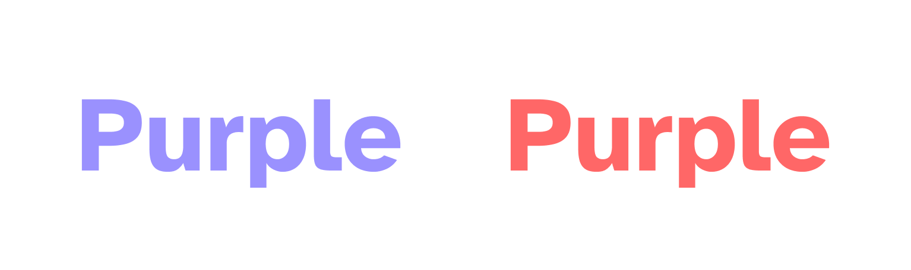
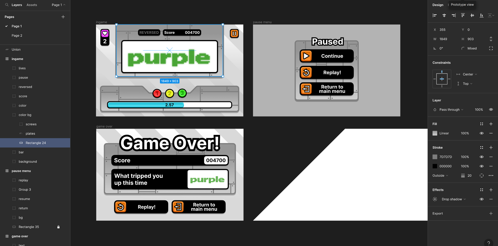

import VideoGif from "@/components/video-gif.astro";

Play now on [itch.io!](https://aczw.itch.io/rcw)

Random Color Words (RCW) is a simple endless minigame about selecting the correct pair of colors and words. They're also randomly generated. Crazy name, I know.

Prior to this, I had very limited experience with Unity and game development in general. I used this experience as a learning opportunity and tried to involve myself with every part of the development cycle. Coming from a design background, _I focused particularly on clean UI_ and making sure that everything felt cohesive and polished. While I wasn't looking to make anything ground-breaking, I wanted the end result to be fully fleshed out and fun.

I think I achieved that goal. I'm very happy to call this my first full game. Details below about how it all came together.

## Gameplay

The gameplay loop is simple... and not original. The core idea is taken from [OLDTV](https://store.steampowered.com/app/643270/OLDTV/) (which you should go play right now, it's free). Both of our games are heavily inspired by the [Stroop test](https://en.wikipedia.org/wiki/Stroop_effect), a psychological phenomenon where reaction time becomes delayed when the stimuli is incongruent.

> Just to reiterate: full credits to OLDTV for the mechanics!

In normal human words, stuff that catches you off guard slows you down. Take these two words, for example.



One word is colored purple, and the other red. It turns out that it's easier for us to name the color of the left word than the right word, because the _word_ matches the _color_. When the word reads "purple" but is actually colored red, this throws us off and delays our answer.

How interesting. Why don't we add a timer, and force the player to decide whether the word matches its color in time. If you don't react fast enough, you lose. And the faster you react, the more points you get.

I keep it simple by only using five colors: Red, Yellow, Green, Blue, Purple.

## Buttons buttons buttons

RCW is an endless, fast-paced minigame about getting the highest score. I was therefore inspired by arcade games and in particular, became obsessed with the art of [Rhythm Heaven Fever](https://en.wikipedia.org/wiki/Rhythm_Heaven_Fever), a 2012 Wii game. I wanted to channel its chaotic vibes, juicy-looking buttons, and generous use of thick borders. I mean, the buttons had to look _delicious_.

I also liked the button hover effect in [The Battle Cats](https://battlecats.club/en/series/battlecats/), which flashed bright yellow and magenta. Here, I tried to recreate it in Figma.

<VideoGif content={{ collection: "posts", folder: "rcw" }} name="flashing-btns-figma" />

I use both the button design and hover effect in RCW. The nice thing about this art style was that it could be consistently applied everywhere, not just buttons.

- Add skeumorphism through the use of light, shading, etc.
- Wrap it in a thick black border
- Add a drop shadow underneath
- If I want to attract the player's attention, add some color. Else, use gray
- I love Inter

Originally I was going for a factory setting, with words coming down a sort of assembly line. But honestly, this was out of my Unity skill scope, so I scratched that idea. You can still see it in the metallic plates and muted gray backgrounds.

### The part where Figma does everything

One thing that may surprise you is that all the art assets were made in Figma. This includes the start screen, in-game, and game over screen, as well as all the UI.



In order to animate different parts of the UI, I exported assets as individual pieces that I could put back together in Unity. This allowed me to, for instance, only animate the border around a button but not change its inside color.

I kept most things grayscale so that I could reuse the asset. In Unity, I simply colored each instance differently.


> In hindsight, I could also have done this with the 3-2-1 stoplight. When it became active, just overlay the glow on top to make it brighter.

It was really nice being able to see the final product within Figma, without needing to tweak anything in Unity. It made adding small changes much faster.

### Animating the UI

The checkerboard on the start screen randomly zooms and changes colors every five seconds. This was done by constantly manipulating the `uvRect` of the checkerboard `RawImage`.

```csharp
[SerializeField] private RawImage cb;

// this would all go in Update()
var length = Mathf.Lerp(2, 10, Mathf.PingPong(Time.time * 0.05f, 1));
var speed = Random.Range(0.1f, 0.8f);

cb.uvRect = new Rect(
    cb.uvRect.position + new Vector2(speed * _x, speed * _y) * Time.deltaTime,
    new Vector2(length, length)
);
```

The other thing I'm really happy about are the button animations. When the instructions or credits button are activated, the same button is used to go back to the start screen.

<VideoGif content={{ collection: "posts", folder: "rcw" }} name="main-menu-ani-btns" />

The "Go back" text slides out, and the outside border becomes a panel for the text to exist in. I spent ~~too much~~ some time getting it to feel just right. I would like to thank this [easings cheat sheet](https://easings.net/) for providing copy-and-paste animation curves.

## Conclusion

This project definitely helped expand my Unity and C# knowledge. I learned to use coroutines and C# events to broadcast gameplay happenings. I became more familiar with Unity's UI and animation system.

How would I update this game in the future? The current gameplay loop is a blatant rip of OLDTV. I've floated some ideas around, including:

- **Shop system.** Earn currency for each game you play that can be spent on power-ups (score multiplier, increased time, more lives, freeze time, etc.)
- **Round streak**. For every additional round you win in a row, a score multiplier is added.
- **Expanding Reversed mode.** To make the player's life even harder, more distractions could be added (flipping the game upside down, smaller words, fake clones, etc.)
- **Levels.** When your score reaches a certain threshold, new challenges appear. Old stuff is swapped out. Maybe add a way to continue from a certain level after losing.

Code and assets are [available on GitHub](https://github.com/aczw/RCW). Thanks for reading.
