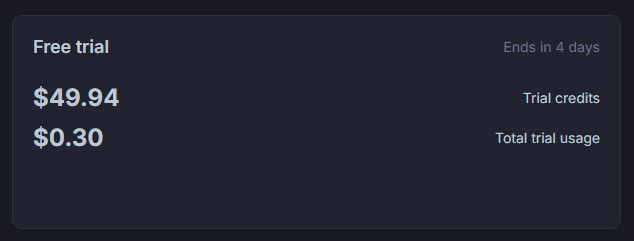

import SpacingBorderWidthGadget from "spacing-border-width-gadget.astro";

I wanted to write a little about the sixth redesign of my website, v6. I've tried doing this before—writing about changes to my site—but it became [horribly overscoped](https://github.com/aczw/changelog) and I burned out before I could finish.[^1] I was pretty sad about that, so to make sure this sees the light of day I'll stick to a simple post.

## Influence

It's embarrassing but I'm always thinking about how I want to update my website design. As a result I've been collecting a number of inspirations since v5 which I've put in this Are.na channel.[^2]

<iframe
  width="100%"
  height="450px"
  style={{ borderRadius: "var(--radius-lg)", overflow: "hidden" }}
  src="https://www.are.na/czw/charleszw-com-v6/embed"
  title="inspo and vibes"
></iframe>

A lot of these blocks emphasize text, structure, and subtlety—stuff that looks simple, but hopefully makes you think _hmmm_, but how did they actually make that? I wanted more polish and personality to shine through.

### Grids

I've experimented with grid layouts since the beginning of this site. Here's what v1 of the home page looked like at one point:

<figure>
  <div class="rounded-lg border-(length:--border-w) border-style">
    
  </div>
  <figcaption>
    **v1 (WIP).** Fun fact, the Last.fm stats you see are live and still work.
  </figcaption>
</figure>

Something about its conformity, rigidity, and formality makes sense to me and is very pleasing. I like the uniformity it brings. Your eyes are guided by the, well, guide lines, to the main content.

It has other benefits! Multiple times in development I've faced a design issue and instead of creating some bespoke solution, I've realized that I can just use the grid. Just follow the grid. Follow The Grid.

<figure>
  
  <figcaption>
    **Sketches from my intro architecture class.** Rhino 3D is one of the
    modeling software of all time.
  </figcaption>
</figure>

While writing this post it reminded of something else: it's like if you drew something but never erased the sketch lines. I took an introductory architecture class, and these lines heavily remind me of the axonometric projections and paraline drawings we had to do. Just employing all kinds of parallel lines of different weights and strokes.

Anyway. I like grids and using them and following them.

## Grid spacing, border width

A cool thing about Tailwind 4 is that everything is just a CSS variable. From early on I defined the grid spacing and border width using them, via <span class="whitespace-nowrap">`--spacing-pad`</span> and <span class="whitespace-nowrap">`--border-w`</span> respectively, so now I can just update one variable and see changes reflected through the whole site.

Here's a little gadget that lets you do just that.

<SpacingBorderWidthGadget />

With bigger values everything breaks, but the hope is that everything breaks _consistently_ because I only used the variables.

## Video CDN

Up until now, videos on this site have been served out of my `public` folder. As I add more videos, though, I had a feeling my hosting provider wasn't going to be very happy.

I decided to switch to an actual CDN. I had heard good things about [bunny.net](https://bunny.net/cdn), so I gave them a chance. Setup was easy and quick, and there were no problems transferring everything over.[^3]

You may be wondering how much I'm paying. In the past I was piggybacking off of my host's very generous free tier, but that generosity would quickly disappear if I ever went over the bandwidth limits.



Out of the $50 of trial credits they gave me, so far I've used 30 cents, so I don't think cost will be a concern. Keep in mind this is after a month of usage.

Moving videos to a CDN also made my website build times drop by like 10 seconds, which is always nice.

## Zooming

To counteract the smaller content width, I wanted some way for people to enlarge an image without having to open it in a new tab. I've also been meaning to play with the HTML [`<dialog>`](https://developer.mozilla.org/en-US/docs/Web/HTML/Reference/Elements/dialog) element, so I wrote my own Lightbox-like image magnifier.

It uses very little JS—[a little less than 40 lines](https://github.com/aczw/personal-website/blob/e6c1fd1c95efb776d161afc8f10e13f793983acd/src/components/content-with-toc.astro#L46-L83)—to add event listeners to images and for setting/resetting the image viewer. A bulk of the work is handled by the `<dialog>` element itself, including the overlay and keyboard accessibility.

Try it now with the image below. (Note: not available on mobile because you can just, you know, _zoom in_.)

<figure>
  
  <figcaption>
    __Click the image to zoom in.__ Also, what's this? A picture of our recently
    released game, Catanks, [free now on
    Steam](https://store.steampowered.com/app/3793790/Catanks), running on a
    Deck? Oh my!
  </figcaption>
</figure>

Nowadays, I rely a lot on HTML data attributes. For instance, I wanted to make certain images non-zoomable. To do this, I add the `data-no-zoom` attribute to them, sort of like a label. The query selector then selects all images such that `img:not([data-no-zoom])`, and only adds event listeners to those.

```html
<!-- Will be zoomable -->

<!-- Cannot be zoomed! -->


<script>
  const zoomable = document.querySelectorAll("img:not([data-no-zoom])");

  zoomable.forEach((elt) => {
    elt.addEventListener("click", () => {
      /* Steal the image URL */
    });
  });
</script>
```

I hope visitors to the site will know it exists! I do change the cursor to a little magnifying glass, and I feel like it's a semi-common pattern across sites, but who knows. I'm chronically online so I've picked up on all the common Patterns.

## Special mentions

Some other notable additions I wanted to highlight.

The site now has a light color scheme.[^4] This took some reconfiguring of CSS variables/discovering hardcoded color styles, and in general took longer than I'd like to admit.

I learned recently you can style selected text and media via the `::selection` pseudo-element, so I've do<span class="bg-sweater-8 text-sweater-2 not-dark:bg-sweater-2 not-dark:text-sweater-8">ne just that like you can see here. Not e</span>verything [is fully supported on all browsers](https://developer.mozilla.org/en-US/docs/Web/CSS/::selection#browser_compatibility) (notably, WebKit on iOS devices) but this is purely visual and should gracefully fall back to defaults.

My (dynamically generated!) OG images have also been updated to the new design, featuring guide lines and dashed lines and all the goodness.

[^1]: One day I'll revisit it and incorporate it in some other way because I do find merit in having a changelog and seeing all your updates laid out like that.

[^2]: I'm still experimenting with Are.na. I understand why they charge $70/year for Premium, I just don't know if I'm ready for that yet.

[^3]: Now I get to use the very official-looking `cdn.charleszw.com` URL for everything, which makes me feel important.

[^4]: Officially. My `<meta name="color-scheme">` always claimed it did, which I'm sure threw off some user agents. My bad.
