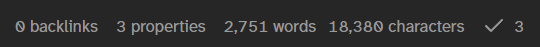

import Link from "@/components/link.astro";

I’ve been writing UI code in Unity for almost 2 years now, and during this time I’ve worked out my own way of handling animations. While working on the v1.0 release of [PennBoy](https://pennupgrade.itch.io/pennboy) I extracted the pattern out into a single, standalone function.

I thought it might be interesting to talk a little about my process and how I got here. At the end I show how you can build on top of it to create your own generic tweening utilities.

> Don’t care about the exposition? <Link href="#the-actual-code">Skip to the code here</Link>.

## First steps

Let’s start all the way at the beginning. One of the very first things you learn about Unity is the `Update()` function in the `MonoBehaviour`[^1] class. This function gets called once every frame. If you’re new to scripting like I was, it might feel natural to write something like:

```csharp title="Example.cs"
class Example : MonoBehaviour {
    [SerializeField] private RectTransform element;

    private void Update() {
        for (var i = 0; i < 10; i++) {
            element.anchoredPosition += new Vector2(1f, 0f);
        }
    }
}
```

The logic in my head went something like, “I want to animate the element moving 10 discrete steps, so I’ll write a loop in `Update()` to do that!” This doesn’t work though, because all we see visually is the _end result_ of having added 10 units. We don’t see the in-between animation steps that allow the element to appear to be, well, animated.

If the for loop’s original purpose was to repeat the same action over and over, then we don’t need it because `Update()` does the same thing. We can treat the code inside `Update()` as a single iteration in a never ending loop:

```csharp
private void Update() {
    element.anchoredPosition += new Vector2(1f, 0f);
}
```

Now our UI element translates one unit to the right every frame. We’ve almost achieved our original goal! However, unless we reset the element’s position every time, it will move forever. Our original loop stops at 10 units though, so let’s add a counter to keep track of which iteration we’re on, and stop adding units when we reach the limit:

```csharp title="Example.cs" ins={3, 6, 8, 10}
class Example : MonoBehaviour {
    [SerializeField] private RectTransform element;
    private int counter;

    private void Update() {
        if (counter < 10) {
            element.anchoredPosition += new Vector2(1f, 0f);
        }

        counter++;
    }
}
```

While this _technically_ works, it doesn’t scale very well. Here are just a few issues I can think of off the top of my head.

- Starting and stopping an animation requires us to manually set and reset the counter.
- We need a new counter for every new animation we want to keep create.
- The status of each animation has to be explicitly checked inside `Update()` to determine whether it should be running or not.
- What does “10 iterations” mean anyway? I guess this means our animation plays for exactly 10 frames. But we usually want to measure animations in seconds. Furthermore, our animation now depends on the user’s framerate.
- Animation frames are played at the same linear rate. What if we wanted to apply some easing, e.g. slow the movement down towards the end?

I think the key takeaway here is that animations occur _across_ frames, so putting animation code in `Update()` inherently feels weird. Surely there’s a better way of writing code that we want to execute over a particular duration?

## Coroutines, my beloved

Spoilers, we can use coroutines. If you have no idea what they are, this [Game Dev Beginner article](https://gamedevbeginner.com/coroutines-in-unity-when-and-how-to-use-them/) provides a pretty good overview and intuition behind how they work. A basic explanation is that coroutines are functions that can be stopped mid execution, and resumed at a later date. Unity provides many ways of customizing how and when coroutines are resumed. Here are three.

- `yield return null` suspends execution until the next frame.
- `yield return new WaitForSeconds(x)` resumes execution after `x` seconds.
- `yield return new WaitWhile(func)` resumes execution only after `func` returns `false`.

There are many, many more. You might already see how coroutines can be useful for animations. In this context, they allow us to perform units of work _spread across an arbitrary period of time_.

### Reimplementation

Let’s try implementing the animation from before, but this time with a coroutine. The syntax for a coroutine function looks like this:

```csharp
private IEnumerator MoveTenXUnits() {}
```

We know that `yield return null` breaks execution until the next frame update. We want to add one unit every frame, so let’s yield return 10 times.

```csharp
private IEnumerator MoveTenXUnits() {
    element.anchoredPosition += new Vector2(1f, 0f);
    yield return null;

    element.anchoredPosition += new Vector2(1f, 0f);
    yield return null;

    element.anchoredPosition += new Vector2(1f, 0f);
    yield return null;

    // ...7 more times
}
```

Because we’re good programmers we decide to collapse this into a loop...

```csharp
private IEnumerator MoveTenXUnits() {
    for (var i = 0; i < 10; i++) {
        element.anchoredPosition += new Vector2(1f, 0f);
        yield return null;
    }
}
```

Funnily enough our code now looks identical to our <Link href="#first-steps">first attempt</Link>. However, this function is already better in a number of ways.

- Unity has established ways of [starting](https://docs.unity3d.com/2022.3/Documentation/ScriptReference/MonoBehaviour.StartCoroutine.html) and [stopping](https://docs.unity3d.com/2022.3/Documentation/ScriptReference/MonoBehaviour.StopCoroutine.html) a coroutine that can be called anywhere and anytime.
- Coroutines abstract away implementation details. No more manual counters or checks within `Update()`.

This is a great start! But I would still like to solve two remaining issues: controlling the _duration_ and _easing_ of the animation.

### Adding duration support

To control the duration, we first must specify one. Let’s say we want this animation to last 3 seconds. We’ll need another variable to track how much time has elapsed so that we’ll know when to stop.

The for loop above defines the animation in terms of frame count, but as we’ve mentioned earlier this is not ideal.[^2] Instead we will want to query how much _time_ has passed since the last frame, and increment our elapsed time by that amount. This value is accessible via `Time.deltaTime`.

<figure class="bleed-wide">
  
  <figcaption>
    The higher the frame rate, the smaller `deltaTime` is. This means the animation will take the
    same amount of time regardless of how terrible your computer is.
  </figcaption>
</figure>

We’re now measuring our animation in terms of time, so we cannot use a for loop with a hardcoded frame count limit. Instead, during each loop iteration we’ll have to check whether the elapsed time has reached our specified duration. At that point, we break free and finish. This sounds like the perfect job for a `while` loop.

```csharp
private IEnumerator MoveTenXUnits(float duration) {
    var elapsed = 0f;

    while (elapsed <= duration) {
        element.anchoredPosition += new Vector2(1f, 0f);
        elapsed += Time.deltaTime;

        yield return null;
    }
}
```

> Side note: if you’re pausing your game by setting `Time.timeScale` to zero, then you should probably use `Time.unscaledDeltaTime` instead, which returns delta time that is—wait for it—not affected by time scale. This way your animations don’t also pause!

I also decided to pass the duration in as a parameter, so that this animation becomes even more flexible. To use it, I would simply call `StartCoroutine(MoveTenXUnits(3f))`.

### Interpolation and adding easing support

Our function doesn’t really do what it’s supposed to anymore, no? Instead of `MoveTenXUnits()` a more apt name would be `MoveForXSecondsAtAnArbitrarySpeed()`, which is both a stupid name and not a very useful function.

It’s helpful at this point to view the animation from another angle and consider the _initial_ and _final_ positions of the element. Relatively speaking, they correspond to 0% and 100% animation progress respectively, or 0 to 1. Thinking about things this way allows us to animate by _interpolating_ between the initial and final state instead. Everything else now falls into place:

- We define the _final_ position to be the _initial_ position plus 10 units to the right.
- Given a measure of progress `t` between 0 and 1, we can derive the position that the element should be at using `Vector2.Lerp(initial, final, t)`.
- How do we calculate `t`? It’s implicitly present in the relationship between `elapsed` and `duration`! That is, `t = elapsed / duration`.
- Want to use a different easing curve? Plug `t` into an easing function of your choosing and use the new value as the interpolant.[^3] We get easing support as a bonus!

Let’s try this approach out.

```csharp
private IEnumerator MoveTenXUnits(float duration) {
    var elapsed = 0f;

    // Define the initial and final states of the element
    var initialPos = element.anchoredPosition;
    var finalPos = initialPos + new Vector2f(10f, 0f, 0f);

    while (elapsed <= duration) {
        // This uses a linear curve...
        var t = Mathf.Clamp01(elapsed / duration);

        // ...but we can easily plug it into another easing function.
        t = EasingCurve.EaseOutCubic(t);

        // Now the element will be animated on a ease out curve!
        element.anchoredPosition = Vector2.Lerp(initialPos, finalPos, t);
        elapsed += Time.deltaTime;

        yield return null;
    }

    element.anchoredPosition = finalPos;
}
```

I added two more things: first, we `Mathf.Clamp01()` our division because floating point division is scary and let’s guarantee that `t` is in the correct range. Second, we do a last assignment of the element’s position to `finalPos` because depending on how `elapsed` is incremented, we might exit the `while` loop with `t` not exactly being 1.

The critical component here is `Vector2.Lerp()`. Luckily for us, we’re not restricted to just `Vector2`s. A search for ["lerp"](https://docs.unity3d.com/2022.3/Documentation/ScriptReference/30_search.html?q=lerp) reveals that we can interpolate a lot more things than you may have realized, including colors, materials, or just plain old floats.

## Extraction

In RCW the pattern above was used once or twice so the duplicated code was less obvious. In PennBoy, however, UI animations are _everywhere_ and very quickly the codebase became littered with `elapsed`s and `duration`s and `while`s. This made me very sad.

### A pattern emerges

I set out to fix this issue. First, I noticed how each of these functions share similar properties and components:

- They divide `t` to give us a value range between `0` and `1`, which is then used to compute some custom interpolated value.
- They utilize a `while` loop that always yield returns `null` and checks the `elapsed <= duration` condition. We also always increment `elapsed` by delta time.

What stuff is “customized” for each instance of this pattern? What stuff can we _not_ generalize? What stuff can we _hide away_ because it’s not used in the actual animation (the stuff we care about)? I highlight the “irrelevant” parts below.

```csharp {2, 6, 15-20}
private IEnumerator MoveTenXUnits(float duration) {
    var elapsed = 0f;
    var initialPos = element.anchoredPosition;
    var finalPos = initialPos + new Vector2f(10f, 0f, 0f);

    while (elapsed <= duration) {
        // This uses a linear curve...
        var t = Mathf.Clamp01(elapsed / duration);

        // ...but we can easily plug it into another easing function.
        t = EasingCurve.EaseOutCubic(t);

        // Now the element will be animated on a ease out curve!
        element.anchoredPosition = Vector2.Lerp(initialPos, finalPos, t);
        elapsed += Time.deltaTime;

        yield return null;
    }

    element.anchoredPosition = finalPos;
}
```

We should still be able to customize the duration and what we’re lerping between, but all the other details aren’t important to us. From this, we can maybe begin to determine the _shape_ of the new function signature. It should look something like this:

```csharp
// We pass in the stuff we want to customize as arguments
public IEnumerator Animate(float duration, Action<float> enumerate) {}
```

If you’re unfamiliar with the [`Action<T>`](https://learn.microsoft.com/en-us/dotnet/api/system.action-1?view=net-9.0) type, it specifies that `enumerate` is a function that accepts a single parameter of type `T`, which in this case is `float`, aka our `t` value. This is how we’re going to customize the lerping behavior for each instance of this function call.

### The actual code

Time to fill in the function body. This is where all the _repeated_ code now lives.

```csharp
public static IEnumerator Animate(float duration, Action<float> enumerate) {
    var elapsed = 0f;

    while (elapsed <= duration) {
        var t = Mathf.Clamp01(elapsed / duration);
        enumerate(t);

        elapsed += Time.deltaTime;
        yield return null;
    }

    // Make sure the animation finishes completely e.g. interpolates to 1
    enumerate(1f);
}
```

> I also made it [available as a GitHub Gist](https://gist.github.com/aczw/d509039eef59e18bfa495bd1158bcfbf).

It’s pretty similar to what we had before, as you’d expect. But the _duration_ and _animation_ are abstracted away.

I also made the function static because it doesn’t depend on member variables or state. Stick this bad boy in any random class and it should be good to go. Let’s rewrite our animation code using this new function.

```csharp
private void MoveTenXUnits(float duration) {
    var initialPos = element.anchoredPosition;
    var finalPos = initialPos + new Vector2f(10f, 0f, 0f);

    StartCoroutine(Animate(duration, t => {
        t = EasingCurve.EaseOutCubic(t);
        element.anchoredPosition = Vector2.Lerp(initialPos, finalPos, t);
    }));
}
```

That’s it! No more worrying about `while` loops or the elapsed time or `Time.deltaTime` or even coroutines. Just plug in a lambda, use `t` however you’d like, and focus on writing your animation code.

You can do some pretty fun things with `Animate()`. For example, one use I’ve discovered is to `yield return` the function call instead in order to pause caller execution until the animation finishes:

```csharp
private IEnumerator DoMoreStuff() {
    AnimateSomeStuff();
    AnimateSomeOtherStuff();

    // Pause execution of this coroutine until this 5s animation finishes
    yield return Animate(5f, t => { /* ... */ });

    // Then yield for 3 more seconds to wait for this animation
    yield return Animate(3f, t => { /* */ });

    // After 8 total seconds, continue!
    AnimateSomeOtherOtherStuff();
    AnimateSomeOtherOtherOtherStuff();
}
```

This works because `Animate()` returns an `IEnumerator`, which Unity will happily accept and [specifically supports](https://docs.unity3d.com/2022.3/Documentation/ScriptReference/CustomYieldInstruction.html) via `CustomYieldInstruction`, which itself also derives from `IEnumerator`. We’ve essentially written our own yield instruction. Neat!

### Your very own tweening library

I prefer using `Animate()` directly because it offers the most control and customizability, but over time even this function can feel tedious. One pain point is having to define the initial and final value outside of the lambda in order to reference it. Also, we often want to do the same animations over and over; one example from PennBoy is fading in and out UI elements.

Fortunately for us, this function is an amazing building block to work on top of. Let’s wrap it in another coroutine that takes in an element and performs an opacity change on it.

```csharp
public static IEnumerator FadeIn(CanvasGroup cg, float duration) {
    yield return Animate(duration, t => {
        cg.alpha = t;
    });
}

public static IEnumerator FadeOut(CanvasGroup cg, float duration) {
    yield return Animate(duration, t => {
        cg.alpha = 1f - t;
    });
}
```

We can do the same thing for scale, color, rotation, movement, etc. Speaking of movement, let’s reimplement `MoveTenXUnits()` one last time.

```csharp
public static IEnumerator MoveX(RectTransform rt, float deltaX, float duration) {
    var initial = rt.anchoredPosition;
    var final = initial + new Vector2(deltaX, 0f);

    yield return Animate(duration, t => {
        rt.anchoredPosition = Vector2.Lerp(initial, final, t);
    });
}

// Hell yeah 🎉
public void MoveTenXUnits(float duration) {
    StartCoroutine(MoveX(element, 10f, duration));
}
```

Beautiful. We’ve come a long way, haven’t we? Although in this example we did lose the ability to change the easing curve, it would be trivial to add another function parameter to customize that behavior.

At this point, functionality-wise there’s not much separating our own utilities from actual tweening libraries like [LeanTween](https://dentedpixel.com/LeanTweenDocumentation/classes/LeanTween.html) or [DOTween](https://dotween.demigiant.com/). However, I will say that I did not take into account performance while writing these, nor have I tested them at scale. If you’re calling these functions hundreds or thousands of times, you probably _should_ move on from `Animate()` and just use one of the tweening libraries above. They offer a much larger API surface and I’m sure they’re more performant as well.

<figure>
  
  <figcaption>**Word count stats.** Cooked.</figcaption>
</figure>

Anyway, I did not expect to write ~2700 words about this 14-line function, but here we are. Please reach out if you spot any mistakes or have any suggestions.

[^1]: Not me realizing for the first time while writing this that Unity is using the British spelling for behavior. What.
[^2]: Imagine a laptop running at 30 FPS while another PC runs at 60 FPS. Our animation would take twice as long to finish on the laptop because each frame takes up a longer duration in the second—this is probably not what we want.
[^3]: TIL the word “interpolant” which is used in the Unity docs for [`Vector3.Lerp`](https://docs.unity3d.com/2022.3/Documentation/ScriptReference/Vector3.Lerp.html).
