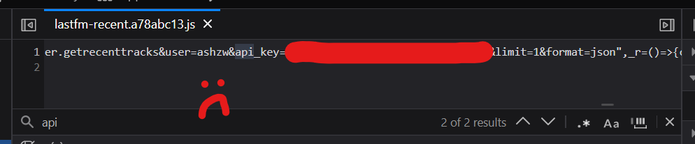

Welcome to my little corner on the internet.

When I first started learning web dev, this website was my first project. One of the few things I wanted to immediately include was a blog system: somewhere I can write about what I'm doing and the things I like. Naturally, the first entry was about this site and the experience of building it.

For the longest time, I treated this post as a "source of truth" for how my website _finally_ came to be. A sort of explanation post for the _final_ state of the site. Clearly, it wasn't going to change anymore this time!

Well, I was absolutely, laughably, horribly wrong. At this point, this site has undergone four _major_ refactorings. The first three times, this post has also been rewritten. After all, the site has changed in a significant way, and I needed to mention how. Otherwise, the post would be outdated, right?

I realize now this was the wrong way to go about things, and I think it's largely a mindset problem: even though the site is tied to who I am as a person, I somehow thought that it would remain in a standstill. Even when I am (invevitably) changing and growing and evolving.

**Just like us, websites are never a finished product. Especially personal ones. And not just websites, but any projects that you care deeply for.**

I experienced this phenomenon firsthand over the past year. This is my fourth rewrite of "my website post". At this point, the post isn't about _building websites_ or _tracking changes_ anymore. The new post title reflects that.

> Something like a changelog fits the purpose of tracking changes a lot better; whenever I have new stuff to yap about, I add a new patch note. I talk a bit more about that idea in [its own post](/posts/changelogs).

Things change, and I should _expect_ things to change. This applies to everything, not just some random person's identity crisis for their website (hint: me). And I think the fact that this post itself has now gone under multiple rewrites is a very beautiful and symbolic thing. I can't tell you what it means, but it definitely feels right.

> If you want to see past versions, just go to this repo's [commit history](https://github.com/aczw/personal-website/commits). It's satisfying to go back in time and look at how, piece by piece, stuff has slowly changed. Thanks, version control.

## But why?

I've written a lot of words about what has changed. Another equally important question is why I keep changing things. I mean, I know everyone does it; once you catch redesign-my-blog-itis, it infects you forever.

But I would like to explain my own reasoning.

With each successive version, my expectations, preferences, and goals for this website change. One central motivation has remained the same though, which is the desire to _express myself_. Unfortunately, I have many ideas about how to go about it.

For one, this platform we're on feels infinite. It's easy to think of the Internet™ as just Google, Twitter, and YouTube, but I've gravitated towards the web so much because you have limitless control over how to present yourself. HTML, CSS, and JS are very, very powerful, accessible, and ubiquitous. It's very freeing.

Having a domain is also a way of showing myself off. This desire has led to its own challenges, with me often torn between making my site look how I want it, and optimizing it for recruiters and employers. I've pretty much accepted that I will never have a [LINK HERE](https://google.com), for example. _(You can reach me at the end of this post, by the way. Shameless plug.)_

So how do you go about achieving everything? I have tried out four different approaches now, and as my beliefs change I'm sure I'll think of even more. Every approach has felt like the _correct_ solution at the time. I'm sure they _were_ the correct solution at the time.

Trust your past self a bit more. Seeing v1, v2, v3, etc. as mistakes is the wrong conclusion here.

## Progression, not repetition

In a past version of this post, I titled a section "The cycle continues." It was about how this post has been rewritten over and over again, and, to quote my exact words:

> _"Every new version meant I had to update past sections, and then add a new section explaining why everything before sucked. This went on for quite a while. But I'm kinda tired of it now! No more!_
>
> _The revisions my site has gone through reflect how I've changed as a person, and will continue to change. I will start letting that speak for itself."_

I mostly agree, past me. This ends now, today. But the section heading irked me: there was no cycle going on here. It implies everything repeats again. Here, it's the literal opposite: everything changes and evolves.

I get it, though. Sometimes I feel like Sisyphus, starting from scratch all over again. But the process and final result is _always different_. Also, I enjoy it. Because I'm updating something I care about to better reflect the current me. It's slightly different from endless, corporeal torture.

So, for real this time, I'll let the changes speak for themselves. Well, that, and also through the [changelog](/changelog).

:\)

# OLD

With the Astro docs open in another window, I started coding. The final result:

Everything looked exactly as I had imagined it. It was perfect, perfect, perfect... until it wasn't, again. In my quest to become quieter, I somehow jumped even further in the other direction.

## Rethinking what I want

What did I want out of my website? What did I want other people to see when they visit? The answers to these questions were often in conflict. It didn't help that I also wasn't sure what to show off to people.

- The music obsession has gone too far. I'm really using half of my homepage to display arguably useless information to the visitor. I could be using that space to talk more about myself and what I do.
- While the bento box layout seemed fine on paper, on practice it was difficult making the blocks look good on all screen sizes. I'm using CSS `grid` and sometimes this led to weird layouts on specific dimensions.
- The more I used Astro, the less I wanted to rely on external UI frameworks. For my purposes, sending this much JavaScript to the client felt _unnecessary_, and I knew I could do everything I wanted without it.

## Aside: how not to fetch data

In the past, in order to make requests to the Last.fm API, I used React and [SWR](https://swr.vercel.app/). For this React component to access my API key from the client, I chose to make it publicly available by prefixing it with `PUBLIC_`. Theoretically, anyone visiting my site could simply Ctrl+F it. Actually, I'll just show it:

Was I seriously expecting anyone to steal the key and use it maliciously? No, but it reflected my inexperience with data fetching and keeping things secure on the web.

> Another thing: I was also relying on React, a UI library, to fetch data. This was also inexperience on my part. Frameworks like Astro provide clean, native ways to [fetch data](https://docs.astro.build/en/guides/data-fetching/) irregardless of the UI you build.

I know better now. All the data fetching is performed on the server, which my API key will never leave. I use Astro's API routes to perform a `GET` request that separates the work from the component that is displaying it. This does mean you have to mark the pages that display this data as SSR only.

I've also gotten rid of the dependency on React and SWR.

## Doing some research and reflection

To aid my redesign, I wanted to see how other people interpreted the idea of a personal website. This included fellow people from DMD, my friends, and other websites that I found intriguing.

> You can find my notes about them [in the Vault.](https://vault.charleszw.com/Notes/Websites)

I realize now that what I need is _simplification_. I don't want to overwhelm any visitors with extraneous info. I've seen how you can show off your personality with constraint and in more subtle ways. Instead, I focused on crafting a design that I truly wanted people to see first.

- Instead of the weird bento box layout for the homepage, use a more standard layout. Text gets more space to exist, and I get to display sneakpeeks of my projects/posts.
- I liked the live music updates but deemphasized it, because it wasn't the main reason I directed people to my site. It's mostly for my own enjoyment, anyway.
- The header took up too much space, so I made it non-sticky. I don't have that much content to require an always visible nav bar.
- After a slight identity crisis, I combined `/projects` and `/portfolio`. The "portfolio" label never made much sense. My programming and design stuff are often one and the same.

I keep everything at fixed widths now. This was an intentional choice I took from the other sites I was ~~stalking~~ taking inspiration from. Reading becomes much easier when your eyes don't have to scan across a large horizontal distance.

## The cycle continues

What you're currently reading has been rewritten over and over as this place has developed and changed. Every new version meant I had to update past sections, and then add a new section explaining why everything before sucked. This went on for quite a while. But I'm kinda tired of it now! No more!

The revisions my site has gone through reflect how I've changed as a person, and will continue to change. I will start letting that speak for itself. So, thanks for reading!

## Colophon

This site was built with pure Astro and styled using Tailwind. It's currently deployed on Vercel's free plan, but uses Cloudflare DNS. All prototyping was done in Procreate and Figma.

Primary type is [Atkinson Hyperlegible](https://en.wikipedia.org/wiki/Atkinson_Hyperlegible). Code is written in [Berkeley Mono](https://berkeleygraphics.com/typefaces/berkeley-mono/). Icons are from [Lucide](https://lucide.dev/).
