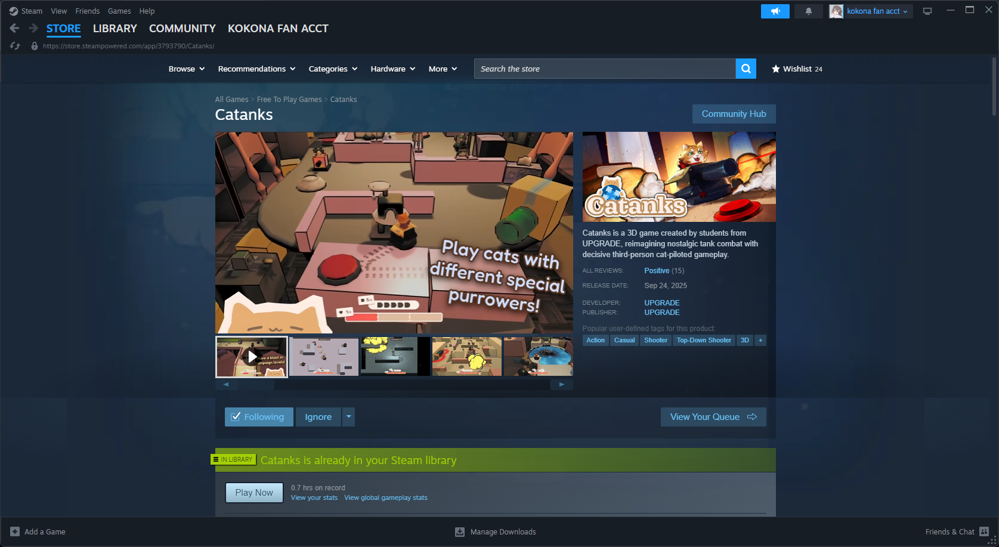
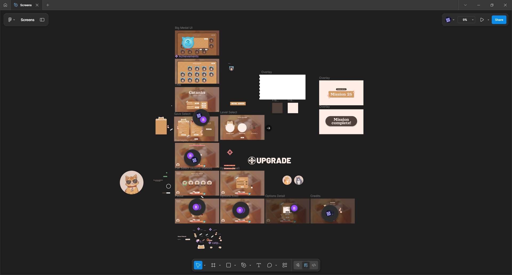

import VideoGif from "@/components/video-gif.astro";

During my junior year at Penn I was co-president of [UPGRADE](https://pennupgrade.com), our game development club. Coming in, [Anthony](https://geant.pro), the other co-president, and I had a single shared goal in mind.

Make a game from start to end and publish it on Steam.

In the history of UPGRADE, this has been done once before à la [Bionic Traveler](https://store.steampowered.com/app/2026430/Bionic_Traveler). However, 2 years had gone by, and the club hasn't been successful since. In my sophomore spring semester, we attempted to make such a game, but for a multitude of reasons we weren't able to succeed.

Armed with our failures and renewed motivation to succeed, we tried again, this time changing the scope and game genre. The end result is this game, Catanks.

<figure>
  
  <figcaption>
    **Catanks!! On Steam!!!** A game I helped make, on the Steam store
    page!!!!!!
  </figcaption>
</figure>

This write-up is a work in progress; for now I'll talk a little about pre-production and show some UI work that I did. You should then go to Steam and get our game (it's free) and install it and play it and leave a review.

## Summer of pre-production

Planning for Catanks began before the school year even started. In the summer of 2024, the new UPGRADE board (includes me!) built a prototype/demo of the game idea that we wanted to make with the club during the school year.

This YouTube trailer, now unlisted, is how we originally pitched the game to our club members.

<iframe
  width="560"
  height="315"
  src="https://www.youtube-nocookie.com/embed/RYcAgzZ8RGQ?si=TPODU6AOz8jkUZNM"
  title="Tanks Preview UPGRADE'24"
  frameborder="0"
  allow="accelerometer; autoplay; clipboard-write; encrypted-media; gyroscope; picture-in-picture; web-share"
  referrerpolicy="strict-origin-when-cross-origin"
  allowfullscreen
></iframe>

"It looks different" is an understatement. During development, we overhauled the _entire art direction_ because we felt that we weren't utilizing our artists' strengths very well.

I wrote a little about the pre-production process a while ago. Here's what I had to say about it:

> This game is heavily inspired by Wii Tanks, which has you fighting other tanks by ricocheting your bullets off walls and obstacles. We also added some puzzle elements like one-way walls and buttons that need to be pressed to remove obstructions.
>
> We created a design document to keep track of gameplay ideas, features, and rules our demo should follow, so I've been involved with all parts of the planning process. As for actual development, I mostly worked on the camera system, which allows you to define a custom boundary to keep the player tank visible in, and otherwise start panning across the screen.

The demo gave us the confidence to continue with the main gameplay loop, even if we (clearly) changed many things down the line.

## UI/UX work

I spent a significant portion of development on designing, refining, and implementing the user interface. To that end, I was the UI team lead and worked closely with two club members.

Everything was first wireframed in Figma, and after we were satisfied the assets were then imported into Unity and assembled.

### Craft

Everything you see here was designed and implemented by me.

<figure>
  <VideoGif
    content={{ collection: "projects", folder: "catanks" }}
    name="achievements"
  />
  <figcaption>Achievements menu.</figcaption>
</figure>

<figure>
  <VideoGif
    content={{ collection: "projects", folder: "catanks" }}
    name="classic_enter"
  />
  <figcaption>Entering Classic mode from the main menu.</figcaption>
</figure>

<figure>
  <VideoGif
    content={{ collection: "projects", folder: "catanks" }}
    name="classic_win"
  />
  <figcaption>Transitioning to the next Mission in Classic mode.</figcaption>
</figure>

<figure>
  <VideoGif
    content={{ collection: "projects", folder: "catanks" }}
    name="level_enter"
  />
  <figcaption>Level enter and transition animations.</figcaption>
</figure>

<figure>
  <VideoGif
    content={{ collection: "projects", folder: "catanks" }}
    name="pause_menu"
  />
  <figcaption>Entering and exiting the pause menu.</figcaption>
</figure>
