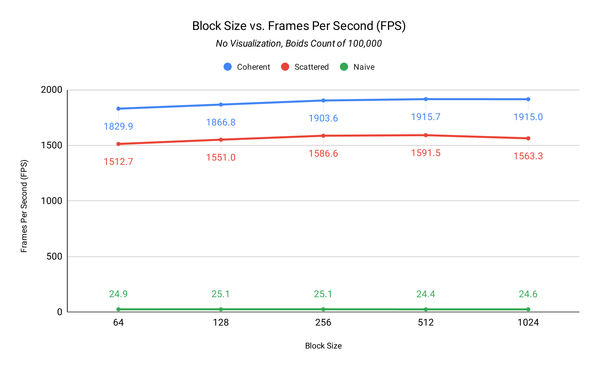

In this project I implemented the classical boids flocking simulation with CUDA. The implementation is based on pseudocode from [Conrad Parker's notes](https://vergenet.net/~conrad/boids/pseudocode.html) and modified in order to take advantage of the GPU. In particular, I launch a new thread for each boid to update its velocity and position.

## Implementations

I test three different ways of calculating velocities. In increasing order of complexity:

- **Naive:** for each boid, look at every other boid in the scene and adjust velocity and position accordingly.
- **Uniform grid, scattered:** add an additional preprocessing step where boids are grouped into 3D grid cells. For each boid, we only have to check the boids in its own grid cell as well as neighboring cells.
- **Uniform grid, coherent:** the same as above, but we add yet another step that guarantees the velocities and positions of boids in a grid cell are also contiguous in GPU memory.

### Grid-looping optimization

Instead of hardcoding a check for the 7 or 26 possible neighbor cells, we instead operate based on a "max distance" from the current boid, and include all neighboring grid cells which are within this max distance radius.

This was as simple as translating `maxDistance` in all three cardinal directions, in the positive and negative, to find the max and min grid cell index respectively. We then perform a triple for-loop iteration over all grid cells within this boundary, and sum up the contributing velocities.

## Testing and pretty graphs

### Methodology

For testing, I mainly looked at the frames per second (FPS) of each implementation (naive, scattered uniform grid, coherent uniform grid). To do this, I wrote additional code that automatically closed the program after 20 seconds of simulation, and kept track of all framerates every second. Then, I would record the average FPS across the 20 seconds.

There were two parameters that I varied across testing: the block size (number of threads) and the number of boids to simulate. I then ran the benchmark for each possible combination of these variables:[^1]

- Block size: 64, 128, 256, 512, 1024
- Number of boids: 10k, 25k, 50k, 100k, 250k, 750k, 1500k

I benchmarked this on my personal computer. Here are the specs.

| Type       | Specifications                                 |
| :--------- | :--------------------------------------------- |
| **OS**     | Windows 11 Pro, version 24H2, build 26100.4946 |
| **Memory** | 32 GB, DDR5-6000                               |
| **CPU**    | Ryzen 5 7600X @ 4.7Ghz                         |
| **GPU**    | RTX 5060 Ti 16 GB, Studio Driver 580.97        |

### Varying boid count

The first set of graphs look at how the average framerate varies across the boid count. I selectively picked benchmarks for block sizes of 64, 256, and 1024.

> For the full set of graphs, including the ones for the benchmark when ran with visualization, please see the [`analysis/graphs`](https://github.com/aczw/Project1-CUDA-Flocking/tree/main/analysis/graphs) folder on GitHub.
>
> I don't include them here because they largely follow the same shape, just with lower framerates across the board.

<figure>
  

    

     
  

  <figcaption>
    In counterclockwise order, top to bottom: block sizes of 256, 64, and 1024.
  </figcaption>
</figure>

Unsurprisingly, increasing the boid count for each implementation made the framerate drop. The slope held still for a bit until 100k boids, at which point the slope became much steeper for all three.

Coherent uniform consistently performed better than scattered uniform, and both left naive in the dust. The use of the uniform grid data structure really helped reduce the number of calculations and checks the CUDA kernel had to perform, therefore allowing us to calculate velocities and positions much faster.

### Varying block sizes

The second set of graphics look more closely at how the average framerate varies across the different block sizes. I selectively picked benchmarks for boid counts of 25k, 100k, and 750k.

<figure>
  

    

     
  

  <figcaption>
    In counterclockwise order, top to bottom: boids counts of 100k, 25k, and
    750k.
  </figcaption>
</figure>

You'll notice that I'm missing data for the naive method when the boid count was 750k. This is because the simulation ground to a halt, and there was no effective way to measure the framerate anymore (effectively it was zero).

Surprisingly, changing the block size did not make much of a difference. I assume it's because we're simulating so many boids that we're essentially hitting the ceiling no matter which block size we use? I do observe a "peak" in performance when I set the block size at 256. I do not really understand why.

## Performance analysis

While the coherent uniform grid achieved performance improvements, it was lower than I expected. The results make sense though. By allowing physically adjacent grid cells to also be contiguous in memory, this reduces potential cache misses and improves memory access times because the locations are less random.

Another factor I haven't really explored is varying the cell width, as well as the number of neighboring cells we're checking. In theory checking 27 cells of the same width as 8 cells will be slower, but by decreasing the cell width we're able to check more cells while still keeping speeds about the same.

[^1]: The raw data is available as CSV files in the [`analysis`](https://github.com/aczw/Project1-CUDA-Flocking/tree/main/analysis) folder on GitHub. Rows are block size in increasing order, columns are boid count in increasing order.
