import Link from "@/components/link.astro";

This is a path tracer written in C++, OpenGL, and GPU-accelerated via CUDA. Here's a quick rundown of the features.

- **Materials:** basic BRDFs like the Lambertian shading model and perfectly specular dielectrics
- **Camera:** anti-aliasing via stochastic sampling and depth of field enabled through a thin lens camera model
- **Meshes:** the most exciting part for me is the ability to load arbitrary glTF models. This is made possible by constructing BVHs for them at scene load, which I then traverse when performing intersection tests.

What follows is a (very informal) discussion on the theory, explanations of the features and implementation details, as well as analysis of some performance benchmarks I conducted. I'll talk about what worked, what didn't (with botched renders!), and my overall experience working on this project.

Here are the specs I performed benchmarks with.

| Type       | Specifications                                 |
| :--------- | :--------------------------------------------- |
| **OS**     | Windows 11 Pro, version 24H2, build 26100.4946 |
| **Memory** | 32 GB, DDR5-6000                               |
| **CPU**    | Ryzen 5 7600X @ 4.7Ghz                         |
| **GPU**    | RTX 5060 Ti 16 GB, Studio Driver 581.29        |

## The theory, in theory

### A very physically inaccurate discussion on light

> If you're familiar with path tracing, feel free to skip the next few sections and jump straight to my <Link href="#materials">discussion on features</Link>.

At its core, a path tracer simulates many real-life physics interactions, and therefore we must discuss some of them first. First, path tracing is all about light. For our purposes, we can treat light in the world as rays, with an origin and a direction. Rays always come from a light source of some kind—a light bulb, the sun, my phone screen in bed at 4 AM.

Whenever a light ray hits an object, it will then bounce and pick a new direction. Depending on the material at the intersection, the ray picks up an appropriate amount of color, mixing it with colors from all previous bounces.[^1] The properties of the material also determine which direction the next bounce will go.

Eventually, this light ray will bounce directly into our eyes, allowing us to see. We could trace out the full _path_ this ray took from its beginning light source to its ending. This is what we're trying to simulate.

### Deviations from the real world

Since we're just trying to _simulate_ the real world, we can cheat in a number of ways.

#### Begin rays from the eye instead

The eye in this case is our virtual camera, and it is the only ray destination we care about. Therefore, it would be extremely inefficient to shoot rays _starting_ from the light source—it is highly unlikely that any ray would contribute pixel color information to our camera.

Instead, we can guarantee the final ray destination by shooting the _initial_ rays from the camera. All that's left is for the ray path to intersect with a light source.

#### Rendering equation

Described by James Kajiya in his 1986 SIGGRAPH paper, the rendering equation can be written in the form

$$
L_o(\omega_o)=L_e+\int_\Omega f(\omega_o,\omega_i)L_i(\omega_i)(\omega_i\cdot\vec{n})\space\text{d}\omega_i
$$

I know, the math symbols spooked me too at first, but the components actually represent pretty simple ideas. This equation tells us how to calculate the light traveling on an outgoing ray direction $\omega_o$ at some particular point.

We have four main components to consider:

- $L_e$ is the inherent light emitted at the intersection point. This value is non-zero if the point is a light source.
- $f$, which is a [BRDF](https://en.wikipedia.org/wiki/Bidirectional_reflectance_distribution_function) telling us _how much_ of the light is reflected. How $f$ is defined depends on the material.
- $L_i$, the incoming light from ray direction $\omega_i$. Or, the accumulated value.
- Lambert's cosine law, which relates $\omega_i$ to the surface normal.

$\Omega$ represents the hemisphere centered at the intersection, and $\text{d}\omega_i$ are all the infinitesimal ray directions that make up $\Omega$. For our implementation, this... poses some problems for us.[^2]

#### Monte Carlo integration

To solve the rendering equation for an outgoing direction $\omega_o$ we have to solve the integral. Since our computer can't actually integrate over an infinite number of $\omega_i$ per intersection, we instead _randomly sample_ a number of $\omega_i$ for each intersection, and weigh them by their probabilities of being chosen.

Furthermore, we repeatedly solve the rendering equation for every pixel in our image, and average the output colors by dividing by the number of samples taken. This allows us to _converge_ to the final image over a period of time.

### Parallelization

While the GPU is generally known for being good at drawing things, we're not using it for rasterization here. Monte Carlo path tracing is considered [embarrassingly parallel](https://en.wikipedia.org/wiki/Embarrassingly_parallel) for a reason: calculate the color for each pixel in parallel. The path that each pixel traces to reach a light is wholly independent of one another.

#### Terminology

I would like to clarify some terminology: an **iteration** (or **sample**) is determining the color of each pixel _once_; we average many iterations to get the final image. However, within each iteration we also perform a number of bounces bounded by some _max depth_.

Each bounce progresses the path traced by one intersection. Multiple bounces result in one sample (or black, of the path went out of bounds).

This distinction is important because there are two ways we could utilize the GPU, the difference being what _kind_ of work is performed per thread:

- Each thread performs one whole iteration.
- Each thread performs one bounce in a iteration. **(I did this.)**

By taking a incremental approach, we gain some additional optimization opportunities. We'll see later that we can get away with launching less threads if we meet certain requirements. (Hint: not all paths end at the same time.)

## Program structure

To provide a general overview of how my path tracer functions, here I describe a single execution loop of my program. One execution of this loop results in one iteration of the path tracer.

In each execution of the loop, until we've reached the max number of samples:

- Check if camera or GUI toggles have changed. If so, reset the samples and start over.
- Generate initial rays from the camera. That is, their origins are at the eye.
- Perform work in inner loop:
  - For each ray, find intersections with scene geometry, if any.
  - If enabled, discard intersections that traveled out of bounds.
  - If enabled, sort the paths by the material they intersected with.
  - For each intersection, calculate its color contribution, and determine the next ray direction.[^3] (The ray origin is the intersection point.)
  - If enabled, discard intersections that have hit a light source.
  - If we've reached the max depth or we've discarded all paths, break out of the loop. Otherwise, repeat.
- Gather all the final color contribution for each pixel, and append it to our image data.
- Divide each raw pixel data by the number of samples, and send the data to OpenGL for rendering.

## Materials

### Lambertian BRDF

One of my first new additions to the base code is adding a Lambertian diffuse shading model. What makes this model great is how easy it is to conceptualize and implement.

<figure class="mx-auto max-w-120">
  
  <figcaption>
    Credits: [PBRT v4](https://pbr-book.org/4ed/Reflection_Models)
  </figcaption>
</figure>

If we look at the rendering equation again, we'll see what really differentiates one material from another is how $f(\omega_o,\omega_i)$ is implemented; that is, the BRDF.

The Lambertian BRDF says that for an outgoing ray $\omega_o$, the scattering of rays is _uniform_ within the hemisphere, as seen in the diagram above. In other words, the BSDF is constant with respect to the incident angle.

After adding it, obviously I had to test this material out on the classics.

<div class="hidden [@media(hover:hover)]:block">
  > Tip: try clicking on an image to enlarge it!
</div>

<div class="480:grid-cols-2 grid grid-cols-1 gap-pad">
  <figure>
    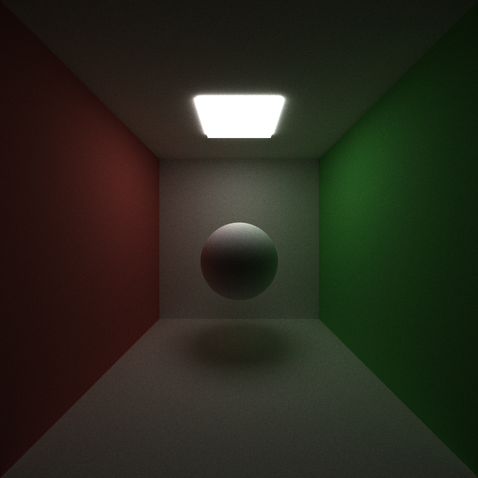
    <figcaption>800×800 / 5000 samples</figcaption>
  </figure>
  <figure>
    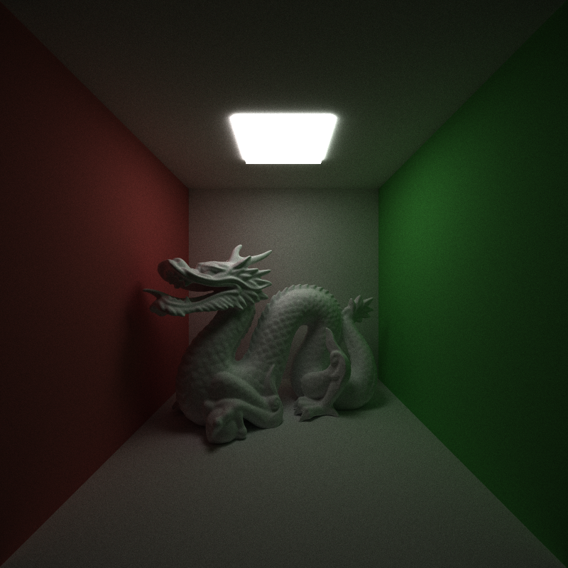
    <figcaption>800×800 / 5000 samples</figcaption>
  </figure>
  <figure>
    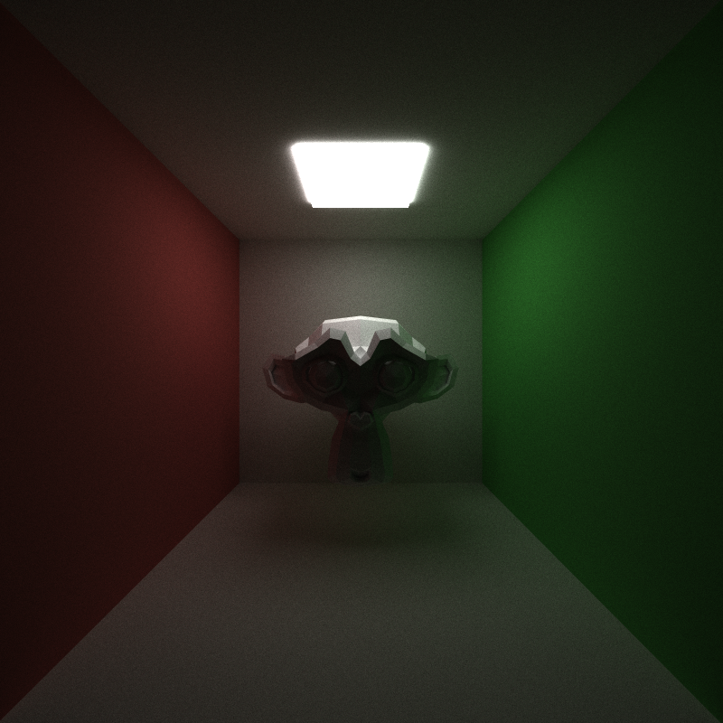
    <figcaption>800×800 / 5000 samples</figcaption>
  </figure>
  <figure>
    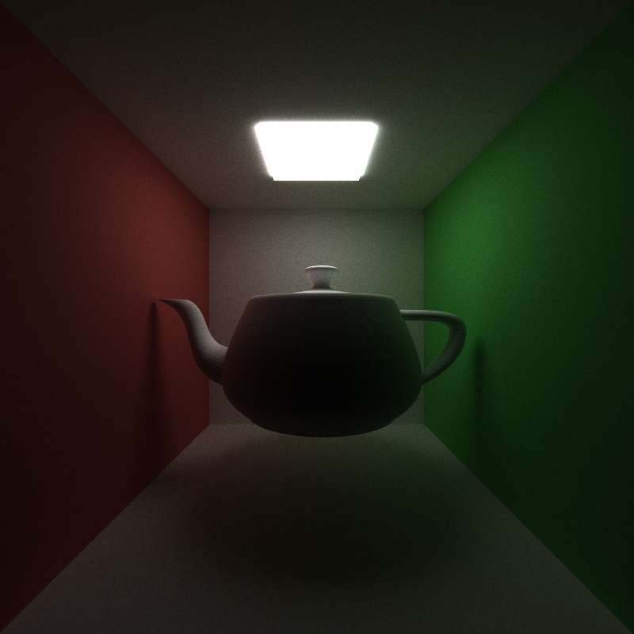
    <figcaption>800×800 / 5000 samples</figcaption>
  </figure>
</div>

#### Cosine-weighted hemisphere sampling

The BSDF informs us how rays are scattered, but we can cheat a little to speed up rendering time. The idea behind [cosine-weighted hemisphere sampling](https://pbr-book.org/4ed/Sampling_Algorithms/Sampling_Multidimensional_Functions#Cosine-WeightedHemisphereSampling) is that we should sample $\omega_i$ such that it's likely to contribute light, leading to faster convergence.

This is guided by Lambert's cosine law: rays near the "dome" of the hemisphere (i.e. smaller incidence angle) have a greater $\omega_i\cdot\vec{n}$ value than those at the bottom. Naively using uniform hemisphere sampling will give us those bottom $\omega_i$ more often.

Since we're manipulating our samples, we have to weigh $\omega_i$'s contribution accordingly. The [PDF](https://en.wikipedia.org/wiki/Probability_density_function) for cosine-weighted sampling is given by

$$
\frac{\text{abs}(\cos{\theta})}{\pi}
$$

which we divide the light contribution by.

```cpp
// Divide by PDF of cosine-weighted sampling
segment.throughput *= bsdf * lambert / pdf;

// Determine next ray origin and direction
segment.ray = {
    .origin = og_ray.at(isect.t),
    .direction = cosine_sample_hemisphere(isect.normal, rng),
};
```

### Perfectly specular dielectrics

What's the opposite of the diffuse shading model? I... don't know the answer, but collapsing from an infinite set of $\omega_i$ to a _discrete_ set of possibilities sounds right to me.

<figure class="mx-auto max-w-120">
  
  <figcaption>
    Credits: [PBRT v4](https://pbr-book.org/4ed/Reflection_Models)
  </figcaption>
</figure>

The figure depicts a _pure reflection_ about the surface normal, but for dielectrics we must also consider refraction, which is governed by the material's index of refraction (IOR).

We will combine them both later to create dielectrics.

> Note that I did not implement rough dielectrics, only the perfectly specular case. I would like to revisit this in the future to completely flesh out my implementation.

#### Pure reflection

First, complete reflection.

<div class="480:grid-cols-2 grid grid-cols-1 gap-pad">
  <figure>
    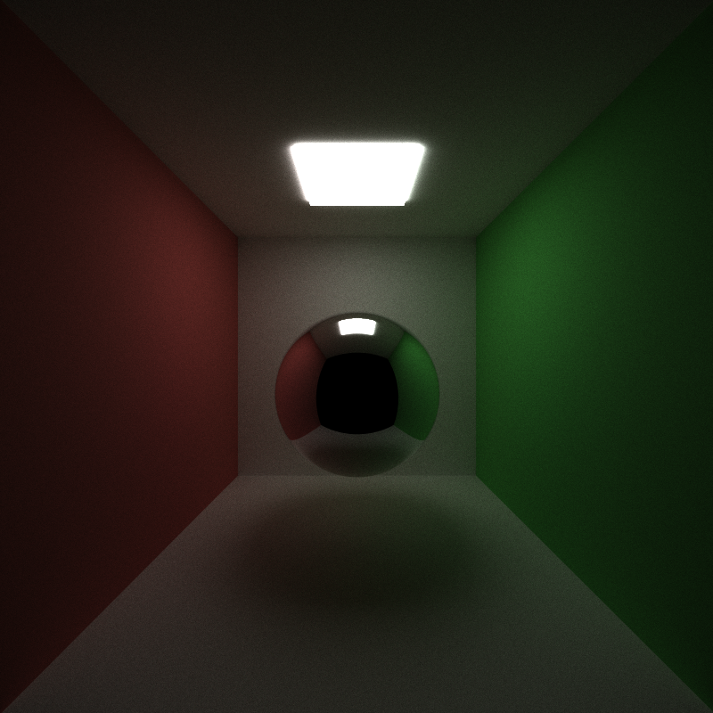
    <figcaption>800×800 / 5000 samples</figcaption>
  </figure>
  <figure>
    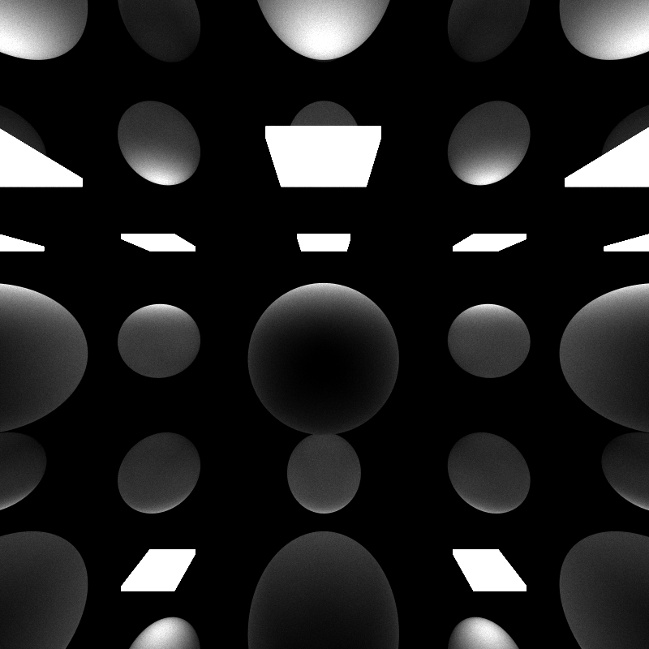
    <figcaption>800×800 / 5000 samples</figcaption>
  </figure>
</div>

The first scene has a single purely reflective material with everything around it set to diffuse. It's essentially a perfect mirror. The second scene inverts everything: every wall is purely reflective.

> The reason most of the scene is black is because the rays are leaving the scene and traveling out of bounds ~~and I never implemented environment maps :(~~

#### Pure transmission

Transmission was much trickier to implement. Two things in particular stood out.

First, IORs are always defined relative to _something_.[^4] At a given intersection point, we always need to know what medium we're _entering_ and what medium we're _leaving_, because that affects the IOR ratio. How I keep track of this is to store an additional enum in my `Intersection` data struct that informs me whether the intersection was with the outside of a surface, or inside. Depending on the surface, we may have to flip the IOR.

```cpp
/// Tracks which side of the geometry the intersection is at.
enum class Surface : char { Inside, Outside };

// GLSL/GLM refract expects the IOR ratio to be incident over target, so
// we treat the default as us starting from inside the material
if (isect.surface == Surface::Outside) {
  eta = 1.f / eta;
}
```

Second, there are cases where the incident angle is so large that a refraction actually _reflects back into_ the original medium. This is called [total internal reflection](https://en.wikipedia.org/wiki/Total_internal_reflection), and we have to check for this possibility. `glm::refract` returns zero when this occurs, which I check for and return `std::nullopt`, indicating that no transmissive ray could be generated for this intersection.

> My pure transmission function returns `std::optional<Ray>` for this reason.

Keeping these two things in mind, we can get transmission working.

<div class="480:grid-cols-2 grid grid-cols-1 gap-pad">
  <figure>
    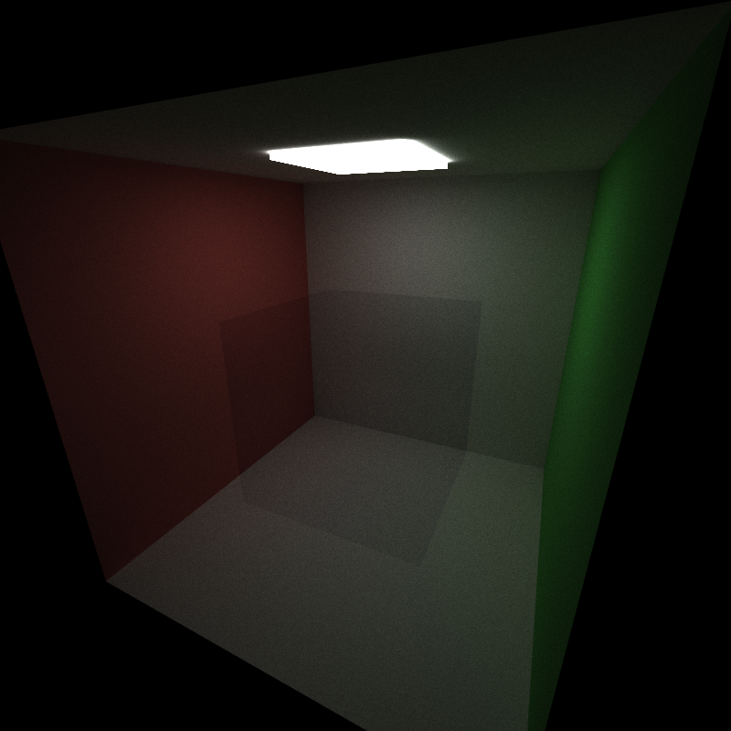
    <figcaption>800×800 / 5000 samples / IOR 1.0</figcaption>
  </figure>
  <figure>
    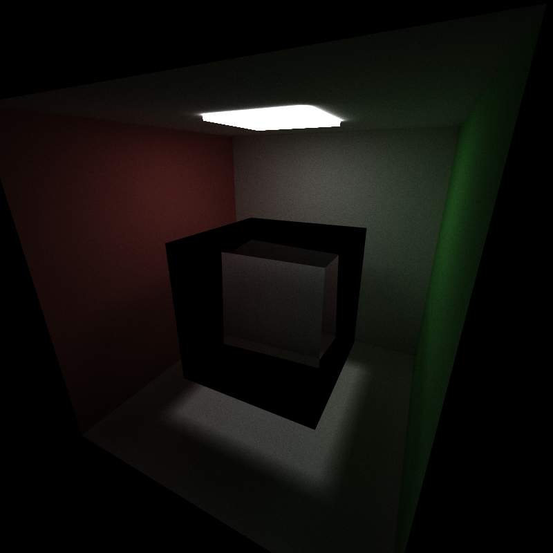
    <figcaption>800×800 / 5000 samples / IOR 1.55</figcaption>
  </figure>
</div>

These renders are... interesting. How do I interpret them?

Well, an IOR of 1.0 means no refraction occurs, causing the first cube to act as a passthrough. With an IOR of 1.55 (roughly that of glass), we get the second scene. I believe the black portions of the cube are due to total internal reflection, which gets mitigated a little when we combine it with reflection.

#### Glass and the Fresnel reflectance term

Now that we have both parts, let's combine them to create dielectrics! In real life, at an intersection such a material would split $\omega_i$ into _multiple_ rays, consisting of a reflection component and a refraction component.

To make our path tracing a little easier (and to piggyback off of the wonders of Monte Carlo) we can randomly choose whether to reflect or refract, and let the image converge over time. This is the technique chosen by [PBRT v4](https://pbr-book.org/4ed/Reflection_Models/Dielectric_BSDF) which I used as a reference.[^5]

What should the probability be? A simple solution is to set it to 50/50. However, this wouldn't result in an accurate physical render because we're not considering the Fresnel coefficients that dictate how much light is reflected and refracted at an intersection.

<div class="480:grid-cols-2 grid grid-cols-1 gap-pad">
  <figure>
    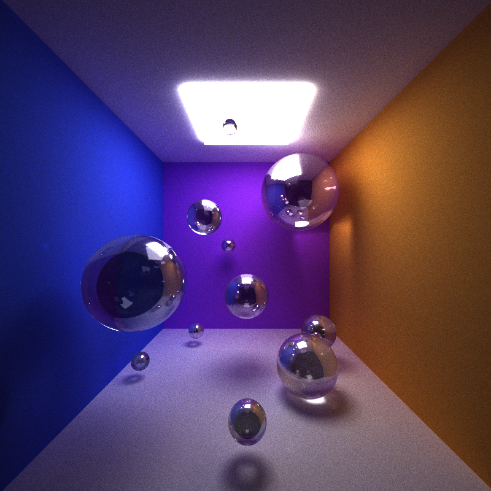
    <figcaption>800×800 / 3000 samples / IOR 1.55</figcaption>
  </figure>
  <figure>
    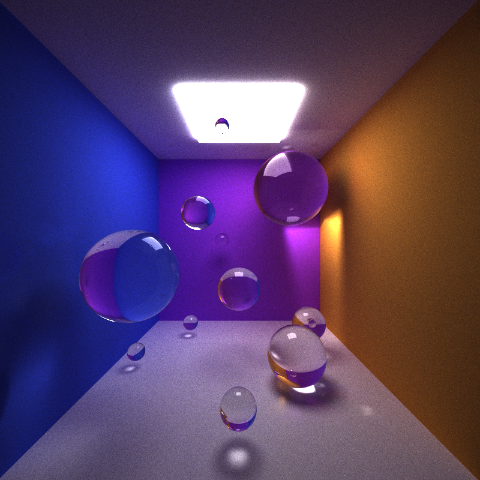
    <figcaption>800×800 / 3000 samples / IOR 1.55</figcaption>
  </figure>
</div>

While both renders use the IOR of glass, the second one looks more real because we're considering the Fresnel reflectance term when randomly deciding to reflect or refract the ray:

```cpp
auto rng = make_seeded_random_engine(curr_iter, index, curr_depth);
thrust::uniform_real_distribution<float> uniform_01;

float refl_term = fresnel_schlick(cos_theta(isect.normal, omega_o), eta);
float trans_term = 1.f - refl_term;

// For the inaccurate render, here we would be comparing against 0.5
if (uniform_01(rng) < refl_term) {
  // Treat ray as pure reflection
} else {
  // Treat ray as pure transmission
}
```

In real life, calculating the reflectance term requires solving the [Fresnel equations](https://en.wikipedia.org/wiki/Fresnel_equations). However, this is graphics so we can cheat! A popular alternative is to use Schlick's approximation, first demonstrated in 1994, which computes the term in a more efficient and simple manner. Here are some resources that helped me:

- [Christophe Schlick's original paper](https://web.archive.org/web/20200510114532/http://cs.virginia.edu/~jdl/bib/appearance/analytic%20models/schlick94b.pdf). The approximation appears on page 7. Note this is a digital archive of the original page via the Wayback Machine.
- [The Wikipedia article about the topic](https://en.wikipedia.org/wiki/Schlick's_approximation)
- [Marc Olano's post about the topic](https://umbcgaim.wordpress.com/2010/07/15/fresnel-environment)
- [Chapter 9 of _Ray Tracing Gems II_](https://link.springer.com/chapter/10.1007/978-1-4842-7185-8_9)

Schlick's paper claims that the approximation runs _almost 32 times faster_ than the physical equations. Is this true? To test this, I also implemented the equations and ran the glass spheres scene from above 10 times, averaging the frame rate.

<figure class="px-0">
  <div class="overflow-x-auto">

|  | 1 | 2 | 3 | 4 | 5 | 6 | 7 | 8 | 9 | 10 | Average |
| --: | :-: | :-: | :-: | :-: | :-: | :-: | :-: | :-: | :-: | :-: | :-: |
| **Schlick** | 61.367 | 61.240 | 61.370 | 61.344 | 61.373 | 61.311 | 61.376 | 61.220 | 61.051 | 61.280 | **61.293** |
| **Real** | 61.256 | 61.187 | 61.317 | 61.200 | 61.339 | 61.279 | 61.271 | 60.928 | 61.224 | 61.196 | **61.220** |

  </div>
  <figcaption class="px-pad">Frames per second (FPS), higher is better</figcaption>
</figure>

Schlick appears to be 0.119% faster, which is not significant enough to make a claim about anything. I am not sure why I'm not getting more drastic results. My best guess is that my testing environment is flawed or biased in some manner.

### Roughness

While I did not implement anything close to actual PBR techniques, I was curious how far I could take my pre-existing diffuse and perfectly specular shading models to mimic it. I only had time to introduce a _roughness_ slider that simply lerps between the diffuse and specular ray directions:

```cpp
auto rng = make_seeded_random_engine(curr_iter, index, curr_depth);

glm::vec3 spec_dir = find_pure_reflection(og_ray, isect).direction;
glm::vec3 diffuse_dir = cosine_sample_hemisphere(isect.normal, rng);

segment.throughput *= material.color;
segment.ray = {
    .origin = og_ray.at(isect.t),
    .direction = glm::lerp(spec_dir, diffuse_dir, material.roughness),
};
```

I got this idea while watching Sebastian Lague's [Coding Adventure: Ray Tracing](https://www.youtube.com/watch?v=Qz0KTGYJtUk) video. Well, how ~~bad~~ good is it?

<figure>
  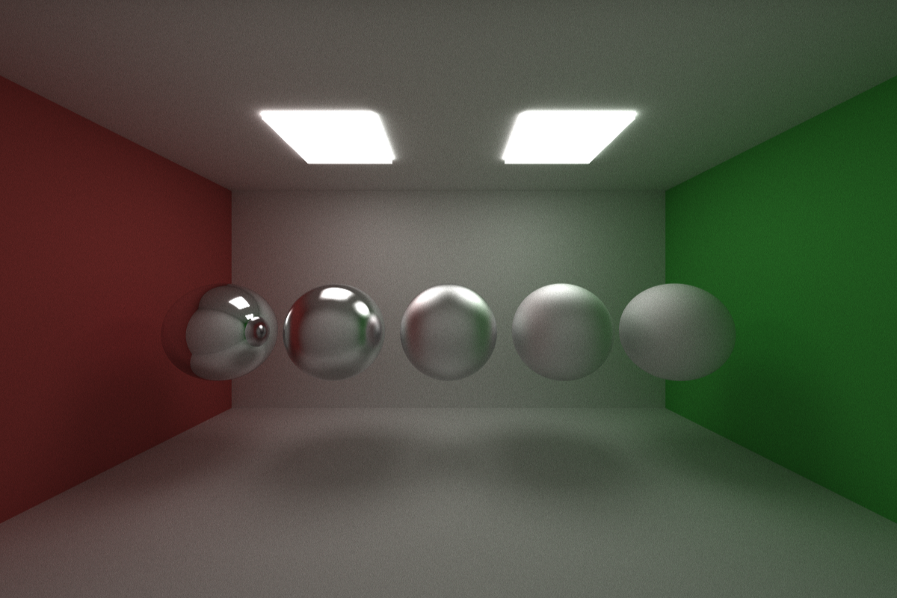
  <figcaption>
    1200×800 / 5000 samples / Roughness, left to right: 0.0, 0.2, 0.45, 0.65,
    0.9
  </figcaption>
</figure>

I would say this is not bad at all! The results are a little blobby but that's to be expected for such a cheap estimate.

## Anti-aliasing via stochastic sampling

We've been adding a lot of features to the scene. What about the camera itself?

There are many ways to solve aliasing. Stochastic sampling is one of them and is pretty easy to add. I have to modify my initial camera ray generation code. The issue is that it shoots the same exact ray direction for every sample of the pixel.

It's easy to think of the rendered world only in terms of pixels, but there usually is two or more geometry inhabiting the same pixel! If we were to use the same direction every time, we would never get to sample the other geometry's color contribution.

The solution is to add some randomness such that multiple different areas _within_ a pixel have an opportunity to be sampled.

```cpp
int index = blockIdx.x * blockDim.x + threadIdx.x;

// Derive image x-coord and y-coord from thread index
float y = glm::ceil((static_cast<float>(index) + 1.0) / camera.resolution.x) - 1.0;
float x = static_cast<float>(index - y * camera.resolution.x);

thrust::default_random_engine rng = make_seeded_random_engine(curr_iter, index, max_depth);
thrust::uniform_real_distribution<float> uniform_01;

// Reduce aliasing via stochastic sampling
y += uniform_01(rng);
x += uniform_01(rng);
```

That's it! We add a random value between $[0.0,1.0)$ so that the ray direction generated will never be the same for a given pixel.

<figure>
  <div class="grid grid-cols-2 gap-pad">
    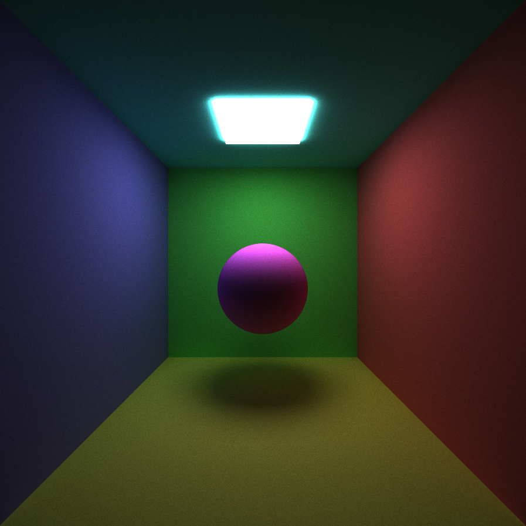 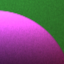
  </div>
  <figcaption>__Stochastic sampling.__ 1000×1000 / 10k samples</figcaption>
</figure>

<figure>
  <div class="grid grid-cols-2 gap-pad">
    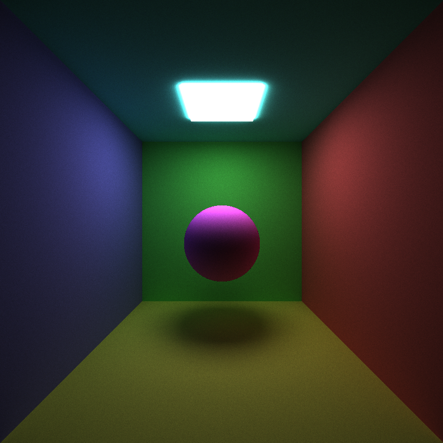 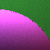
  </div>
  <figcaption>__No stochastic sampling.__ 1000×1000 / 10k samples</figcaption>
</figure>

The jagged edges are particularly noticeable on diagonal or curved lines. In the scene above, pay close attention to the intersection between the walls and the sphere outline.

## Depth of field and thin lens camera model

Virtual cameras commonly use a [pinhole camera](https://en.wikipedia.org/wiki/Pinhole_camera), which models all rays traveling through a single infinitesimal point to hit the (imaginary) film plane.

However, by simulating a _thin lens_ with an aperature diameter, we can achieve more interesting effects like depth of field (DOF). This essentially comes for free with path tracing because of how we're simulating light.

Once again, PBRT v4 is a great resource and has a [section on thin lens models](https://pbr-book.org/4ed/Cameras_and_Film/Projective_Camera_Models#TheThinLensModelandDepthofField), which I referenced for my DOF implementation.

The idea is we sample a random point on the lens (which is thin enough to simply be considered a circle), and use that as the initial camera ray's origin.

```cpp
thrust::default_random_engine rng = make_seeded_random_engine(curr_iter, index, max_depth);
thrust::uniform_real_distribution<float> uniform_01;

// Sample point on lens
glm::vec2 sample = sample_uniform_disk_concentric(uniform_01(rng), uniform_01(rng));
glm::vec2 lens_point = settings.lens_radius * sample;
```

We also adjust the ray direction such that it intersects with the imaginary focus point. This is what allows us to "focus" a particular slice of the scene, and blur everything else.

```cpp
// We want the relative distance from the camera to the plane of focus, so it
// doesn't matter what sign  the ray direction is
float t = settings.focal_distance / glm::abs(ray.direction.z);
glm::vec3 focus = ray.at(t);

// Offset ray origin by lens sample point and adjust direction such that the ray still
// intersects with the same point on the plane of focus
ray.origin += glm::vec3(lens_point.x, lens_point.y, 0.f);
ray.direction = glm::normalize(focus - ray.origin);
```

With that, we get DOF!

<div class="480:grid-cols-2 grid grid-cols-1 gap-pad">
  <figure>
    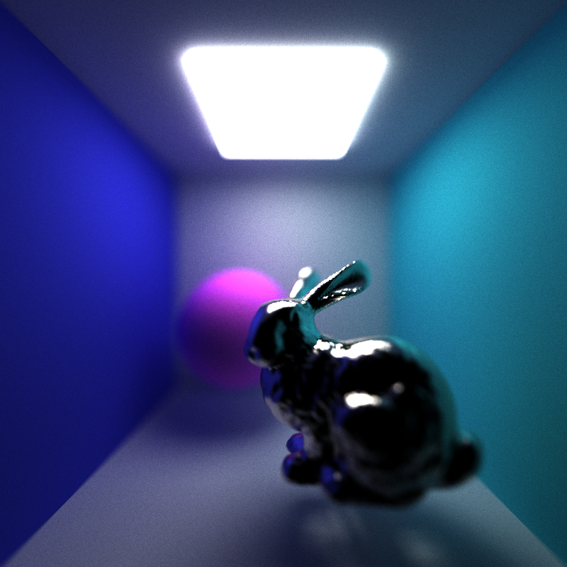
    <figcaption>800×800 / 5000 samples / 12 depth </figcaption>
  </figure>
  <figure>
    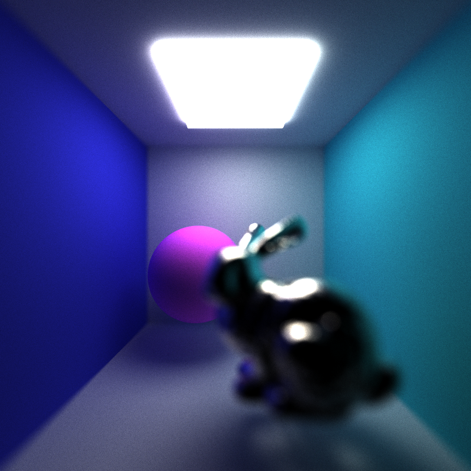
    <figcaption>800×800 / 5000 samples / 12 depth</figcaption>
  </figure>
</div>

Here we can see the focus point at two different places: the Stanford bunny, and the sphere.

## glTF model loading

In order to produce more interesting scenes, it would be beneficial if we could load additional models from online. To that end, I added the [`tinygltf`](https://github.com/syoyo/tinygltf) library to the project, which parses the data to C++ structs.

> I currently do not consider scene hierarchy nor transformations. Models are loaded assuming they are defined at the world origin with zero rotation, translation, and a scale of 1.
>
> In the future I would love to add proper glTF scene traversal.

### Creating a mesh

While the library helps us load the raw data, I still have to create a complete mesh from it! The minimum amount of vertex data I needed were positions and normals. I parse these out of the binary buffers specified by glTF and manually construct triangles.

A `Triangle` struct stores three vertices, but my `Vertex` structs do not store the actual position and normal values; instead, it stores a position and normal index into a global `position_list` and `normal_list` buffer available on device. This allows each triangle to be much smaller in size (six `int`s versus six `glm::vec3`s).

### Recycling vertex data indices

When parsing the glTF mesh data, I check if the current position value I want to add already exists in the global position list. If it does, I reuse the index of that position for this triangle. This allows me to send much less position data to the GPU. I do the same thing for normals.

While on paper this should provide a speed-up, in practice my first implementation was catastrophically slow. This is because I used `std::find` and stored the vertex data in a `std::vector`. If we do this for every vertex attribute in the mesh, that results in a $O(n^2)$ operation time. For something like the Stanford dragon, which has over 435,000 unique position data, this made loading the model impossible.

To solve this, we need to dramatically reduce lookup times. On my second try, I used a map instead, pairing each unique data point to its index. At the end, we perform one single $O(n)$ pass to transfer each entry over to its vector index:

```cpp
// Same for positions and normals. Make sure to call data_list.resize() before!
for (const auto& [data, idx] : unique_data) {
  data_list[idx] = data;
}
```

By using a map, checking whether a data point is unique is now on average $O(1)$ instead of linear.

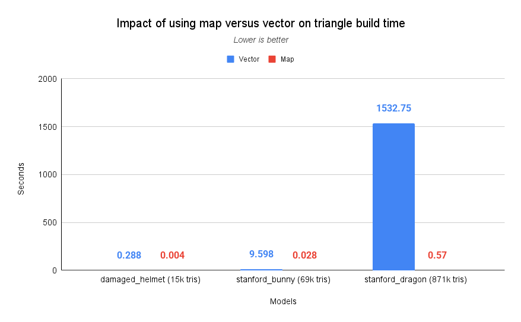

The graph is a little comical and clearly demonstrates the exponential operation time. Yes, the 1532.75 seconds for `stanford_dragon` meant that my original implementation caused scene loading to take over 25 minutes. I am glad that it's fixed.

### Ray-triangle intersection

A mesh is just a giant list of triangles that encompass it. Since the primitives we're intersecting with aren't spheres or cubes anymore, we need to write a new intersection test function, this time for lists of triangles. Luckily, GLM provides `glm::intersectRayTriangle` for me to start with.

My first implementation was simple and naive. For each triangle in the mesh, we perform a ray-triangle intersection test. If successful, we calculate intersection terms and return early. However, this logic is incorrect because it may not necesarily return the intersection with the _smallest_ `t` value.

<div class="480:grid-cols-2 grid grid-cols-1 gap-pad">
  <figure>
    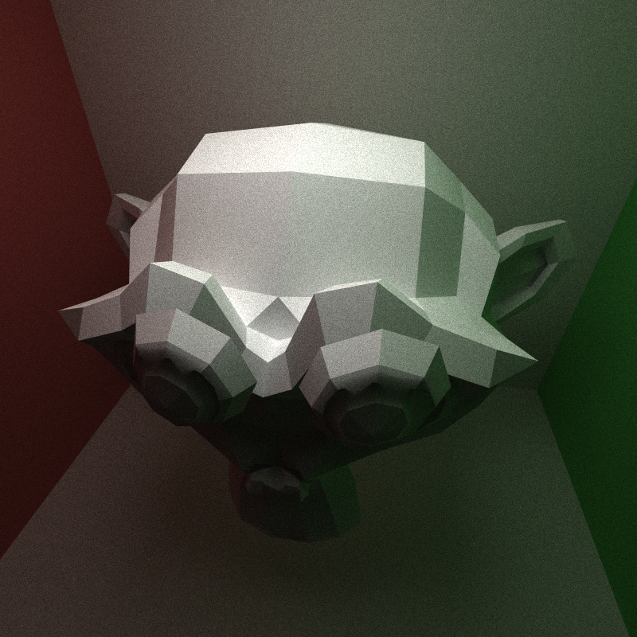
    <figcaption>Not taking the minimum `t` value</figcaption>
  </figure>
  <figure>
    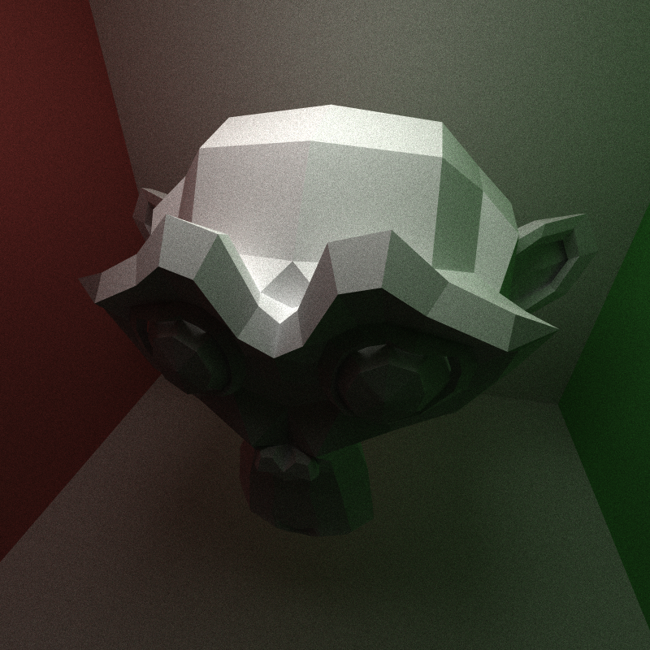
    <figcaption>Taking the minimum `t` value</figcaption>
  </figure>
</div>

In the first render we can see Suzanne's eyes are protruding out of the face when they should be shadowed by the eyebrows, as seen in the second.

So, similar to the logic for finding the closest geometry, we keep track of the smallest `t` value found so far, and update the intersection data only if we've found a closer one. This also means that we cannot return early because the closest triangle may be the last one in the triangle list.

## Intersection culling

Computing intersections with the scene is one of the most expensive operations in the path tracer.

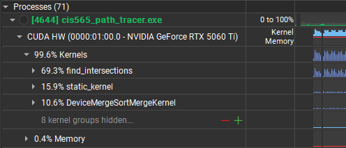

Running Nsight Systems on my executable confirms this. In terms of CUDA operations, 99.6% of overall operations were spent on kernels, with 69% of those being spent on `kernel::find_intersections` itself! Meanwhile, memory operations were only 0.4% of operations.[^6]

If we show the kernel operations in the Events View and sort by duration, we can also see that `kernel::find_intersections` takes up all the spots at the top of the list, meaning it makes up the bulk of our compute time.

<figure>
  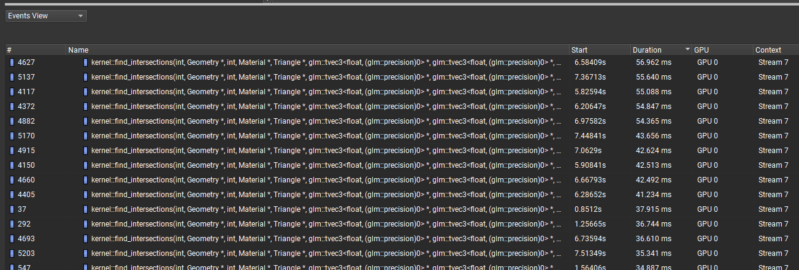
  <figcaption>Intersections all the way down</figcaption>
</figure>

So, reducing the number of intersections with the scene will be one of the most high-impact changes we can make. My path tracer offers two solutions: AABBs and BVHs.

### Axis-aligned bounding boxes (AABB)

AABBs are conceptually simple and also easy to implement. They scale very very well with heavier models, because the data required stays the same: two `glm::vec3`s to represent the minimum and maximum world positions of the model.

```cpp
struct Aabb {
  glm::vec3 min = glm::vec3(std::numeric_limits<float>::max());
  glm::vec3 max = glm::vec3(std::numeric_limits<float>::lowest());
};
```

Performing operations on an AABB is also extremely easy. To include a new point in the AABB, we take the minimum between the point and the current minimum, and do the same for the maximum. To include a triangle, we do this for each of the three vertices.

```cpp
/// Adds `point` to the bounding box, growing the bounds if necessary.
void include(glm::vec3 point) {
  min = glm::min(min, point);
  max = glm::max(max, point);
}
```

In `kernel::find_intersections`, for each geometry in the scene, we first check if the ray intersects with the AABB, which is (usually) more efficient to compute. If the ray missed, then we can skip the intersection test entirely, and move on to the next geometry.

#### Pre-computing inverse ray direction

This was an interesting performance gain I wanted to highlight. My AABB-ray intersection test is based on [this article by Tavian Barnes](https://tavianator.com/2022/ray_box_boundary.html). In the algorithm, we have to perform two divisions by the ray direction. About this operation, he writes:

> "_We precompute `ray->dir_inv[d] = 1.0 / ray->dir[d]` to replace division (slow) with multiplication (fast)._"

Really? Would this really make a difference? Since a thread is launched for every path segment, every intersection test with scene geometry uses the same ray. So I pre-computed the inverse direction once before the loop and passed it into the AABB-ray intersection function.

And it turns out, yes, he's very much speaking the truth.

|                 | Pre-computing the inverse | Dividing by direction |
| --------------: | :-----------------------: | :-------------------: |
| **Average FPS** |          59.715           |        49.567         |

Pre-computing the division term made my scenes run faster by _roughly ~20%_ and this held true for most scenes, with those having more objects seeing the most benefit. A cursory search for division performance on the GPU led me to [this discussion on NVIDIA Developer forums](https://forums.developer.nvidia.com/t/speed-comparison-of-division-compared-to-other-arithmetic-operations-perhaps-something-like-clock-cycles/168371), which saw division being ~10 times slower than multiplication.

Given that this division would be occurring in a hot loop and is entirely unavoidable, the speed up is not surprising. I was surprised at how _much_ it made an impact, though.

### Bounding volume hierarchy (BVH)

However, AABBs are not enough. For models with many triangles, they cannot help because if the intersection is successful, we'll need to iterate through the entire triangle list. Is there some way of addressing this?

BVHs work on the following principle: if the ray has intersected with some bounding box, then anything _outside of that box_ does not need to be checked anymore, and can immediately be discarded.

For instance, what if we split our model into two different AABBs, let's say at the midpoint of the model? If the ray intersected with one AABB, then we know every triangle in the other AABB, aka the other half of the model, can be safely ignored.

That's the idea. Of course, having never built one before I needed to do some research. My implementation was primarily guided by the following two resources:

- [Sebastian Lague — Coding Adventure: More Ray Tracing!](https://www.youtube.com/watch?v=C1H4zIiCOaI)
- [Jacco's Blog — How to build a BVH series](https://jacco.ompf2.com/2022/04/13/how-to-build-a-bvh-part-1-basics/)

I decided on a binary tree structure. Every node in the tree either has two children or is a leaf. If the node is a leaf, then it contains a list of triangles. Every node also has an AABB. It follows that the AABBs for two children make up the parent's AABB.

While I construct the BVH on the CPU, the data needs to be sent to the GPU. Therefore, a naive implementation of a node like this:

```cpp
struct BvhNode {
  Aabb bbox;
  BvhNode* c0;
  BvhNode* c1;
  std::vector<Triangle> triangles;
};
```

would not work, because we can't dynamically allocate memory for the triangles, nor can we store references to the node children. Instead, all the BVH nodes need to be stored as a list in a buffer, and the triangles as well. We then store _indexes_ into those buffers in the `BvhNode` struct to act as references.

```cpp
struct Node {
  Aabb bbox;
  int child_idx;
  int tri_idx;
  int tri_count;
};
```

In my implementation, the children BVH nodes are placed next to each other in the buffer, so we can get away with storing one child index; the other one is located at `child_idx + 1`.

#### Stackless tree traversal

A word on traversing the BVH structure: we're performing this on the GPU, so we can't repeatedly recurse into the children nodes. Trust me, I tried.

Instead, we have to maintain a _stack_ of nodes that we haven't processed. Then, for each node, after we remove it from the stack, we check if it's a leaf or if it has children. If it's a leaf, we perform ray-triangle intersection tests on its list of triangles. Otherwise, we push the two children BVH nodes to the top of the stack, and repeat the steps as long as the stack is not empty.

#### Performance improvements

So, how much do BVHs improve performance?

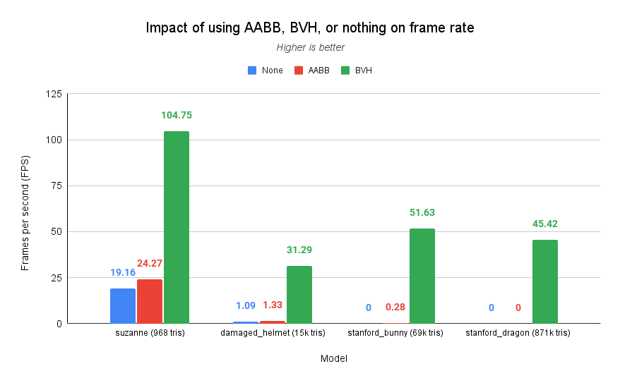

_The bottom line is that without BVHs I simply could not run certain scenes_. Anything above roughly 3,000 triangles would simply take too long to converge to a passable image. For the Stanford bunny and Stanford dragon, loading the scene made my program crash, so I've assigned them a FPS of zero.

From the graph we can see the logarithmic nature of the BVH. At every step of the BVH traversal we remove around half of the current triangles, so while the Stanford dragon has more than 10 times the triangles of the Stanford bunny, the FPS did not significantly drop.

## Partitioning path segments

Choosing to launch kernels every path bounce allows us to discard paths we don't need to perform additional computations on anymore. By discard, I mean we dynamically adjust the number of blocks we launch per kernel at runtime.

Each pixel gets a `PathSegment` struct which stores its current state. All of these segments are stored in a big buffer allocated on device. By partitioning this buffer, we can separate paths that are still "active" and those that aren't. I currently do this in two phases:

- Discarding paths that went out of bounds (OOB)
- Discarding paths that have intersected with a light

Partitioning the buffer also rearranges the active paths such that they're now contiguous in the buffer.

- For scenes that are less bounded by walls and have more open space, discarding OOB should improve performance.
- Scenes that are closed will not benefit from partitioning and may even decrease in performance due to the extra overhead of the algorithm not being offset.
- Scenes that may contain a large number of lights will benefit from the ray light intersection discarding step.

## Sorting paths by intersection material

Another optimization I made is to keep paths that intersected the same material contiguous in the buffer. I reference the material at an intersection via a `material_id`, a number, so `thrust::sort` can just compare the two material IDs of an intersection to perform the sort.

The reason for this change is to reduce random accesses into the global material list within a warp. When parsing the scene JSON file, we create a `Material` struct for each possible material in the scene, and make it accessible at runtime in a buffer allocated on device.

By grouping paths with the same materials together, they all benefit from the caching benefits of accessing the same material over and over within a warp. The more materials and objects in the scene, the more pronounced this effect will be.

## Bloopers

Here are some failed renders that I thought looked pretty cool.

<div class="480:grid-cols-2 grid grid-cols-1 gap-pad">
  <figure>
    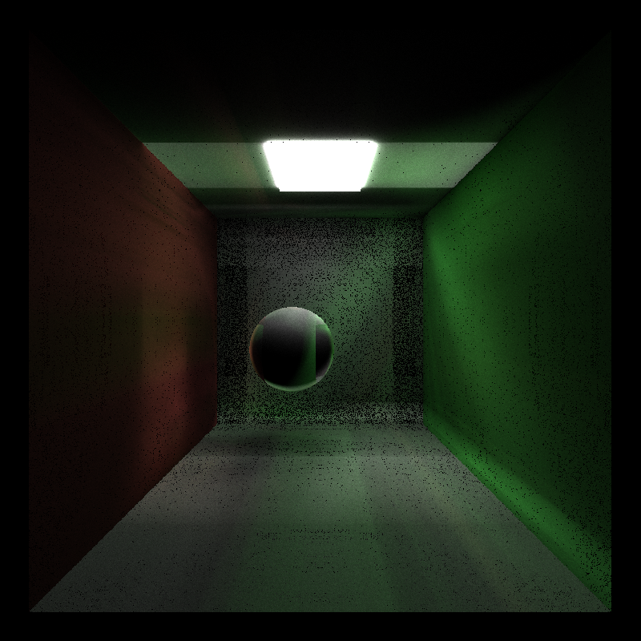
    <figcaption>The seed for my random number generator was off</figcaption>
  </figure>
  <figure>
    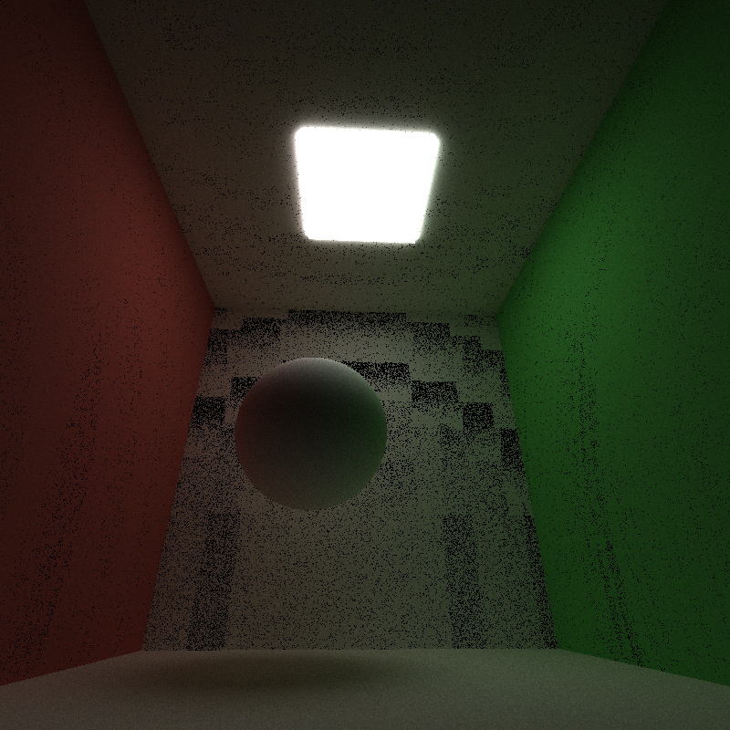
    <figcaption>Objects were self-intersecting</figcaption>
  </figure>
  <figure>
    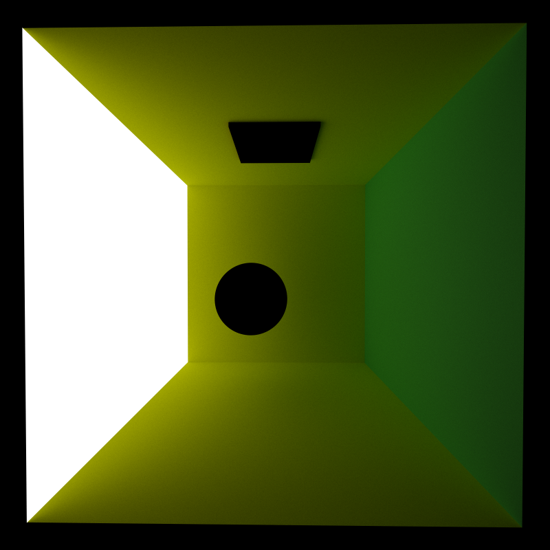
    <figcaption>Honestly, no clue what I did here</figcaption>
  </figure>
  <figure>
    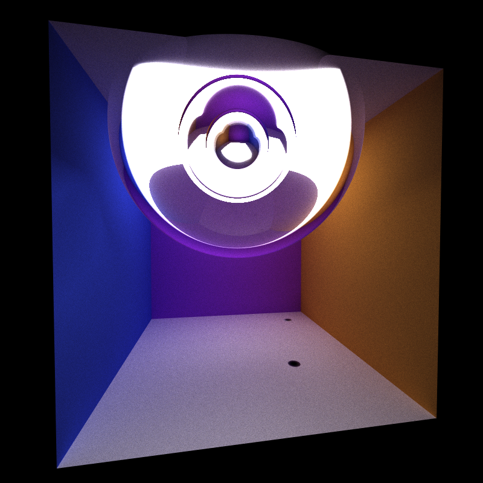
    <figcaption>Messed up my IOR calculations somewhere</figcaption>
  </figure>
</div>

## Future work

Some stuff I would do differently next time:

- Store geometry in world space to prevent having to transform to local object space first, perform computations, and then transform position/normals back
- In terms of development, breaking problems into much smaller parts and individually testing each before moving on. I got bit way too many times because I wrote everything at once and then I had to debug the whole mess.

## Credits

- CIS 5650 staff for the base code
- Lewis Ghrist for the path discarding test scene

### Third party code

- I use [`tinygltf`](https://github.com/syoyo/tinygltf) for loading the initial glTF model data.

### Custom models

The repo contains a lot of scenes with models taken from elsewhere. Here are their sources.

- `suzanne`, `blender_cube`, `plane`: exported from Blender.
- `utah_teapot`: I tried finding the original source model. The closest I could find is from [David E. Johnson's University of Utah page](https://users.cs.utah.edu/~dejohnso/models/models.html). I converted the "Boolean Combined Teapot" .stl file to glTF.

#### Stanford 3D Scanning Repository

Repository can be found at [graphics.stanford.edu/data/3Dscanrep](https://graphics.stanford.edu/data/3Dscanrep/).

- `stanford_bunny`: converted to glTF by me from the original PLY format.
- `stanford_dragon`: converted to glTF by me from the original PLY format.

#### Khronos glTF Sample Assets

The following models are taken from the repository at [github.com/KhronosGroup/glTF-Sample-Assets](https://github.com/KhronosGroup/glTF-Sample-Assets).

- `avocado`
- `damaged_helmet`

[^1]: In actuality, the color of an object is determined by the light wavelengths _not_ absorbed, so the idea of "picking up" the object's color is purely a construct for understanding the path tracer.

[^2]: Small problems such as, you know, having a finite amount of memory in my computer.

[^3]: We're technically finding the _previous_ ray, since we're choosing an incoming ray $\omega_i$. Remember that we're working backwards from the camera to a light source.

[^4]: For my path tracer, one side of the ratio is always a vacuum, which has an IOR of 1.0. This simplifies a lot of calculations.

[^5]: Their discussion about [specular reflection and transmission](https://pbr-book.org/4ed/Reflection_Models/Specular_Reflection_and_Transmission) is very helpful in general.

[^6]: This could just mean my kernels were highly inefficient, which... seems highly likely.
