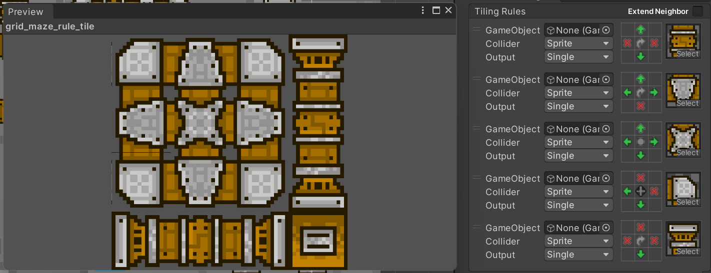

import VideoGif from "@/components/video-gif.astro";

deth (with a lowercase "d") was born out of 24 hours of total insanity. I wasn't even planning on attending this game jam, mind you. I got a call the day of from a friend, who begged me to join their team. You see, they also spontaneously signed up and needed a third person in order for the team to become legitimate.

I'm never someone who backs down from crazy requests, plus I didn't have too much homework that weekend. So I decided to help out a friend in need. ~~Oh how I regret it.~~

## Overview

The game concept is very simple. Each round, you're spawned into a randomly generated arena filled with turrets and moving enemies. You have to eliminate all enemies to clear the wave and move on to the next round. If you take too much damage, you die and your run ends.

You're armed with three kinds of weapons:

- A pistol, with a slow firing rate but very powerful bullets
- An assault rifle, with rapidfire shooting but weaker bullets
- A shotgun, which unleashes a volley of bullets at once in a wide radius.

We tried to "balance" it but the pistol is insanely overpowered (its firing speed should probably be slower). However, I feel that all three weapons have their uses, even late into the game.

## Arena generation

The headaches began when we realized one of our friends has never touched Unity or C# (again, spontaneous). This meant that they originally wrote the generation code in Python, which I had to then translate over to C#.

> ChatGPT did not help. Believe us, we tried. Also, I know, but to be fair we were on a time crunch.

On the bright side, I learned how the generation works. Essentially we treat the arena as an enormous grid, and then iteratively pick a random side of a grid to remove, thus creating a "doorway" into the next grid cell.

We repeat this, doing some additional checks to make sure every cell is accessible by at least one opening, and add some variation by removing varying parts of the wall. This gave us pretty good results and resulted in decently fun gameplay.

## Art, tilemaps, and UI

I did most of the assets for the game, including the walls, backgrounds, and two of the three gun textures. Honestly I have no idea how we ended up with the final art style, I was trying to draw the pipes from Super Mario games as the walls, but give them an industrial twist.

This was my first exposure to [Unity tilemaps](https://docs.unity3d.com/2022.3/Documentation/Manual/Tilemap.html) and it took me some time to become familiar with using them, creating tile rulesets, and scripting the placement of tiles.

<figure>
  
  <figcaption>
    **Tiling rules.** The window on the left shows every single possible combination.
  </figcaption>
</figure>

> The title screen is actually haphazardly thrown together using the arena tileset.

I also threw together a quick UI that basically displays info and stats that we're tracking from the game manager. Some stuff I managed to sneak in includes a nice gun switching animation as well as the round number appearing in the middle of the screen at the start.

<VideoGif content={{ collection: "projects", folder: "deth" }} name="gun-switch-anim" hasWebM />

I greatly enjoy watching the text and gun sprite animate in at _slightly_ different times, giving us a little more personality.

## Play now on itch.io

I don't regret this experience one bit. It's rare to have a "legit" reason to stay awake for 24 hours. You can play the game via itch.io from [UPGRADE's website](https://pennupgrade.com/games/deth) right now.
