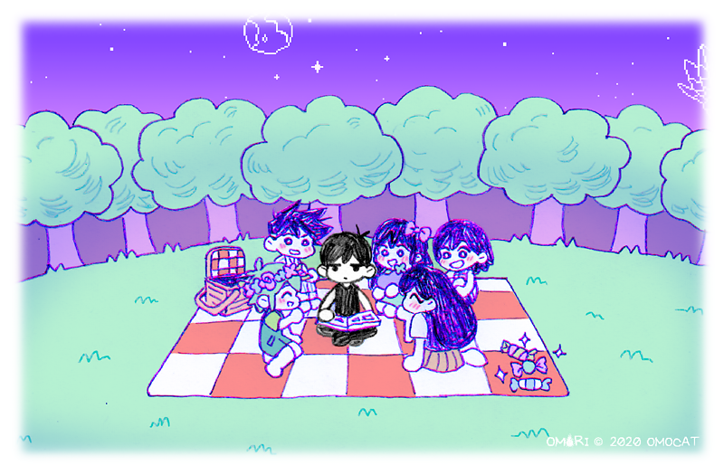
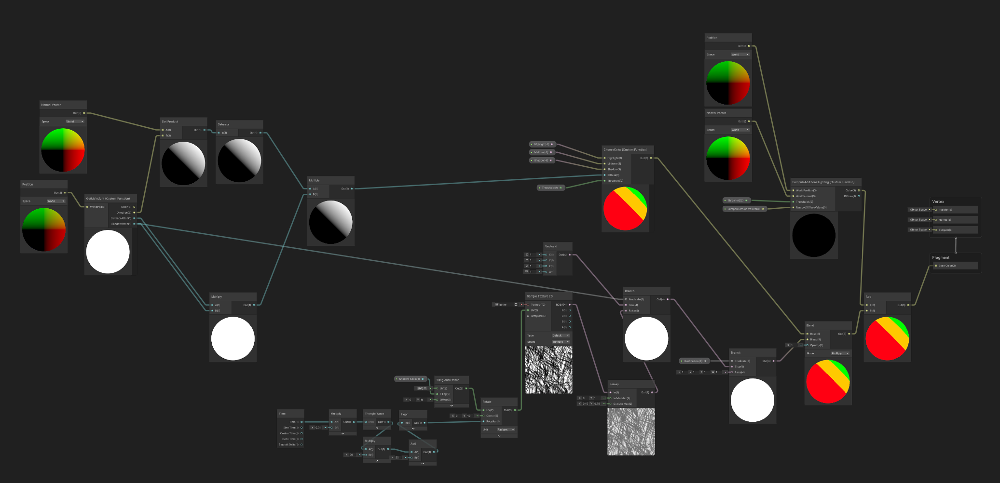
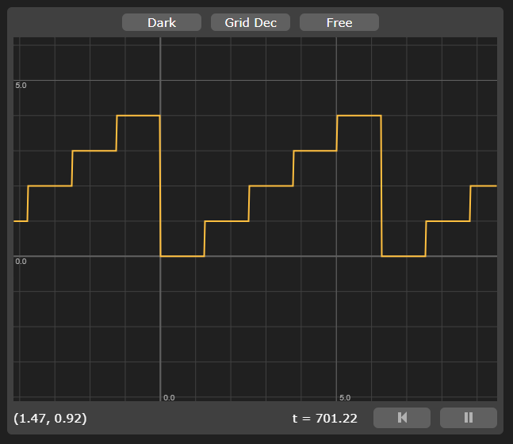
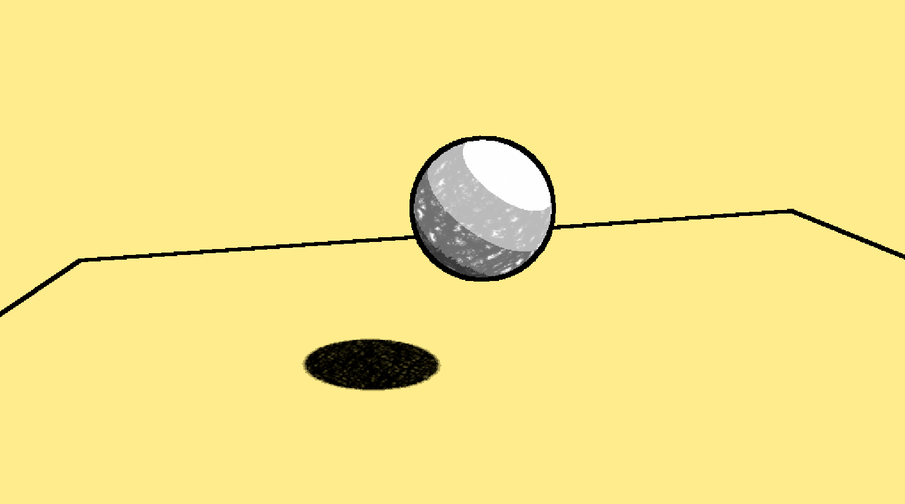
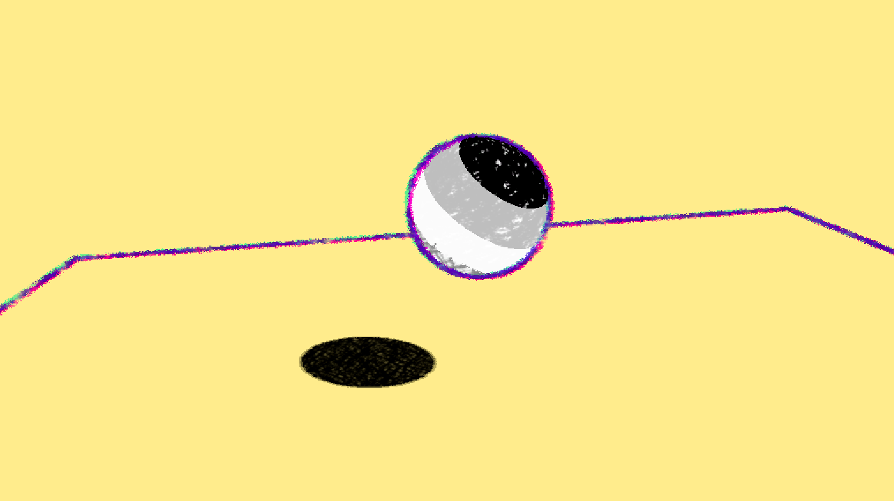
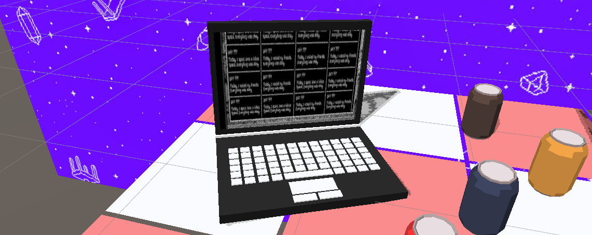
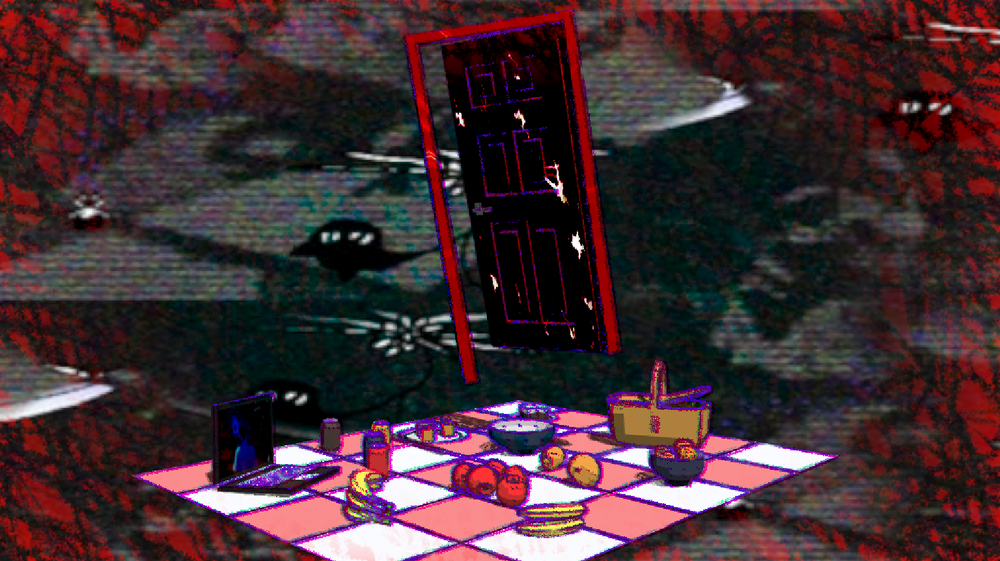

import { Image } from "astro:assets";
import VideoGif from "@/components/video-gif.astro";

For one of the homeworks of our procedural graphics class, CIS 5660, we were to create a stylized scene mimicking some concept art that we pick out. In particular, we focused on using Unity Renderer Features to achieve non-photorealistic rendering (NPR).

## Concept art

The natural pick for me was anything from [OMORI](https://www.omori-game.com/). Any opportunity I get to work with this game, I take it. Here are the two main pieces that guided me, both by OMOCAT:

> I should mention that there will be light spoilers for the game from this point onwards. You've been warned!

  <figure>
    
    <figcaption>
      **Concept art 1.**
      [Source.](https://www.omocat-blog.com/post/648392765629136896/new-art-for-the-walkthroughartbook)
    </figcaption>
  </figure>

  <figure>
    
    <figcaption>
      **Concept art 2.**
      [Source.](https://www.omocat-blog.com/post/654945224037187584/it-has-already-been-6-months-since-omoris)
    </figcaption>
  </figure>

I've always adored OMORI's unique art style, and in this homework set out to recreate the following aspects:

- Scribbly, colored pencil textures
- Wobbly and multicolored outlines that animated over time
- Purple [OTHERWORLD](https://omori.wiki/Otherworld) sky and picnic blanket motif

## Shaders

Homework is still homework and there were two shaders I was required to create.

### Toon shading

<figure>
  
  <figcaption>Shader Graph for my toon shader.</figcaption>
</figure>

What exemplifies NPR more than good ol' toon shading? I will spare you a detailed walkthrough because thousands of people online have already explained it better than I ever will, but this was my general process:

1. Calculate the Lambertian coefficient by taking the dot product between the surface normal and light direction.
2. Clamp it between 0 and 1 inclusive, because values less than zero should be in shadow.
3. I use three colors of decreasing brightness representing a highlight, a midtone, and shadow. The coefficient is compared against two thresholds that then decides which of the three colors is chosen.

### Animated and textured surface

Another requirement we had to meet was to create an additional shader that animated over time. But, this was already a given for me; if you look at any in-game footage, the textures are always "shifting" around. It's a bit hard to explain, so here's a YouTube video:

https://youtu.be/2D1VBDjamoA

To create the drawn look as seen in-game, I drew two textures using Procreate's default pencil brushes. The lighter one emphasizes the scribbles more by being more sparse.

  <Image
    src={import("tex-light.png")}
    alt="White square with lighter black scribbles all over it."
  />
  <Image
    src={import("tex-heavy.png")}
    alt="White square with heavier black scribbles all over it."
  />

The textures being black and white make them very versatile. The values can be interpreted literally and used to multiply by another color, or interpreted as booleans: black (0) for false, and true for everything else.

> I used [this website](https://www.imgonline.com.ua/eng/make-seamless-texture.php) to make the texture tileable.

I can now "animate" these textures by rotating them by a random amount. To emulate the game's behavior of animating across a fixed set of sprites, I sample the UV orientation from a triangle wave that I've increased the amplitude of, and then floored so I could get staggered values that repeated infinitely.

<figure class="mx-auto max-w-[400px]">
  
  <figcaption>
    **Staggered triangle wave.** I used [Graphtoy](https://graphtoy.com) to figure out values before
    programming it.
  </figcaption>
</figure>

Hopefully the image conveys my implementation visually. Each of those steps are a value I plug into my UV rotation. That results in this final output:

<figure>
  <VideoGif content={{ collection: "projects", folder: "door" }} name="door-anim-tex" hasWebM />
  <figcaption>
    The green-yellow-red color scheme is for me testing out the highlight, midtone, and shadow
    colors.
  </figcaption>
</figure>

## Outlines

To perform edge detection we turn to Unity's Scriptable Renderer Features. We first render geometry normals to a RenderTexture, allowing us to sample from it later using screen position UVs. We also enable the depth texture which is just a built-in checkbox, much easier.

For outlines I turned to the [Roberts cross operator](https://en.wikipedia.org/wiki/Roberts_cross). The following two links were very useful in helping me understand what's going on. The video showcases a Shader Graph solution while the article has GLSL code.

- [Outlines - Devlog 2](https://www.youtube.com/watch?v=LMqio9NsqmM)
- [Unity Outlines Shader Tutorial - Roystan](https://roystan.net/articles/outline-shader/)

This gives us basic outlines.

<figure class="float-right ml-8 hidden pb-6 xs:block">
  <Image
    src={import("outline-example.png")}
    alt="Close-up of Mari's elbow, showcasing the multicolored outlines."
  />
  <figcaption>OMORI's unique outline style.</figcaption>
</figure>

However, outlines in OMORI seem to be made up of three overlapping parts: a green, pink, and purple part. Zooming in on the second concept art you can see it very clearly.

<Image
  src={import("outline-example.png")}
  alt="Close-up of Mari's elbow, showcasing the multicolored outlines."
  class="mx-auto xs:hidden"
/>

We need three outlines, so we do exactly that. Each outline has a different color and has its UVs slightly offset to give us the chromatic aberration look. I also use the Random Range node to vary the outline thickness based on screen position. Finally, I replace the solid outline with the scribble texture and animate it using the same method as the surface shader.

## Assembling a scene

I found all the models on Sketchfab. They are [credited in the README here](https://github.com/aczw/hw04-stylization/tree/main?tab=readme-ov-file#5-create-a-scene). All of the items are in some way thematic or relevant to the game, including the floating door and laptop.

Speaking of laptop, I created a custom shader that specifically draws a texture to the screen geometry.

To prevent the door from self-shadowing and ruining the 𝓪𝓮𝓼𝓽𝓱𝓮𝓽𝓲𝓬, I added a `UseShadow` shader parameter that completely turns off shadow attenuation in the main toon shader.

> We're not exactly being realistic in this homework.

### Scrolling background

I couldn't figure out how to achieve this effect using Unity UI or another render pass, so I resorted to this hack.

As the image above betrays, the purple scrolling background you see is actually a giant plane that is perpendicular to the camera view vector. I made it a child of the camera so any transforms are applied to the plane as well.

I scroll the UVs of an image in a shader that I specifically wrote for the background. The material is then applied to the plane.

## Interactivity

Press spacebar to toggle between two different views.

A number of changes occur:

- The background translates faster in the opposite way and the image is replaced.
- Similarly, the turntable camera rotates faster and in the opposite direction.
- The subtle white vignette around the screen border gets replaced. Instead, I use the scribble texture from before as an interpolation value between a pure red color and the scene color. This gives it the "veiny" look. It is also animated.
- I change the door's material to a modified version of the surface shader: the animation speed is cranked up.
- The laptop screen displays... [something else](https://github.com/aczw/hw04-stylization/blob/main/Assets/Textures/othermari.jpg). IYKYK.

### Web build

The version you see at [door.czw.sh](https://door.czw.sh) (live demo above) has some web-specific goodies: I toggle between a red and white background color for the body, and I also update the favicon.

I should probably add a hint to press the spacebar, but I'll let future me take care of that. For now, thanks for reading.
