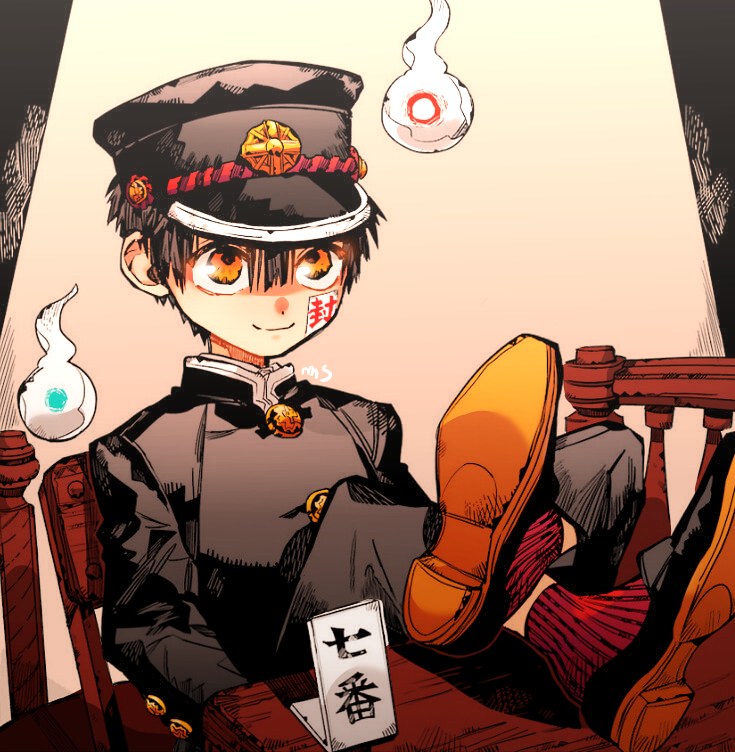

When I saw the next homework for our Procedural Graphics class was to make a "procedural fireball," I instantly knew where to get inspiration from: [Jibaku Shounen Hanako-kun](https://anilist.co/manga/98842/ToiletBound-Hanakokun/).

> I refuse to call it by its English name. If you see it you'll understand too.

<figure class="mx-auto max-w-[200px] xs:float-right xs:ml-6 xs:pb-3">
  
  <figcaption>**Hanako-kun.** And his hakujoudai.</figcaption>
</figure>

In particular, two characters from the manga have floaty things hovering around them at all times (called _hakujoudai_ and _kokujoudai_ apparently), doing their bidding. They looked close enough to fireballs, so why not?

Many values in both shaders below are customizable via a GUI on the live demo page. Adjust colors, noise roughness, tail speed, and more.

## Vertex shader: deformation and tail creation

I uses trigonometric functions for the base and then add FBM on top to give the surface some more detailed variety. To get the "tail" I use the dot product between the vertex normal and a hardcoded `(0, 1, 0)` vector to vary the height at that location.

Vertex positions are displaced over time, and the tail is animated using another trigonometric function.

## Fragment shader: shading, the ring, and animation

The fireball is made up of two primary colors. Lambert shading is calculated by taking the dot product of the surface normal with the camera direction, so the geometry facing the screen is always lit up.

The glowing ring expands and shrinks in size over time, and I use a sawtooth function to make it pulse. I also smoothly interpolate the outer edge of the ring, giving us a gradient.
