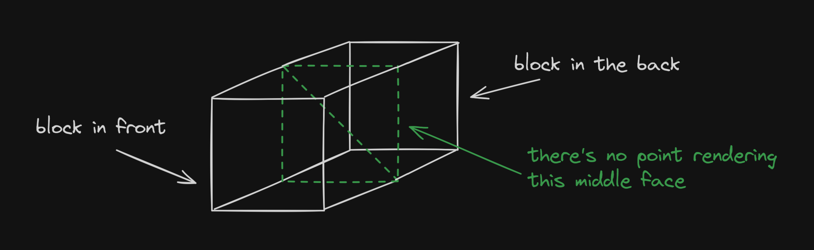

First, let's take a look at this snazzy ~2.5 minute showcase reel that I made ~~at 6 AM after pulling an all nighter finishing the project~~.

<figure class="mdx-bleed-wide">
  <div
    class="overflow-hidden rounded-xl"
    style="padding:56.25% 0 0 0;position:relative;"
  >
    <iframe
      src="https://player.vimeo.com/video/893391293?badge=0&amp;autopause=0&amp;player_id=0&amp;app_id=58479"
      frameborder="0"
      allow="autoplay; fullscreen; picture-in-picture; clipboard-write; encrypted-media; web-share"
      referrerpolicy="strict-origin-when-cross-origin"
      style="position:absolute;top:0;left:0;width:100%;height:100%;"
      title="Mini Minecraft - Geedle War Crimes"
    ></iframe>
    <script src="https://player.vimeo.com/api/player.js"></script>
  </div>
  <figcaption>
    If you're not seeing the video for some reason, here's the [direct
    link](https://vimeo.com/893391293) to watch it.
  </figcaption>
</figure>

It does a nice job of demonstrating our engine's features and gives credits where due. While we all contributed code, I focused primarily on the following features:

- Chunking
- Efficient chunk rendering and block face culling
- Textures and animations
- Distance fog
- Day/night cycle and sky system (sun, moon, clouds, stars)
- Flood fill lighting
- GUI, inventory, and text rendering

I wanna talk a bit about each, some implementation details, and any other interesting details.

> Please contact me if you would like to see the project code. Anything I write here are just quick examples (and are definitely not the best way to implement things).

## Chunking

Just like Minecraft, we group the world terrain into 16x16x256 collections of blocks. This chunk data structure is really just a 1D array that stores the block type for a given coordinate. We have helpers that convert a (x, y, z) coordinate to an array index, and vice versa.

```cpp
enum Block {
  EMPTY, STONE, DIRT, OAK_LOG, ETC
};

class Chunk
{
private:
  std::array<Block, 16 * 16 * 256> blocks;
};
```

> Why not a 3D array? A flattened array should enable faster lookup times due to the way it is laid out in memory.

A `Block` enum declares all possible block types in our game. The `EMPTY` block represents air, or the _absence_ of a block. There are some benefits to this. For instance, breaking a block is the same as placing an `EMPTY` block!

Conceptually, our terrain should "own" these chunks, so they all live in a `Terrain` structure. For easy access, we represent a chunk by its lower-left xz-coordinate, and use smart pointers for safety.

> The `glm` namespace comes from [GLM](https://github.com/g-truc/glm), a commonly-used library that implements vectors, matrices and other utilities in an OpenGL-friendly manner.

```cpp
class Terrain
{
private:
  std::unordered_map<glm::ivec2, std::unique_ptr<Chunk>> chunks;
};
```

## Efficient rendering + face culling

Chunking our terrain helps a lot when we draw our blocks. For instance, my teammate implemented multithreading based on my chunks, which are easier to reason about than individual blocks. We render the terrain whole chunks at a time.

A block has six faces. Each face uses two triangles. If we render every face of every non-`EMPTY` block of every chunk, every single frame, our GPU would catch on fire and explode. There's no point in rendering faces that are hidden by another block. The player never sees it.



Instead, we first iterate over every block in the chunk. For each non-`EMPTY` block, we check its six neighbors, and only render a corresponding face if its neighbor is `EMPTY`.

> I did not implement this part, but we only render a small area of the terrain around the player's current position. More details when I talk about distance fog.

In the `Chunk` class, we store pointers to its neighbors. This way, we can check the neighbor of a block that may reside in a different chunk.

```cpp
enum Direction {
  X_POS, X_NEG, Z_POS, Z_NEG, Y_POS, Y_NEG
};

// This really only makes sense for X_POS, X_NEG, Z_POS, and Z_NEG,
// but Y_POS and Y_NEG will be used later for other purposes.
std::unordered_map<Direction, Chunk*> neighbors;
```

If you were to noclip below the ground, it now looks "hollowed out." What you're seeing below is what our caves look like... on the outside! The player is technically inside solid `STONE` right now, but it's just not being drawn.


_I cannot emphasize how much this improves performance._ On my laptop, my framerate basically tripled. This was a crucial step in getting our game to run well.

## Texturing and block animations

I render chunks using [indexed rendering](https://www.opengl-tutorial.org/intermediate-tutorials/tutorial-9-vbo-indexing/) and store all vertex attributes in a single [interleaved](https://www.khronos.org/opengl/wiki/Vertex_Specification#Interleaved_attributes) VBO. This includes UVs and an animation flag that determines whether a block texture should move.

```cpp
struct VertexAttrs
{
  glm::vec4 position;
  glm::vec4 normal;
  glm::vec2 uv;
  GLfloat animated;
}

// See the visual below for more clarification.
int stride = 4 + 4 + 2 + 1;
```

The [`stride` parameter](https://registry.khronos.org/OpenGL-Refpages/gl4/html/glVertexAttribPointer.xhtml) in `glVertexAttribPointer` was difficult to wrap my head around. All it does is tell the GPU when the data for the next vertex starts. To the GPU, our VBO is just a really, really long sequence of floats. So, we have to specify the size of each attribute.


For example, `position` takes up four floats, while `anim` only uses one.

### Block texture atlas

All the block textures in our game live in a 256x256 PNG sprite. Each block face texture is 16x16 pixels, so we can refer to specific textures using a coordinate system. For example, the dirt texture's lower-left corner is located at (2, 1) on our imaginary grid.


We map a block type to the imaginary coordinate for each of its six faces.

```cpp
using DirectionUVMap = std::unordered_map<Direction, glm::ivec2>;
std::unordered_map<Block, DirectionUVMap> block_uv_map;

glm::ivec2 get_dirt_y_neg_uv() {
  // As an example, this accesses the UVs for the Y_NEG face of a
  // dirt block. The enums really come in handy here!
  return block_uv_map[DIRT][Y_NEG];
}
```

Face textures are 1/16 of the whole sprite, so we multiply the coordinate by 1/16 to get the correct UV. Note that this only describes the lower-left corner of the block. We need to add 1/16 horizontally and vertically to get the other three corners.

In our engine, water and lava blocks are seemingly "flowing." This effect was achieved by slowly translating over the whole texture sprite, moving the UV coordinates over time. The `animation` flag turns this on and off.

> "Time" in our game is a `uniform` variable in the shader that we increment by one every frame.

### Handling transparent blocks

At first, transparent blocks like water and glass were overwriting opaque blocks from neighbor chunks. To fix this, we actually need to keep two separate VBOs and index buffers for opaque and transparent blocks.

We first draw all opaque blocks to screen, and _then_ all transparent blocks. This is done through our `Terrain`.

```cpp
void Terrain::render_terrain() {
  // Get the list of chunks we actually want to render
  std::vector<Chunk*> chunk_list = get_chunks(player->position);

  // First render opaque blocks
  for (const Chunk* c : chunk_list) {
    c->render_opaque();
  }

  // Then render transparent blocks
  for (const Chunk* c : chunk_list) {
    c->render_transparent();
  }
}
```

This solves our issue because transparent blocks now have the correct fragment color to overlay on top of.

## Distance fog

If we fly really high up into the air, you'll see a circular fog that surrounds the player and slowly fades blocks into the distance.


In the chunk fragment shader, I obtain the player's world position and the fragment's world position. I find the distance between these two, and divide by a `max_distance` to get a value between 0.0-1.0.

This value is used to lerp between the original block color and the sampled sky color. I use a nice [cubic easing curve](https://easings.net/#easeInCubic) to make the fog get denser the further the block is from the player.

So, what is `max_distance`? At all times, we only render a specific number of chunks around the player: a 12x12 group of chunks, to be exact. The player is always at the center of this group, so the max distance (the circle's radius) is always at most 96 blocks.


So, the distance fog plays a second role: to stop the player from seeing chunks appear and disappear as they move. But, it's worth it to implement for aesthetics alone, I think:


## Day/night cycle, celestial objects

Our engine features a day cycle. We see the sun during the day, and the moon and stars at night. Clouds are always visible. In between, sunsets and sunrises transition us nicely.


During development, I religiously followed the diagram above. It defines a single day as a range from 0.0-1.0, and specifies exact durations for transitions. For example:

- Day is in the range 0-0.375, and is 0.375 long.
- Sunset is between 0.375-0.5, and is 0.125 long.
- The day-to-sunset transition begins at 0.3125 and ends at 0.4375.
- To enable a seamless sunrise-to-day transition, we split it in half.

The relative 0.0-1.0 scale allowed us to constantly change the actual length of the cycle (versus a hardcoded number), making debugging infinitely easier.

### Skybox

The skybox is _not_ a cubemap. We're actually drawing to a screen space quad. To determine the color of each pixel, we cast a ray from the player camera and see what it intersects.

Depending on the direction of the ray, we can decide different colors to give to every single pixel. The picture below, for example, maps the literal ray direction to RGB values.


There's a lot we can do here. For example, map a position to a UV coordinate, and output a different color depending on the value. Or, shooting a ray out and coloring the radius around that ray a different color, up to a certain angle (like a cone). I also lerp between colors depending on the time of day.

### Sun, moon, and stars

Both the sun and moon are quads that rotate at a fixed distance _around_ the player. This allows them to appear "infinitely" far away.

After drawing the sun and moon but before drawing the terrain, I reset the OpenGL depth buffer. This means that they are _always_ drawn behind blocks, no matter the player's y-coordinate.

```cpp
// Called every time our scene is drawn
void paint() {
  /* ...previous rendering stuff... */

  sun.render();
  moon.render();

  // Reset depth buffer so all celestial objects are drawn behind
  glClear(GL_DEPTH_BUFFER_BIT);

  // Keep on renderin'
  terrain.render_terrain();
}
```

Each individual star is a tiny quad that I rotate and scale by a random amount. Originally, the stars also rotated around the player, but that looked too unrealistic when the player climbed things. Instead, it only follows the player's xz-coordinates, but rotates at a fixed y-height.

### Clouds

A giant quad floats above the player at all times. On it, I sample a portion of a large texture that contains all the possible clouds in the world:


This was created in Photoshop. I used a noise function as the base, reduced the number of colors, and deleted the rest to make somewhat realistic-looking swirlies.

When I send the texture to the GPU, I set these options so that the texture repeats itself for UV values outside the normal 0.0-1.0:

```cpp
glTexParameteri(GL_TEXTURE_2D, GL_TEXTURE_WRAP_S, GL_REPEAT);
glTexParameteri(GL_TEXTURE_2D, GL_TEXTURE_WRAP_T, GL_REPEAT);
```

This way, I can offset the UV coordinates based on the player's current world position. When the player moves forward, the UV coordinates translate "back," which gives the clouds the appearance of having been left behind. Take a look at [jdh's implementation](https://github.com/jdah/minecraft-weekend/blob/387ecb554946180094d58c57a4ee216dba506cc4/src/world/sky.c#L350C17-L350C17) to get an idea of the math.

Overall the sky system is pretty rudimentary, but with some good skybox colors, animation times, and tweaking, it feels very cohesive and looks _very_ similar to Minecraft's.

## Flood fill lighting

This section could get its own entire write-up, but there are many articles on the internet that do a much better job explaining than I ever could. I'll link some here:

- [r/gamedev - Fast Flood Fill Lighting in a Blocky Voxel Game](https://www.reddit.com/r/gamedev/comments/2iru8i/fast_flood_fill_lighting_in_a_blocky_voxel_game/)
- [0 FPS - Voxel Lighting](https://0fps.net/2018/02/21/voxel-lighting/)
- [Minecraft Wiki - Light](https://minecraft.wiki/w/Light#Block_light)
- [Wikipedia - Flood fill](https://en.wikipedia.org/wiki/Flood_fill)

In our engine, I store a 1D array in each chunk that tracks each block's light level. Just like Minecraft, our light scale ranges from 0-15.

```cpp
// Using 32-bit integers is overkill for our purposes
// and takes up unnecessary memory
std::array<unsigned char, 16 * 16 * 256> light_level;
```

When generating a chunk's block data, I track all the naturally occurring light sources, like lava. After we finish, I run the flood fill algorithm on each source, starting with a light value of 15. It's important to do this after we populate the `blocks` array so that the algorithm doesn't propagate through opaque blocks.

> The algorithm is also run when a block is destroyed or placed.

We add a new vertex attribute that tracks the light level. In our chunk fragment shader, we multiply our default block color by this additional brightness. Make sure to clamp it between 0.0-1.0 so it doesn't overpower.

Note that each block face samples the light level from its neighbor block. Depending on the light location, this also means each block face can be affected by a different light value! That's what makes this system feel more dynamic and lively, I feel.

> I did the base algorithm implementation, and it works well. My teammate improved it and added colored lights! That's what you see in the final video.

## Inventory

The inventory system is stupidly simple. Here it is in all its glory:

```cpp
struct Inventory
{
  std::array<Block, 9> slots;
  int active;
};
```

Pressing numkeys 1-9 (or scrolling with mouse wheel) sets `active` accordingly. Whenever we want to use the currently selected block, we index into `slots` using `active`. This is nice because we don't have to keep track of what `Block` is selected, that is abstracted away for us.

## GUI

The UI took a bit more planning. Every UI element inherits from a base class that stores our screen's width, height, and aspect ratio. UI lives in 2D space, so I can use UV-like coordinates to specify each UI element's position on the screen.

For example, if we wanted to draw a crosshair texture on a square at the center of the screen, I could use the following vertex positions:

```cpp
class Crosshair : public UI
{
  void set_vbo_data();
};

void Crosshair::set_vbo_data() {
  // Upper right, lower right, lower left, and upper left corners
  pos = {
    glm::vec2(0.51f, 0.51f),
    glm::vec2(0.51f, 0.49f),
    glm::vec2(0.49f, 0.49f),
    glm::vec2(0.49f, 0.51f),
  };
}
```

We store the index, position, and UV buffers as `std::vector` member variables in `UI`. The base class only has one function, `render_ui()`.

```cpp
void UI::render_ui() {
  int diff = screen_w - screen_h;
  float margin = diff / 2.f;

  std::vector<glm::vec2> scaled_pos;

  for (const glm::vec2 &p : pos) {
    scaled_pos.push_back(
      glm::vec2(p.x * screen_w / aspect_ratio + margin,
                p.y * screen_h)
    );
  }

  // Send all of this (now correctly scaled) vertex data to the GPU
}
```

We're allowed to define our UI element positions on a relative 0.0-1.0 scale because the `UI` class takes care of transforming it into actual positions on our current screen resolution. Furthermore, the x-values are offset by a `margin` that centers everything.


I make a number of assumptions about the player's display:

- The width is greater than the height.
- The aspect ratio is always greater than 1.
- UI elements only exist in a square in the middle of the screen.

However, I feel that these are fair tradeoffs (who is playing Minecraft in portrait mode??). Furthermore, this is more than enough for our crosshair, hotbar, and text to scale well and work across all screen resolutions.

The hotbar UI naturally uses the base class as well. To render the currently active slot, I add an additional offset to its x-position depending on what slot number we're on.

```cpp
void HotbarActiveSlot::set_vbo_data() {
  // Turns out that each slot takes up 7% of the renderable UI space!
  // `active` comes from the current selected slot in our hotbar.
  float offset = active * 0.07f;

  pos = {
    glm::vec2(0.255 + offset, 0.13),
    glm::vec2(0.255 + offset, 0.06),
    glm::vec2(0.185 + offset, 0.06),
    glm::vec2(0.185 + offset, 0.13),
  };
}
```

## Text rendering

Picture this. It's 4 AM and there are only a few hours left before the due date. The engine is done, but falling asleep now would actually feel worse. You decide to go all out on one last thing.

The end result? Very, very basic text rendering.

> Fun fact: the font below comes from a heavily-customized Minecraft texture pack that I made over quarantine! If I didn't have a bitmap font like this ready, all of this probably wouldn't have happened.


The idea is simple: map a basic set of characters to UVs on a sprite that contains the characters as a bitmap. This is not a new idea—[far, far from it](https://en.wikipedia.org/wiki/Computer_font#Bitmap_fonts)—and there are probably thousands of implementations online, but

- this is a school project and I didn't want to bring in external libraries.
- I wanted to see if I could write my own.
- I was slowly losing my sanity.

The question now becomes "how do I fill this character-to-UV map in a smart way?" I mean, I only have to map 78 characters by hand, which wouldn't have been _too_ bad...

Remember that in C++, `char` really just represents the [ASCII code](https://en.cppreference.com/w/cpp/language/ascii) of the characters. If we order the bitmap characters in ASCII order in our sprite, generating the map on the fly becomes really easy: just increment `c` to get to the next character! Our `glm::ivec`s correspond to coordinates on the font sprite.

```cpp
std::unordered_map<char, glm::ivec2> char_uv_map;
char c = 'a';

for (int i = 0; i < 26; i++) {
  char_uv_map[c] = glm::ivec2(i, 1);
  c++;
}
```

From there, I was able to render a single character, and then a string, which is really just many `char`s at once. My `Text` class inherits from `UI` as well to make things easier. I could have extended this system to add information about kerning, offsets, etc. Unfortunately, I fell asleep soon after.

### Debug information

I did have time to, however, add an in-game debug mode that shows the player's current position, as well as the current chunk (press F3 just like Minecraft):


This helped my teammates easily share cool structures they found for our showcase reel: just take a screenshot! I thought this was a great way to immediately start using my text system.

## Conclusion

This project has been very rewarding and is probably the most fun I've ever had with a class project. I've learned a lot about OpenGL, C++, and rendering in general. I've also become _very_ aware of all the heavy lifting that engines like Unity or Unreal do for us.

I'm proud of my UI system, which came together at the very last minute but turned out really well. I also really enjoy how the sky looks. Prettier than Minecraft, I dare say?

Anyways. Thanks for reading this far.
