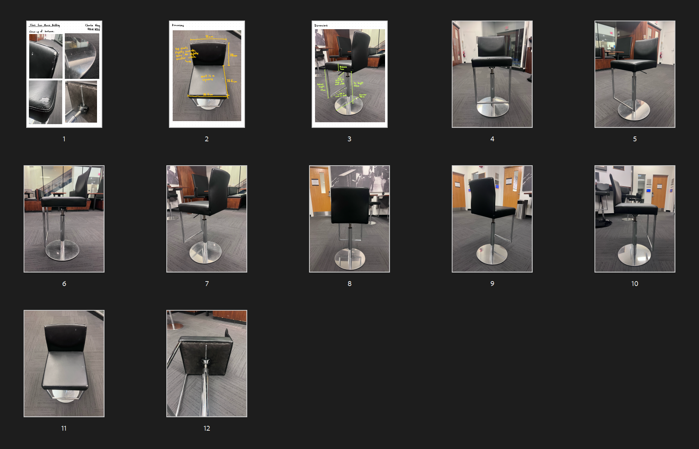

For my 3D Modeling class our first assignment was to try and model a regular object from your daily life. I was looking for ideas, walking around the Engineering Quad when I entered Moore and saw this chair. I proceeded to take pictures from all angles for reference later.

<figure>
  
  <figcaption>
    **Reference images.** I hope no one saw me flipping chairs for 10 minutes straight.
  </figcaption>
</figure>

This was my first time using Autodesk Maya so I wanted to start with something relatively simple. I began by blocking out general shapes before going in and beveling and extruding out the details. To get the slight "arching" of the upper half seat, I enabled soft selection and gently pulled one of the central vertices back.

## Substance Painter

After assigning geometry different materials and (somewhat) figuring out UVs, I exported the chair as a FBX and imported it into Painter.

Most of the materials came with Painter by default. I simply searched for leather and metallic materials and adjusted some of the colors and roughness maps (I mostly increased roughness; the Moore chairs were in _rough_ shape).

I added small white cracks on the seat's surface by adding a mask layer and painting with a negative height map.

## Rendering

I used Arnold to render. Unfortunately, Arnold GPU rendering requires [a NVIDIA GPU](https://help.autodesk.com/view/ARNOL/ENU/?guid=arnold_for_maya_am_Getting_Started_with_Arnold_GPU_html) and I have AMD. Also, I decided to try rendering on my laptop instead of a proper workstation. This was a mistake.

It took me _15 hours to render 240 frames._ Each frame took ~2.5 minutes. So I'm never trying that again. But at least the end result looks nice!
