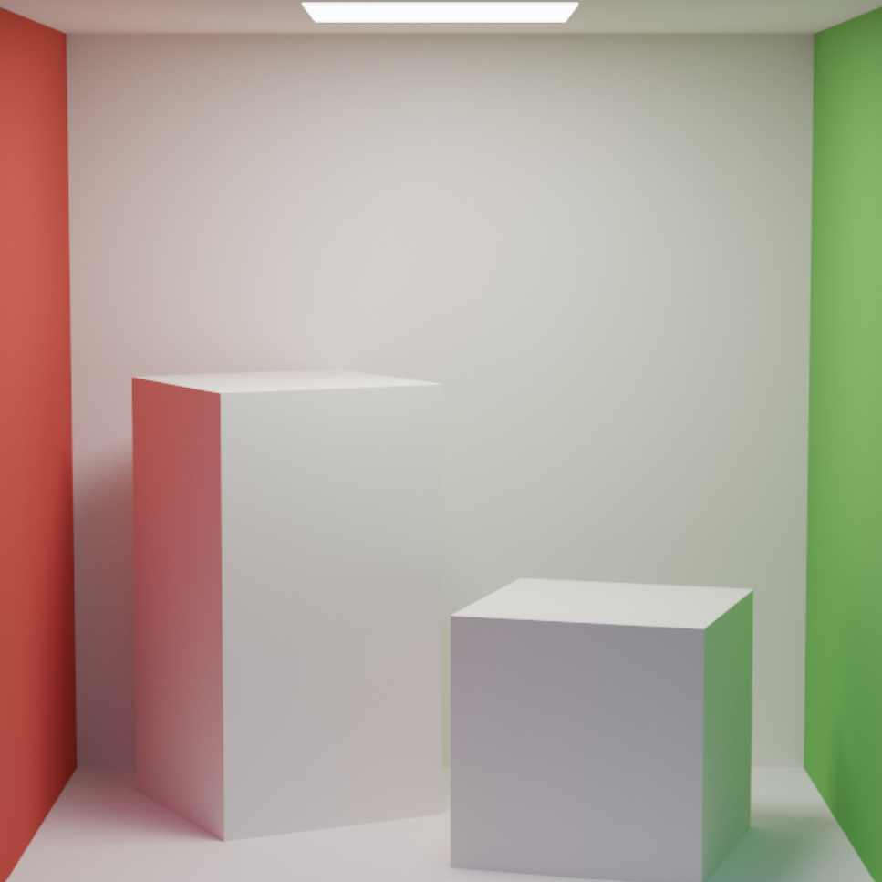
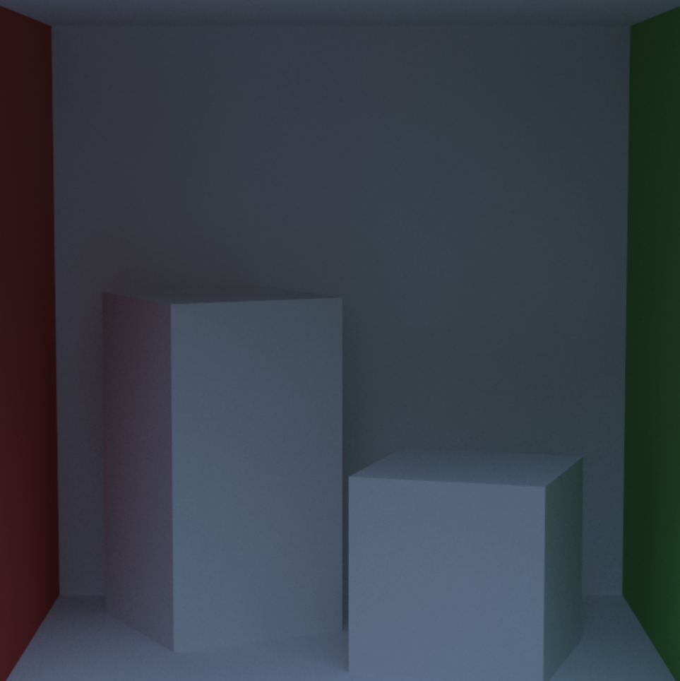
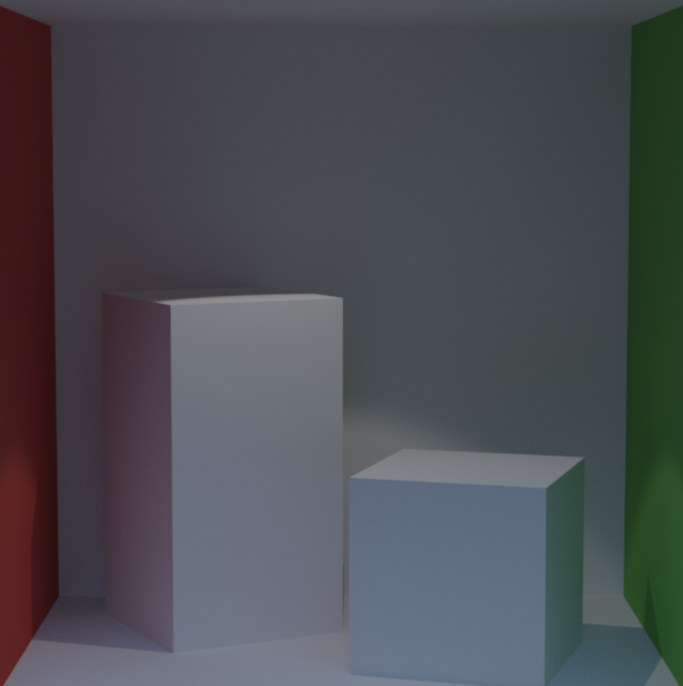
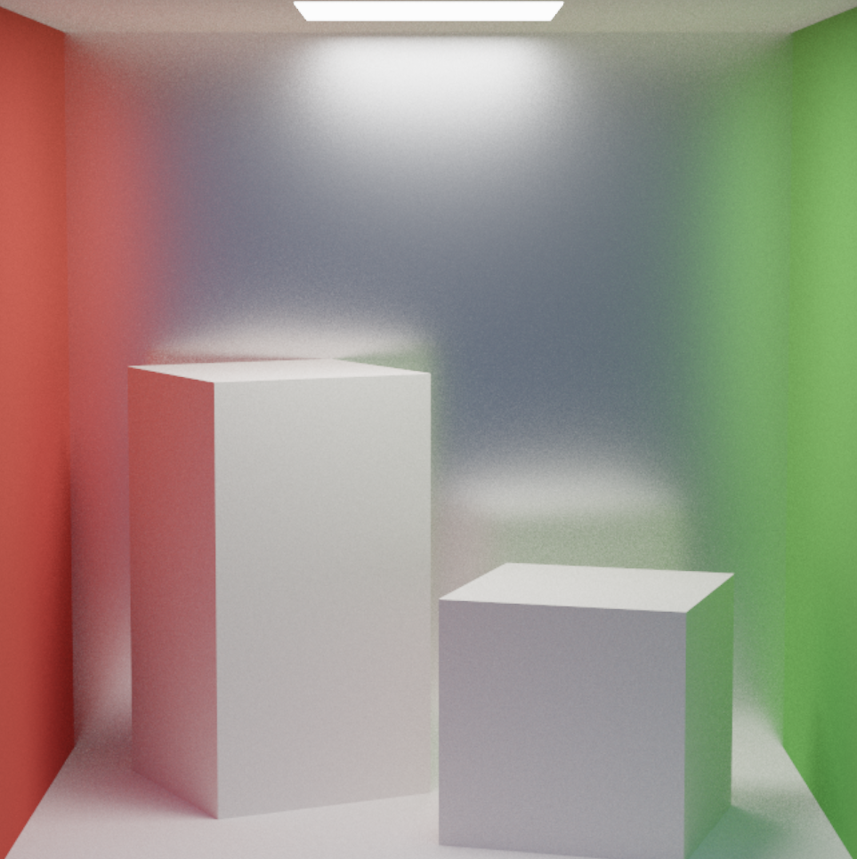
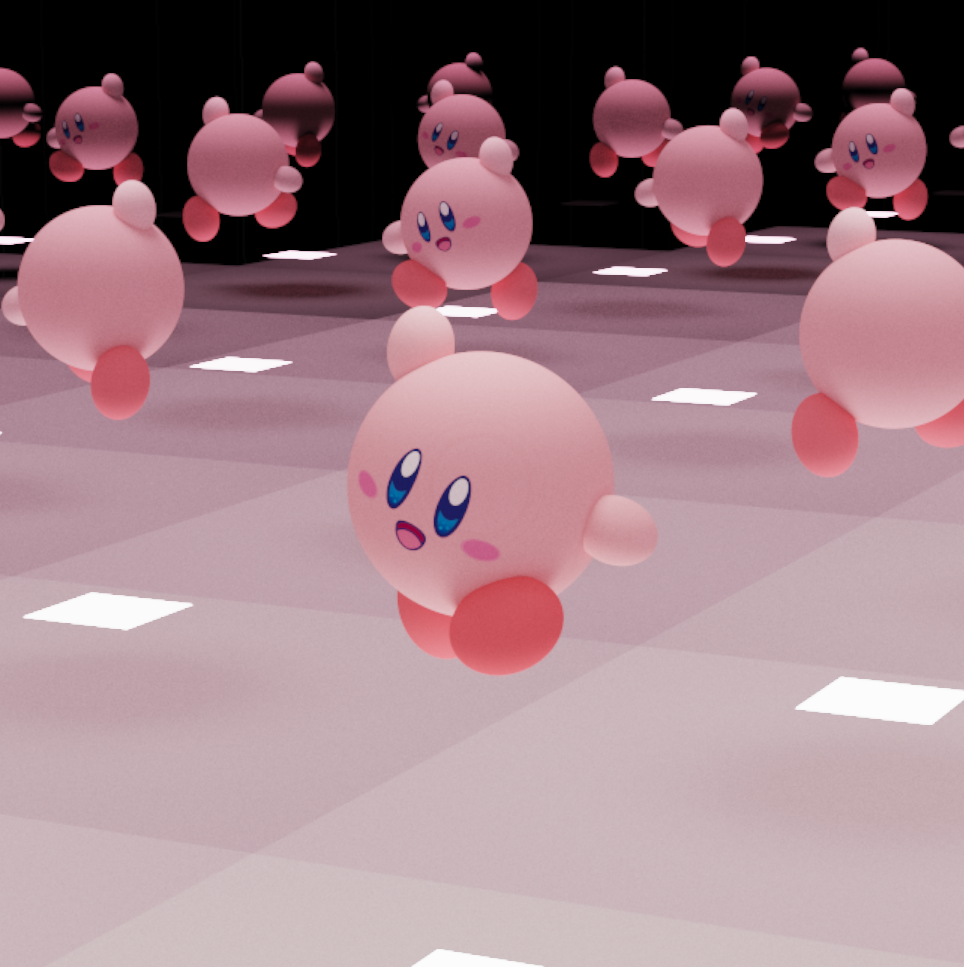
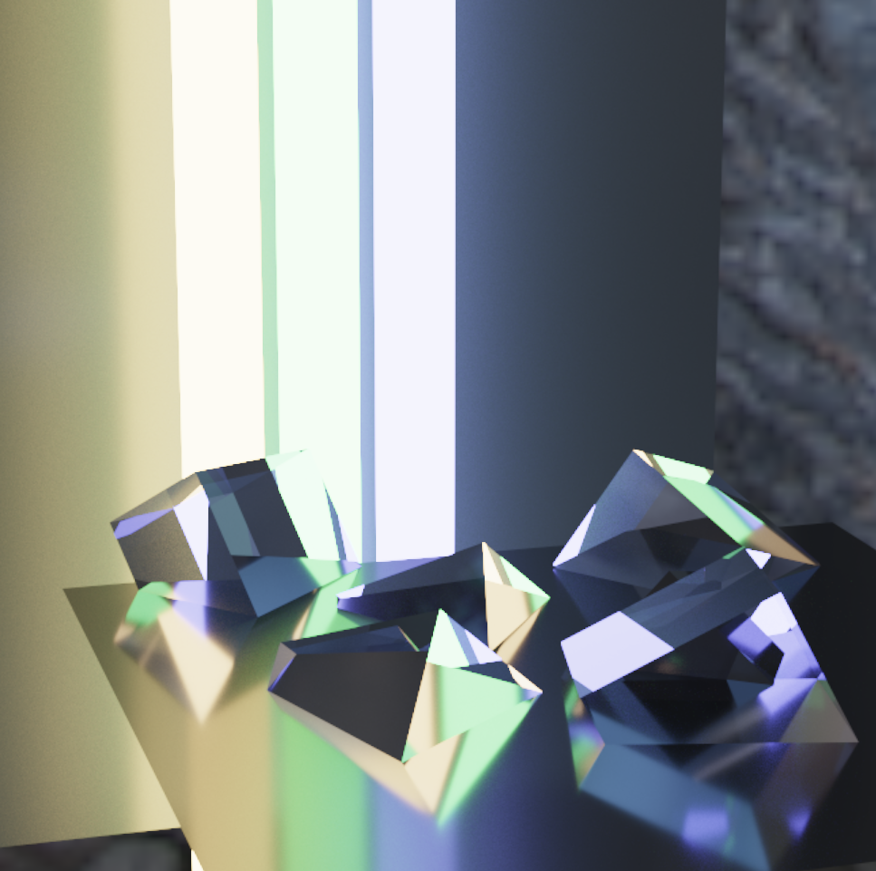
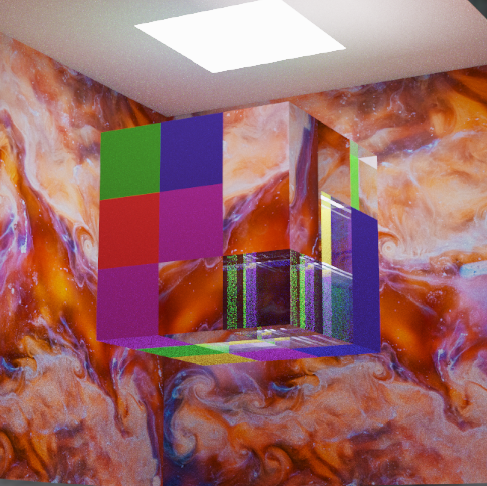
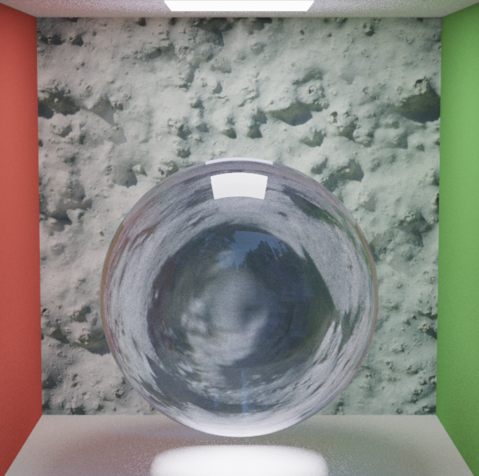

Sorry about the compression in the video. Screenshots below!

What's unique about this path tracer is that most of the work _is being performed on the GPU._ The fragment shader defines multiple structures and helpers for working with rays, intersections, materials, and geometry. We then cast a ray from our camera position (made accessible via a `uniform` variable) to the current `gl_FragCoord`.

## Integration methods

This pathtracer supports multiple methods of integration, including:

- A "naive" implementation that uses cosine-weighted sampling to determine the next ray, but only returns meaningful results if the path intersects with a light source. Very inefficient as many rays are wasted.
- Randomly but directly sample light energy from one of the light sources from our scene, uses the reflection of that ray to travel to the next iteration.
- Direct light sampling but using [multiple-importance sampling](https://www.pbr-book.org/3ed-2018/Monte_Carlo_Integration/Importance_Sampling) to help take the weighted average and get better results, quicker.
- A "full" integrator that considers both indirect light (like the naive one) as well as direct lighting. The final, most physically realistic form of the four, as it also considers global illumination (like from the environment map).

## Screenshots

These screenshots all use the full integrator that takes into account direct, indirect, and global illumination.

### Classic Cornell box

Can't go wrong with this one. An area light is attached to the ceiling.

### Cornell box, no lights

Here we can see the light from the environment map "bleed" into the scene. Without taking into account global illumination, this scene would be pitch dark.

### Cornell box with a spotlight

Different from an area light, we can see the spotlight lighting up the scene, but not as intensely.

### Cornell box with a rough mirror material

The path tracer supports physically-based materials like this microfacet mirror that roughly reflects the boxes.

### Kirby!

I trapped Kirby in a room of mirrors and this is what we get. For his face, I mapped a texture on to the sphere.

### Believer

I took inspiration from the artwork from [Imagine Dragons' _Believer_](https://duckduckgo.com/?q=imagine+dragons+believer+art&iax=images&ia=images). The cubes are glass, the surfaces are metallic, and the three strips are area lights.

### Rubik's cube

To test out many different materials, I created a 3x3x3 cube of mirrors, textures, and transmissive materials. _This scene sets my computer on fire._

### Cornell box with glass ball

To further drive the point home, this pathtracer supports glass-like materials by simulating specular reflection and transmission via the Fresnel equations.

  

