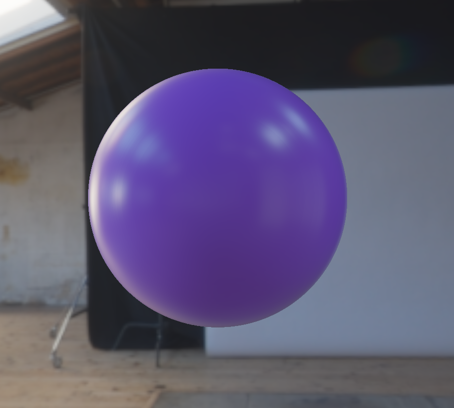
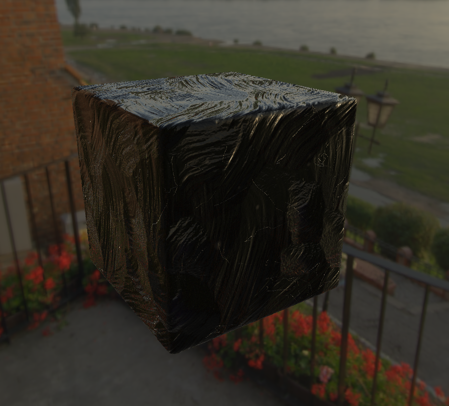

import VideoGif from "@/components/video-gif.astro";

For the second half of our Offline & Real-time Rendering class, we implemented the industry-standard real-time shading model [as presented by Epic Games](https://cdn2.unrealengine.com/Resources/files/2013SiggraphPresentationsNotes-26915738.pdf) for Unreal Engine 4.

In particular, we used the following approximation formulas for the many components of the Torrance-Sparrow microfacet model:

- The distribution function uses the Trowbridge-Reitz distribution for approximation.
- We use Schlick's approximation of the Fresnel reflectance term.
- The geometric attenuation term is approximated by Smith's Schlick-GGX formula.

All the lighting calculations are performed in the fragment shader. Depending on whether the model provides its own textures, we either sample a texture for the material attribute or rely on a GUI slider for adjustments.

For IBL, we precompute the Lambertian/diffuse and glossy irradiance from the environment map, store them in a `samplerCube`, and sample via a vector (surface normal for diffuse, reflection about normal from camera for glossy).

## Some screenshots

The following are screenshots and a video of different models interacting with the light coming from different environment maps.

### PBR shader

Here is the PBR shader with the albedo set to purple. The left/top image has metallicness turned to zero while the right/bottom has it set to full. Both have a roughness of ~0.25.

   

### Model with albedo texture

For models that have an inherent texture, we sample its albedo from that texture and include it during the final lighting calculations. We also do the same for metallicness, roughness, etc.

  <VideoGif content={{ collection: "projects", folder: "pbr-renderer" }} name="model-ibl" hasWebM />

As you can see, we're getting pretty good performance! My laptop has a 120 Hz screen and the renderer is dropping no frames (the recording is limited to 60 FPS unfortunately).

### Displacement map

The obsidian block model in particular also has a displacement/normal map. Here it is set to zero and one, respectively.

   

