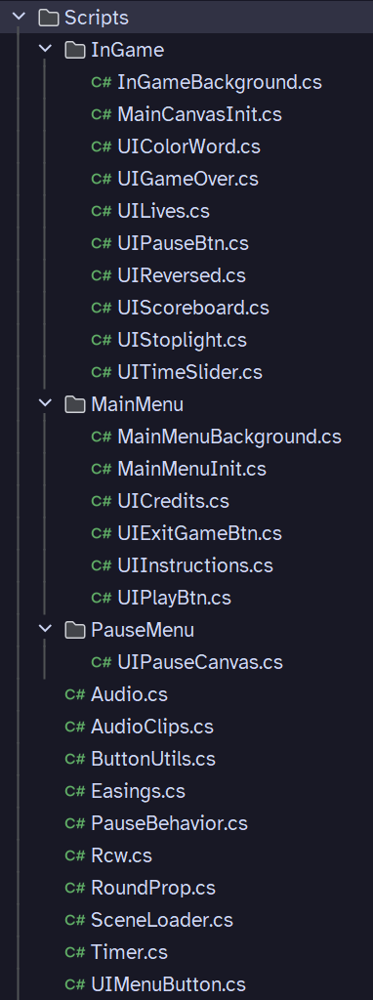
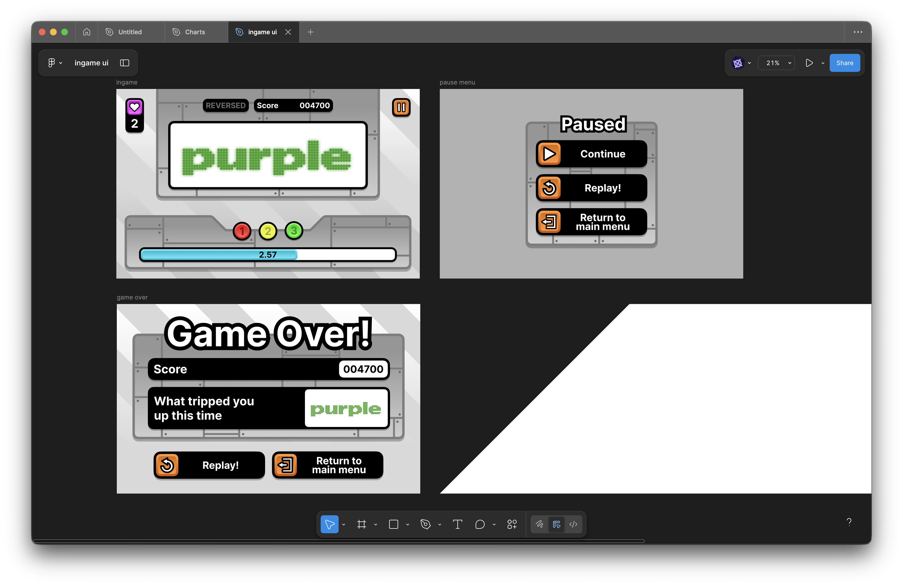
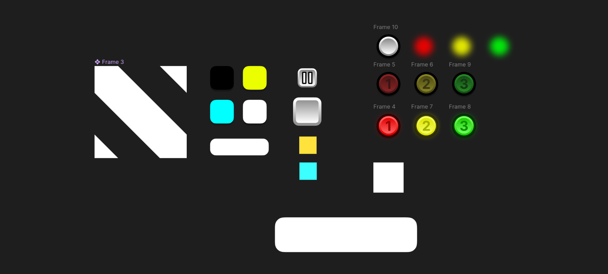

import VideoGif from "@/components/video-gif.astro";

I've always wanted to make games, and so this summer I took the plunge and decided to start learning Unity. The end result is this quick-n'-dirty game that I made in a month or so. More than anything, this was a learning experience to get my feet wet; you'll find that none of the stuff here is very original or game-changing, but that's okay.

In this post I wanted to talk a little about how I approached coding, designing, and making assets for the game in the eyes of someone new to Unity, C#, and game dev in general.

## Overview

In Random Color Words (RCW) you are constantly trying to pair the correct combination of colors and words together. Both of these are randomly generated at the start of each round.

> Incredibly creative name for a game, I know. That's why I like calling it RCW instead.

I saw this project as a way to involve myself with every part of a game development cycle. This led to me getting my hands dirty with things other than programming, like the audio and UI. And being new to... well, everything, I focused my attention on simple but _polished_ and _fleshed out_ results. And hopefully, the game's fun to play as well.

I think I achieved that goal. I'm proud to be able to publish RCW as a "complete package."

## Brainstorming gameplay

To begin, I started brainstorming simple gameplay ideas that didn't take too much time to implement. This means that the gameplay loop should be simple, and the best way to achieve that is to make the game _infinite_ and have no ending, like an arcade game.

No ideas came to mind, and so I turned to other sources for inspiration...

Recently I had been playing this game called [OLDTV](https://store.steampowered.com/app/643270/OLDTV/). The premise is that you're a gifted child sitting in front of a TV, and you're trying to switch between every single channel in the world.

<figure>
  <VideoGif content={{ collection: "projects", folder: "rcw" }} name="oldtv" />
  <figcaption>**OLDTV.** In-game footage. It's free on Steam, go play it.</figcaption>
</figure>

But uh, you're not exactly pressing next on the TV remote. What's happening here?

### Explanation

Essentially, each round we're given a color word, and a word color—uh, that's just as confusing. Actually, lemme restart. Ignore the game for a sec—let's just consider these two words below.

<figure>
  
  <figcaption>**Purple.** Purple.</figcaption>
</figure>

One word is colored purple, and the other is colored red. If I were to ask you what color the word on the right is, you might find yourself saying "purple" on instinct, which is wrong!

It turns out that it's easier for us to name the color of the left word than the right word, because the word itself _matches_ its color. When the word reads "purple" but is actually colored red, this throws us off and delays our answer.

This is OLDTV's gimmick. Given the current word and color combination, left click if the color matches the word, and right click if it doesn't. To make your life even more fun, OLDTV can (and will) flip your screen upside down, change the background color, and even reverse the controls. Oh, and there's a time limit so you're forced to react quickly.

### Using the Stroop effect

Turns out this phenomenon has a name. It's called the [Stroop effect](https://en.wikipedia.org/wiki/Stroop_effect), a psychological phenomenon where "reaction time becomes delayed when the stimuli is incongruent." In simpler human words, stuff that catches you off guard slows you down.

I thought this would be an awesome mechanic to ~~shamelessly rip from OLDTV~~ implement. On paper it doesn't sound too hard: just randomly pick a word and color each round, and check whether the correct user input was entered.

There are some differences between RCW and OLDTV though:

- I use these five colors: <span class="text-[#d20f39]">**Red**</span>, <span class="text-[#dfc31d]">**Yellow**</span>, <span class="text-[#409f2b]">**Green**</span>, <span class="text-[#1e66f5]">**Blue**</span>, <span class="text-[#8739ee]">**Purple**</span>.
- OLDTV instantly boots you out the moment you mess up. Instead, I have a lives system, where you get three chances.
- I also have a score system that depends on how fast you react.

With the gameplay decided, it was time to code.

## Programming the game and learning C#

I will admit that RCW's code is a _little_ bit overengineered. If I were to redo everything
today, I would definitely structure things differently (read: simplify things). But in order to
actively learn Unity idioms and C# features, I tried out many different things throughout the
codebase.

<figure class="mx-auto flex max-w-[225px] items-end gap-4 xs:float-right xs:ml-6 xs:block xs:max-w-[150px] xs:gap-0">
  
  <figcaption>**RCW's filetree.** This is just a _little_ bit insane.</figcaption>
</figure>

### Singleton pattern

Everytime I searched up something related to "singletons" or static instances, the resources I find seemed to always discourage it. See:

- [Singletons in Unity (done right)](https://gamedevbeginner.com/singletons-in-unity-the-right-way/). "Done right" implies people usually do it wrong....
- [What are drawbacks or disadvantages of singleton pattern?](https://stackoverflow.com/questions/137975/what-are-drawbacks-or-disadvantages-of-singleton-pattern) Here I wasn't even trying to look for disadvantages, this was just one of the first results for "unity singleton."
- [Singletons: are they ALWAYS bad?](https://www.reddit.com/r/Unity3D/comments/13jghvh/singletons_are_they_always_bad/) Yeesh.

From what I've read some disadvantages include having to modify/keep global state and increased inflexibility. To be fair, people from the links above aren't arguing to never use it, but to consider whether it's suitable for the _current_ context; it seems like it's misused/overused often.

I can see how keeping global state in a large codebase can be scary and hard. But RCW is not that, and in my case singletons really helped. For instance, I have an `Audio` class which manages all my sounds in the game. Here it is:

```csharp
public class Audio : MonoBehaviour
{
    public static Audio Instance { get; private set; }

    public AudioSource musicSource;
    public AudioSource sfxSource;

    private void Awake()
    {
        if (Instance == null)
        {
            Instance = this;
            DontDestroyOnLoad(gameObject);
        }
        else
        {
            Destroy(gameObject);
        }
    }

    /* Plus some other helpers */
}
```

`Awake()` makes sure there only exists one instance of this class throughout the project. Repeat similarly for `AudioClips`, which stores all the sound files in the game. Then, I can just play music or SFX wherever I want, whenever I want, like when my cursor enters an on-screen button:

```csharp
public void OnPointerEnter(PointerEventData eventData)
{
    Audio.Instance.sfxSource.PlayOneShot(AudioClips.Instance.buttonHover);
}
```

I also use the singleton pattern for my main game manager, the `Rcw` class. It's important I can easily access this class because it contains all gameplay-related events, which other components need to subscribe to. Speaking of events...

### Events and UI

I discovered the existence of C# events in the middle of development, and started converting many things over, realizing not everything works, and then back; so the game runs in a singleton/observer hybrid. Again, learning new things! It's okay.

In `Rcw`, I define events for most things that can happen in-game, like winning a round, losing a life, or starting a new game.

```csharp
public event Action GameInit;
public event Action GameStart;
public event Action GameLost;

public event Action ScoreChanged;
public event Action LifeLost;
public event Action ColorWordChanged;
public event Action ReverseChanged;

public event Action RoundWon;
public event Action RoundLost;
```

The `event` keyword prevents it from being invoked in other files. This encourages me to constrain all gameplay logic within `Rcw`, and broadcast out changes when necessary.

**I found the most use out of events for updating the UI.** Before discovering events existed, I saw two options:

1. Store a reference to a UI-related component within `Rcw`, and use it when necessary.
2. Use more singletons. Maybe a `UIManager`, for instance.

Both options cluttered up the code and made tracking things harder. With events, however, only `Rcw` needed to be accessible, things are more centralized, and C# scripts are free to subscribe to whatever they need within their own file.

The additional freedom that events warranted me made me go a little crazy with separating UI stuff into their own files, I think (I mean, just take a look at the screenshot above). But it really kept things modular, and kept behaviors within their own domains. For example, this is a simplified version of the script that controls the score UI:

```csharp title="UIScoreboard.cs"
public class UIScoreboard : MonoBehaviour
{
    [SerializeField] private TMP_Text scoreText;

    private void Start()
    {
        Rcw.Instance.ScoreChanged += OnScoreChanged;
        scoreText.text = "000000";
    }

    private void OnScoreChanged()
    {
        var score = Rcw.Instance.Score;
        scoreText.text = score switch
        {
            >= 1000000 => "WTF",
            >= 100000 => score.ToString(),
            >= 10000 => "0" + score,
            >= 1000 => "00" + score,
            >= 100 => "000" + score,
            >= 10 => "0000" + score,
            >= 1 => "00000" + score,
            _ => "000000"
        };
    }
}
```

This component's sole purpose is to display the score, and it does it very well. But if I wanted to add some new functionality that occurs when the score changes, I just create another script that subscribes to the same event. It's great.

### Other stuff

Obviously there was so much more that I learned and played around with, but talking about it is a bit dull and quickly turns into a C# tutorial, which is not my intention. But I'll list some stuff:

- Coroutines and being able to pause logic until the next frame is amazing.
- The different types of C# data structures. I used a `struct` for storing the colors and their associated names, for example.
- Getters, setters, and avoiding Java-esque methods via properties. God these are amazing.

Funnily enough I feel that the least interesting part of the codebase is the `RoundProp` component which actually generates the color and word for each round. I try to maintain a counter so that a matching color and word is generated every 2 to 7 rounds. [Here's the source file](https://github.com/aczw/RCW/blob/main/Assets/Scripts/RoundProp.cs) if you're interested in taking a look though.

## Music and SFX

I know I said I wanted to dabble in a little bit of everything, but I wasn't exactly going to _start learning music production_, so this time I turned to the internet for some help.

> Can I quickly give a shoutout to the [OLDTV soundtrack](https://www.youtube.com/watch?v=Nwswp1GKM_w&list=PLGrojvvZb3f_C0B75O_L1GBhzA8x19lED&index=2)? My God this game has amazing music, it makes it even sadder when I eventually lose and it stops playing.

To make the game feel more alive I wanted most interactions to play sound, and for them to be unique. It took me quite some time to compile together sounds, and I had certain criteria I wanted to hit:

- For the main menu I wanted something that sounded like "elevator music." In-game should be upbeat and exciting, and the game over screen should be slower and sound sadder.
- I wanted the sound effects to sound "juicy," if that makes any sense.

In the end I'm really happy with what I found. So a big thank you to Eric Matyas from [soundimage.org](https://soundimage.org) and SubspaceAudio from [opengameart.org](https://opengameart.org) for making awesome free music (and obviously sounds are also credited within the game itself).

## Art direction and design

RCW is an endless, fast-paced minigame about getting the highest score. I was therefore inspired by arcade games and in particular, became obsessed with the art of [Rhythm Heaven Fever](https://en.wikipedia.org/wiki/Rhythm_Heaven_Fever), a 2012 Wii game. I wanted to channel its chaotic vibes, candy-looking buttons, and generous use of thick borders. I mean, the buttons had to look _delicious_.

I also liked the button hover effect in [The Battle Cats](https://battlecats.club/en/series/battlecats/), which flashed bright yellow and magenta. Here, I tried to recreate it in Figma.

<VideoGif content={{ collection: "projects", folder: "rcw" }} name="flashing-btns-figma" />

### Buttons buttons buttons

I use both the button design and hover effect in RCW. The nice thing about this art style was that it could be consistently applied everywhere, not just buttons.

- Add skeumorphism through the use of light, shading, etc.
- Wrap it in a thick black border
- Add a drop shadow underneath
- If I want to attract the player's attention, add some color. Else, use gray
- I love Inter

Originally I was going for a factory setting, with words coming down a sort of assembly line. But honestly, this was out of my Unity skill scope, so I scratched that idea. You can still see it in the metallic plates and muted gray backgrounds.

### Making literally everything in Figma

One thing that may surprise you is that all the art assets were made in Figma. This includes the start screen, in-game, and game over screen, as well as all the UI.



In order to animate different parts of the UI, I exported assets as individual pieces that I could put back together in Unity. This allowed me to, for instance, only animate the border around a button but not change its inside color.

I kept most things grayscale so that I could reuse the asset. In Unity, I simply colored each instance differently.



> In hindsight, I could also have done this with the 3-2-1 stoplight. When it became active, just overlay the glow on top to make it brighter.

It was really nice being able to see the final product within Figma, without needing to tweak anything in Unity. It made adding small changes much faster.

### Animating the UI

The checkerboard on the start screen randomly zooms and changes colors every five seconds. This was done by constantly manipulating the `uvRect` of the checkerboard `RawImage`.

```csharp
[SerializeField] private RawImage cb;

// this would all go in Update()
var length = Mathf.Lerp(2, 10, Mathf.PingPong(Time.time * 0.05f, 1));
var speed = Random.Range(0.1f, 0.8f);

cb.uvRect = new Rect(
    cb.uvRect.position + new Vector2(speed * _x, speed * _y) * Time.deltaTime,
    new Vector2(length, length)
);
```

The other thing I'm really happy about are the button animations. When the instructions or credits button are activated, the same button is used to go back to the start screen.

<VideoGif content={{ collection: "projects", folder: "rcw" }} name="main-menu-ani-btns" />

The "Go back" text slides out, and the outside border becomes a panel for the text to exist in. I spent ~~too much~~ some time getting it to feel just right. I would like to thank this [easings cheat sheet](https://easings.net/) for providing copy-and-paste animation curves.

## Future updates??

How would I update this game in the future? The current gameplay loop is a blatant rip of OLDTV. I've floated some ideas around, including:

- **Shop system.** Earn currency for each game you play that can be spent on power-ups (score multiplier, increased time, more lives, freeze time, etc.)
- **Round streak**. For every additional round you win in a row, a score multiplier is added.
- **Expanding Reversed mode.** To make the player's life even harder, more distractions could be added (flipping the game upside down, smaller words, fake clones, etc.)
- **Levels.** When your score reaches a certain threshold, new challenges appear. Old stuff is swapped out. Maybe add a way to continue from a certain level after losing.

...but for now, I'll just enjoy the current results. Repo is public and [available on GitHub](https://github.com/aczw/RCW). Thanks for reading!
