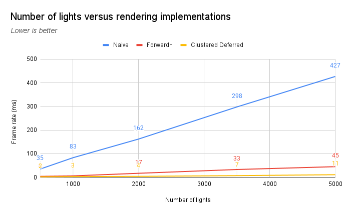

This project aims to demonstrate clustered shading in a forward rendering pipeline (frequently known as Forward+) and a deferred pipeline. Both of these methods are then compared against a naive method. This was my first time working with WebGPU, and I came away impressed and satisfied with its API.

Below I will discuss some details on how each rendering method was implemented, and perform some performance benchmarks to see how well I did for each!

## Implementations

The base setup is the same across all three implementations. We are initially looking down our Sponza scene, and have a certain number of lights to render.

<figure>
  
  <figcaption>Sponza scene, rendered purely with its base albedo.</figcaption>
</figure>

Every frame, the lights randomly move across the scene, meaning they're dynamic. They're also all different colors; the point is, we can't make any assumptions about the lights themselves. In our shaders, we only have a light's position and color information.

### Naive

There's not many interesting things to say about the naive implementation. We perform light calculations in the fragment shader, and iterate over the entire light list to sum up the total light contribution, multiplying that by the base diffuse color.

There's many optimization opportunities here. In the next two implementations, we'll try to address the following two problems:

1. Consider the world position associated with a fragment. Since the lights are all spread out across the scene, we are wasting resources on calculating the light contribution for lights that are too far away to have any impact.
2. In the graphics pipeline, by default the depth test is performed _after_ processing all fragments. This means we waste a lot of time on light computation for fragments that will be discarded in the end anyway.

### Forward+

Forward+ attempts to address the first problem by performing _clustered_ rendering. The idea is that we split the scene into _clusters_, which are view space bounding boxes. Then, before performing the render pass, we perform an additional compute pass that assigns lights to clusters.

In the fragment shader, we then only consider lights present in the cluster associated with the fragment, which is determined by its view space position.

### Clustered deferred

Building on forward+, we introduce _deferred_ rendering in between the compute pass and final render pass. Before performing light calculations, we first render the scene to textures, storing information such as world position, normals, and scene albedo.

Performing the g-buffer pass runs depth tests, meaning we only calculate lighting contributions for each final pixel once. This solves our second problem mentioned earlier.

## Performance benchmarks

To keep things consistent, I maintained the same canvas resolution of 1920×1200 for all benchmarks. Here are the specs I performed them with.

| Type       | Specifications                                 |
| :--------- | :--------------------------------------------- |
| **OS**     | Windows 11 Pro, version 24H2, build 26100.4946 |
| **Memory** | 32 GB, DDR5-6000                               |
| **CPU**    | Ryzen 5 7600X @ 4.7Ghz                         |
| **GPU**    | RTX 5060 Ti 16 GB, Studio Driver 581.29        |

