import { Vimeo } from "@astro-community/astro-embed-vimeo";

For the final project of our computer graphics class, I worked in a team of three to write a 3D voxel engine. While we all wrote code, I focused primarily on rendering optimizations, GPU programming, and GUI.

We were clearly influenced by how Minecraft approached its game engine. However, as someone who grew up playing it, I took this opportunity to change some things I've always wished looked a bit different.

But! Let's first take a look at this snazzy showcase reel I made (\<3 minutes).

<Vimeo id="893391293" />

It does a nice job of demonstrating our engine's features and credits who worked on what. To reiterate the video, I implemented the following:

- Chunking
- Efficient chunk rendering and block face culling
- Textures and animations
- Distance fog
- Day/night cycle and sky system (sun, moon, clouds, stars)
- Flood fill lighting
- GUI, inventory, and text rendering

I'm going to talk a bit about each, some technical details on how I approached them, and issues that I faced. Let's begin!

> I can't publicly share project code, so everything here are just examples. Please contact me if you would like to see the code.

## Chunking

Just like Minecraft, we group the world terrain into 16x16x256 collections of blocks. That's 16 blocks each in the x- and z-directions, and 256 blocks in the y-direction (height).

This chunk data structure is really a 1D array that stores the block type for a given index. We have helper functions that convert a (x, y, z) coordinate to this index, and vice versa.

```cpp
enum Block {
  EMPTY, STONE, DIRT, OAK_LOG /* ...and many more */
};

class Chunk
{
private:
  std::array<Block, 16 * 16 * 256> blocks;

  /* we'll be adding more stuff to this class for later features. */
};
```

> Why not a multidimensional array? A 1D array is supposedly better for memory, but we're working with a statically-sized array here, so I'm not sure. Can't hurt though!

The `Block` enum declares all possible block types in our game. This includes `STONE` or `OAK_LOG`, but also `EMPTY`, which represents air, or the absence of a block. This makes it easy to implement "breaking" a block; we're simply placing an `EMPTY` block!

Our chunks live in a `Terrain` class and are allocated on the heap. For easy access, we map a chunk's lower-left xz-coordinate to a pointer to that chunk. Conceptually, our terrain should "own" these chunks, so we're using `std::unique_ptr`s.

```cpp
class Terrain
{
private:
  std::unordered_map<glm::ivec2, std::unique_ptr<Chunk>> chunks;
};
```

> The `glm` namespace is from the [GLM library](https://github.com/g-truc/glm), which implements vector and matrix types in an OpenGL-friendly manner.

## Efficient rendering, face culling

Chunking our terrain provides a number of benefits when we draw our blocks. For instance, my teammate implemented multithreading based on my chunks, which are easier to reason about than individual blocks. We render the terrain one chunk at a time.

A block has six faces. Each face has two triangles. If we render every face, of every non-`EMPTY` block, of every chunk, every single frame, our GPU would catch on fire. There's no point in rendering faces that are hidden by another block. The player camera never sees it.

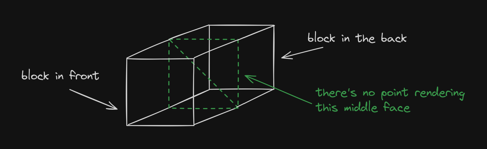

Instead, we first iterate over every block in the chunk. For each non-`EMPTY` block, we check its six neighbors, and only render a face if its neighbor is `EMPTY`.

> I did not implement this part, but we only render a small area of the terrain around the player's current position. More details when I talk about distance fog.

In the `Chunk` class, we store raw pointers to its neighbor chunks. This way, we can check the neighbor of a block that may reside in a different chunk.

```cpp
enum Direction {
  X_POS, X_NEG, Z_POS, Z_NEG, Y_POS, Y_NEG
};

class Chunk
{
private:
  std::array<Block, 16 * 16 * 256> blocks;

  // this really only makes sense for X_POS, X_NEG, Z_POS, and Z_NEG
  std::unordered_map<Direction, Chunk*> neighbors;
};
```

If you were to fly below the ground, it now looks "hollowed out." What you're seeing in the picture below are what our caves look like... on the outside! The player is technically inside solid `STONE` right now, it's just not being drawn.

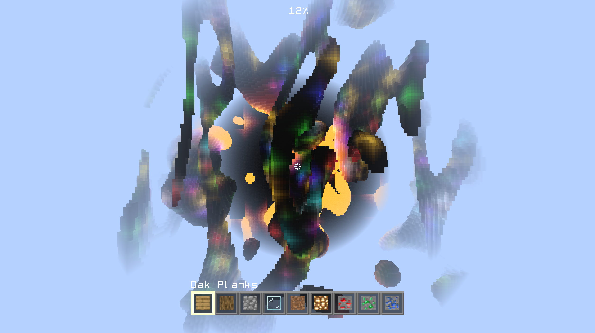

**I cannot emphasize how much this improves performance.** On my laptop, my framerate basically tripled. Our game would feel horrible to play without these optimizations.

## Texturing and block animations

I render chunks using [indexed rendering](https://www.opengl-tutorial.org/intermediate-tutorials/tutorial-9-vbo-indexing/) and store all vertex attributes in a single, [interleaved](https://www.khronos.org/opengl/wiki/Vertex_Specification#Interleaved_attributes) VBO. This includes UV texture information and a single "animated?" flag that I either set to 0 or 1.

```cpp
struct VertexAttrs
{
  glm::vec4 position;
  glm::vec4 normal;
  glm::vec2 uv;
  GLfloat animated;
  /* ...more attributes here */
}

int stride = 4 + 4 + 2 + 1 /* + additional attributes */;
```

The ["stride" parameter](https://registry.khronos.org/OpenGL-Refpages/gl4/html/glVertexAttribPointer.xhtml) in `glVertexAttribPointer` was difficult to wrap my head around. All it does is tell the GPU when the data for the next vertex starts. To the GPU, our VBO is just a really, really long line of floats. So, we must also specify the size of each attribute.

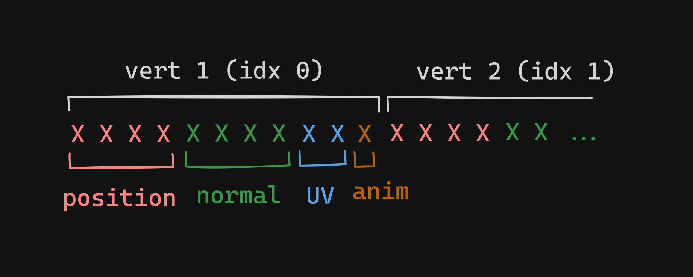

For example, `position` takes up four floats, while `anim` only uses one.

### Block texture atlas

All the block textures in our game live in a 256x256 texture sprite. Each block face texture is 16x16 pixels, so we can refer to specific textures using a coordinate system. Here, the dirt texture's lower-left corner is located at (2, 1) on our imaginary grid.

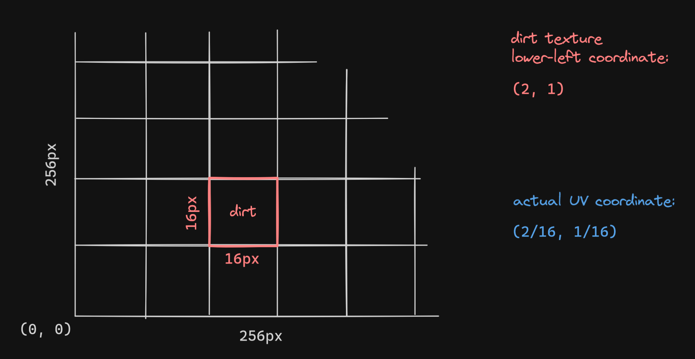

Furthermore, we map a block type to the texture coordinate for each of its six faces.

```cpp
std::unordered_map<Block, std::unordered_map<Direction, glm::ivec2>> block_uv_map;

// for example, to access the UV coordinates for the Y_NEG face of a dirt block
glm::ivec uv = block_uv_map[DIRT][Y_NEG];
```

Block face textures are 1/16th size in width and height of the whole sprite, so we multiply the coordinate by 1/16 to get the correct UV. Note that this only describes the lower-left corner; we need to add 1/16 to either U, V, or both to get the other three corners.

And animation? Our water and lava blocks are seemingly "flowing." This effect was achieved by slowly translating over the texture sprite, moving the UV coordinate over time. "Time" in this case is a `uniform` variable in the shader that increments every frame.

### Transparent blocks

At first, transparent blocks like water and glass were incorrectly drawing over opaque blocks from from neighbor chunks. To fix this, we actually need to keep two separate VBOs and index buffers: one for opaque blocks and one for transparent.

In `render_terrain()`, we first draw all opaque blocks to screen, and then all transparent blocks.

```cpp
void Terrain::render_terrain() {
  // first render opaque blocks
  for (const Chunk* c : chunk_list) {
    c->render(true);
  }

  // then render transparent blocks
  for (const Chunk* c : chunk_list) {
    c->render(false);
  }
}
```

This solves our issue because transparent blocks now have the correct fragment color to overlay on top of.

## Distance fog

If we fly really high up into the air, you'll see a circular fog that surrounds the player and slowly fades blocks into the distance.

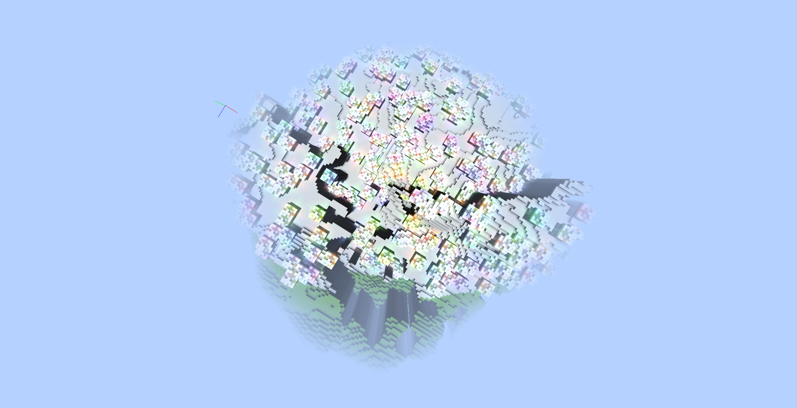

In the chunk fragment shader, I pass in the player's world position as a `uniform` and the fragment's world position as an `in` from the vertex shader. I find the distance between these two and divide by the max distance to get a value between 0.0-1.0.

This is used to lerp between the original block color and the sampled sky color. I use a nice [cubic easing curve](https://easings.net/#easeInCubic) to make the fog get denser the further the block is from the player.

So, what is this max fog distance? At all times, we only render a specific number of chunks around the player. A 12x12 square of chunks, to be exact. The player is always at the center, so the max distance (which is the circle radius) is at most 96 blocks.

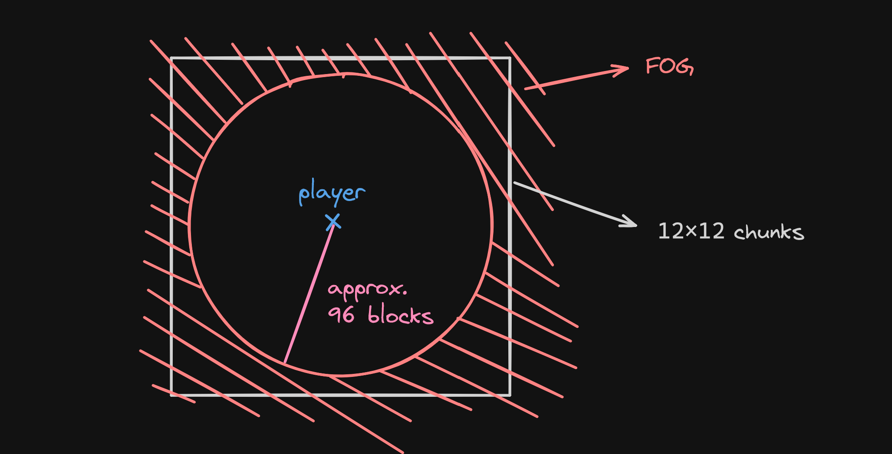

The distance fog now plays a second role: to stop the player from seeing chunks appear and disappear as they move. But, it's worth it to implement for aesthetics alone, in my opinion.

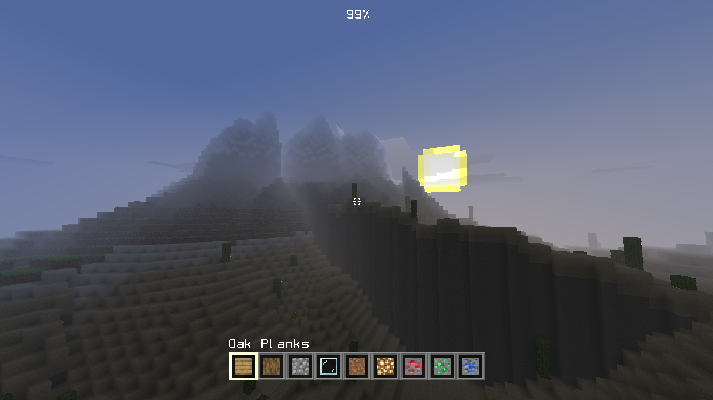

## Day/night cycle, celestial objects

Our engine features a day and night cycle. We see the sun during the day, and the moon and stars at night. Clouds are always visible. In between, sunrises and sunsets transition us nicely.

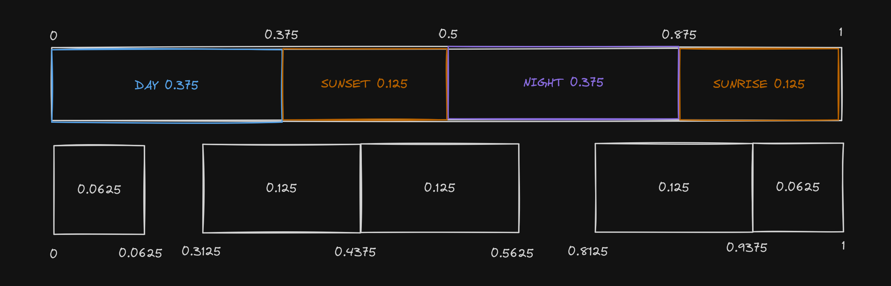

During development, I religiously followed the diagram above. It defines a single day as a range from 0.0-1.0, and specifies exact durations for transitions.

- "Day" is considered to be 0-0.375, and is 0.375 long.
- "Sunset" is between 0.375-0.5, and is 0.125 long.
- The `Day->Sunset` transition starts at 0.3125 and ends at 0.4375. It is 0.125 long.
- To enable a seamless `Sunrise->Day` transition, we split it in half.

Making calculations depend on a relative 0.0-1.0 scale instead of a hardcoded number made changing the day length for debugging infinitely easier.

### Skybox

The skybox is not a cubemap. We're actually rendering to a screen space quad. To determine what colors to sample, we cast a ray from the player camera (in world space) to a pixel on our screen. We choose the far clip of the camera as the ray endpoint.

We're essentially tracing out a giant sphere around the player, where the ray spans the sphere radius. We map this position to a UV coordinate of the quad, which decides what color is painted.

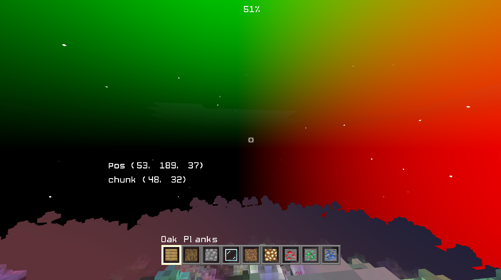

In the picture above, I'm mapping the ray to a color. What we're seeing makes sense. If we look along the x-axis (to the right), we get lots of red. If we look along the y-axis (up), we get lots of green. If we look behind us, we get black. Blue can also be seen, just not here.

### This still doesn't make sense

One thing that helped me understand better was my usage of `gl_FragCoord` in the fragment shader. For each `gl_FragCoord`, the raycast of the player camera will return different results, and therefore result in many different colors.

When you rotate your camera and look somewhere else, the world space position of the point you're raycasting to is different as well. That's how we get an illusion of the sky "moving" as we turn, when in reality we're just painting to a rectangle.

### Celestial objects

The sun, moon, and stars are much simpler. Both the sun and moon are two quads that rotate at a fixed distance around the player. This allows them to appear "infinitely" far away.

In our [`paintGL()`]("https://doc.qt.io/qt-6/qopenglwidget.html#paintGL"), after drawing the sun and moon and before drawing the terrain, I reset the OpenGL depth buffer. This means that they are _always_ drawn behind blocks, no matter the player's y-coordinate.

```cpp
// this is a built-in Qt function that makes it easier to communicate with OpenGL.
// it is called every time our scene is drawn, so ~60 times a second in our engine.
void MyWidget::paintGL() {
  /* previous rendering stuff */

  sun.render();
  moon.render();

  // reset depth buffer so all celestial objects are drawn behind terrain
  glClear(GL_DEPTH_BUFFER_BIT);

  // keep on renderin'
  terrain.render_terrain();
}
```

Each individual star is a tiny quad that I rotate and scale by a random amount. I originally had the stars rotate around the player too, but that looked too unrealistic when the player climbed things. Instead, it only follows the player's x- and z-coordinates, but rotates at a fixed y-height.

### Clouds

A giant quad floats above the player at all times. On it, I sample a portion of a large texture that contains all the possible clouds in the world:

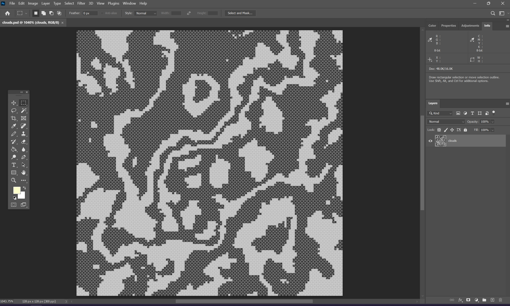

This was created in Photoshop. I used a noise function as the base, reduced the number of colors, and deleted the rest to make somewhat realistic-looking swirlies.

When I send the texture to the GPU, I set these options so that the texture repeats for values of UV outside of 0.0-1.0:

```cpp
glTexParameteri(GL_TEXTURE_2D, GL_TEXTURE_WRAP_S, GL_REPEAT);
glTexParameteri(GL_TEXTURE_2D, GL_TEXTURE_WRAP_T, GL_REPEAT);
```

This way, I can offset the UV coordinates based on the player's current world position. When the player moves forward, the UV coordinates translate "back," which gives the clouds the appearance of having been left behind. Take a look at [jdh's implementation](https://github.com/jdah/minecraft-weekend/blob/387ecb554946180094d58c57a4ee216dba506cc4/src/world/sky.c#L350C17-L350C17) to get an idea of the math.

> I could technically calculate this on the CPU, but I'm doing this work in our cloud shader.

I also use the previously mentioned `uniform` time variable to make the clouds translate across the sky even when you're not moving.

These three components are pretty simple, but with some good skybox colors, animation times, and tweaking, our sky system feels cohesive and full of personality.

## Flood fill lighting

This section could get its own entire write-up, but there are many articles on the internet that do a much better job explaining than I ever could. I'll link some here:

- [r/gamedev - Fast Flood Fill Lighting in a Blocky Voxel Game](https://www.reddit.com/r/gamedev/comments/2iru8i/fast_flood_fill_lighting_in_a_blocky_voxel_game/)
- [0 FPS - Voxel Lighting](https://0fps.net/2018/02/21/voxel-lighting/)
- [Minecraft Wiki - Light](https://minecraft.wiki/w/Light#Block_light)
- [Wikipedia - Flood fill](https://en.wikipedia.org/wiki/Flood_fill)

In our engine, I store a 1D array for each chunk that tracks each block's light level. Just like Minecraft, our light scale ranges from 0-15.

```cpp
class Chunk
{
private:
  std::array<Block, 16 * 16 * 256> blocks;
  std::unordered_map<Direction, Chunk*> neighbors;

  // using ints are overkill for our purposes and take up more space
  std::array<unsigned char, 16 * 16 * 256> light_level;
};
```

When generating chunk block data, I track all the naturally occurring light sources. After we finish, I run the flood fill algorithm on each source, using a starting value of 15. It's important to do this after we populate the `blocks` array so that the algorithm doesn't propagate through opaque blocks.

Remember `VertexAttrs` from earlier? We add a new attribute called `lightLevel`. In our fragment shader, we multiply our default block color by this additional brightness. Make sure to clamp it between 0.0-1.0 so the block doesn't get _too_ bright.

> I did the base algorithm implementation, and it works well for "no color" lights. My teammate decided to jazz it up a bit and added colored lights! That's what you see in the video.

Note that each block face samples the light level from the neighbor block it's adjacent to. Depending on the light location, this also means each block face can be affected by a different light value!

## GUI, inventory, text rendering

The inventory system is very simple. Stupidly simple. I'll reimplement it right here:

```cpp
struct Inventory
{
  std::array<Block, 9> slots;
  int active;
};
```

Pressing numkeys 1-9 (or scrolling with mouse wheel) sets the `active` variable accordingly. Whenever we want to access the currently selected block, we index into `slots` using `active`. This is nice because we don't have to keep track of what `Block` is selected, that is abstracted away for us.

The UI took a bit more planning. Every UI element inherits from a base class that stores our screen's width, height, and aspect ratio. UI lives on a 2D surface, and so I use UV-like coordinates to specify each UI element's position on the screen.

For example, if we wanted to draw a crosshair texture on a square at the center of the screen, I could use the following vertex positions:

```cpp
class Crosshair : public UI
{
  void set_vbo_data();
};

void Crosshair::set_vbo_data() {
  // upper right, lower right, lower left, and upper left corners
  pos = {glm::vec2(0.51f, 0.51f),
         glm::vec2(0.51f, 0.49f),
         glm::vec2(0.49f, 0.49f),
         glm::vec2(0.49f, 0.51f)};
}
```

We store the index, position, and UV buffers as `std::vector` member variables in `UI`. The `UI` base class only needs one function: `render_ui()`. It looks something like this:

```cpp
void UI::render_ui() {
  int diff = screen_w - screen_h;
  float margin = diff / 2.f;

  std::vector<glm::vec2> scaled_pos;
  for (const glm::vec2 &p : pos) {
    scaled_pos.push_back(glm::vec2(p.x * screen_w / aspect_ratio + margin, p.y * screen_h));
  }

  /* send all of this correctly scaled vertex data to the GPU */
}
```

We're allowed to define our UI element positions on a relative 0.0-1.0 scale because the `UI` class takes care of transforming it into actual positions based on our current working screen resolution. Furthermore, the x-values are offset by a margin that centers everything.

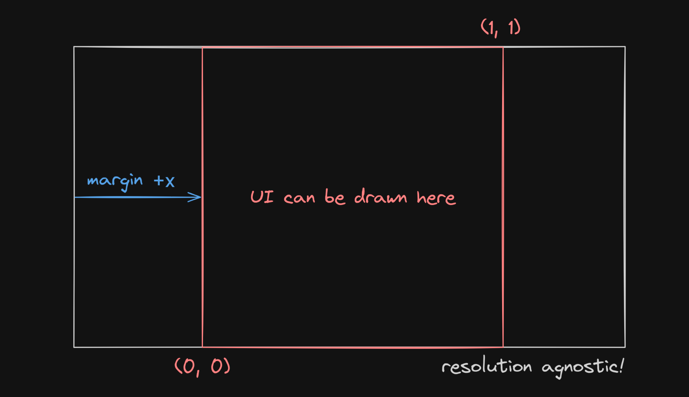

I make a number of assumptions. First, that the screen width is greater than the height. Also, that the aspect ratio is always greater than 1. In addition, UI elements only exist in a square in the middle of the screen. However, for our rudimentary crosshair, hotbar, and text, this is more than enough to scale well and work across all screen resolutions.

The hotbar naturally uses `UI` as well. To render the currently active slot, I add an additional offset to its x-position depending on what slot number we're on.

### Text rendering

Picture this. It's 4 AM and there are only a few hours left before the due date. Everything else is done but you don't want to sleep yet. You decide to go all out on one last thing, or fall asleep trying. End result? Very, very basic text rendering.

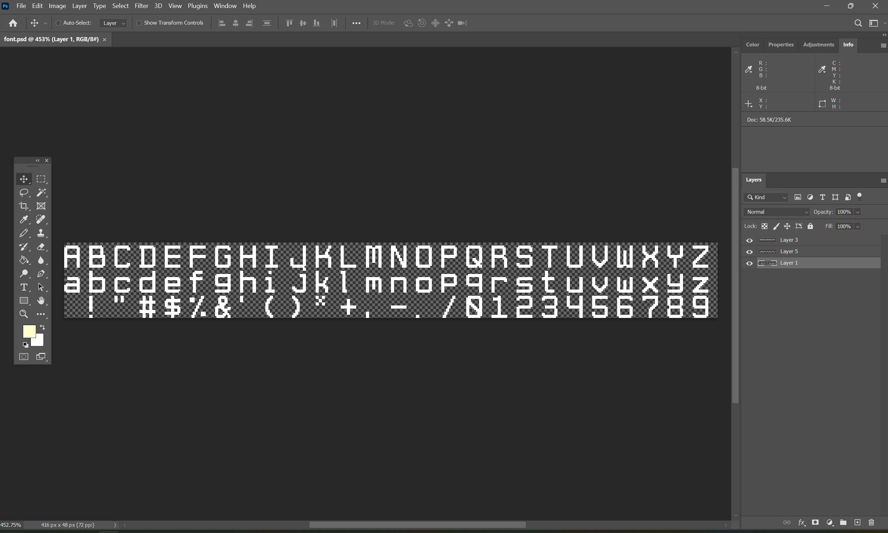

The idea is simple: map a basic set of characters to UV coordinates on a texture sprite that contains the characters as a bitmap. This is not a new idea ([far, far from it](https://en.wikipedia.org/wiki/Computer_font#Bitmap_fonts)) and there are probably thousands of implementations available online, but

- this is a school project and I didn't want to bring in external libraries.
- I was sleep-deprived and going mad.
- I wanted to see if I could write my own.

> The font comes from a heavily-customized Minecraft texture pack that I made over quarantine! If I didn't have a bitmap font like this ready, all of this probably wouldn't have happened.

The question now becomes "how do I fill this character-to-UV map in a smart way?" I mean, I only have to map 78 characters by hand, which wouldn't have been _too_ bad...

No! There must exist a better way. And there does. Remember that in C++, the `char` type is really just [ASCII representation](https://en.cppreference.com/w/cpp/language/ascii) of the characters. If we order the bitmap characters in ASCII order, generating the map on the fly becomes really easy:

```cpp
std::unordered_map<char, glm::ivec2> char_uv_map;

char c = 'a';
for (int i = 0; i < 26; i++) {
  char_uv_map[c] = glm::ivec2(i, 1);
  c++;
}
```

Just increment `c` to get to the next character! Our `glm::ivec`s correspond to UV information about the font sprite. From there, I was able to render a single character, and then a string, which is really just many `char`s at once. My `Text` class inherits from `UI` as well to make things easier.

Hopefully you can see how I could extend this system to add information about kerning, offsets, etc. Too bad I ran out of time though. I was able to, however, add an in-game debug mode that shows the player's current position, as well as the current chunk:

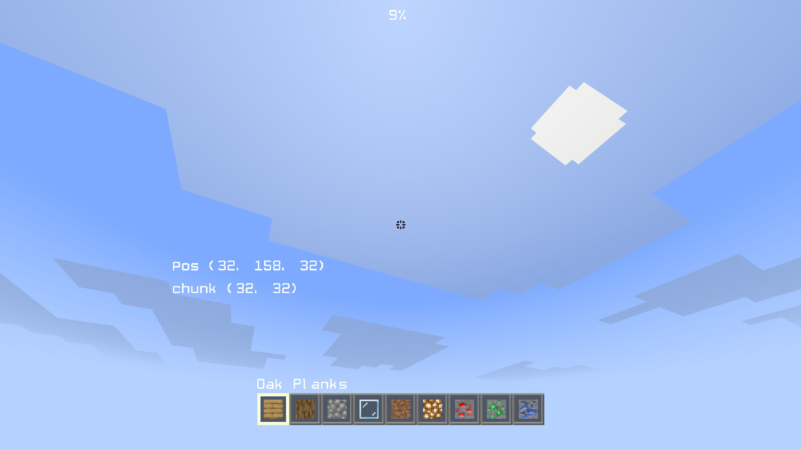

This helped my teammates easily share cool structures they found for our showcase reel: just take a screenshot! I thought this was a great way to immediately start using my text system.

## Conclusion

Overall, this project has been very rewarding and is probably the most fun I've had with a class project, ever. I've learned a lot about OpenGL, C++, and rendering in general. I've also become _very_ aware of all the heavy lifting that engines like Unity or Unreal do for us.

I'm proud of the UI system, which came together very last minute but turned out really well. I also really enjoy how the sky looks. Prettier than Minecraft, I dare say?

Anyways. Thanks for reading this far! :\)
