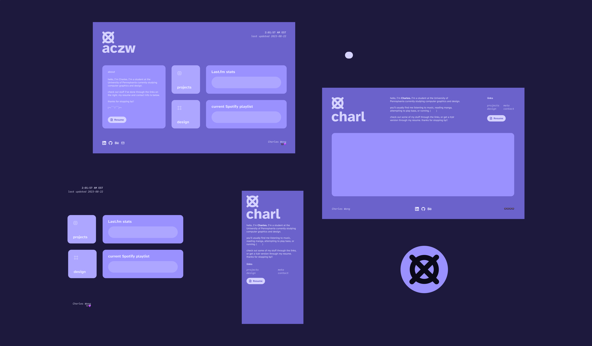
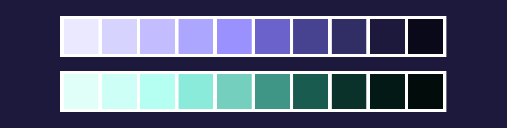
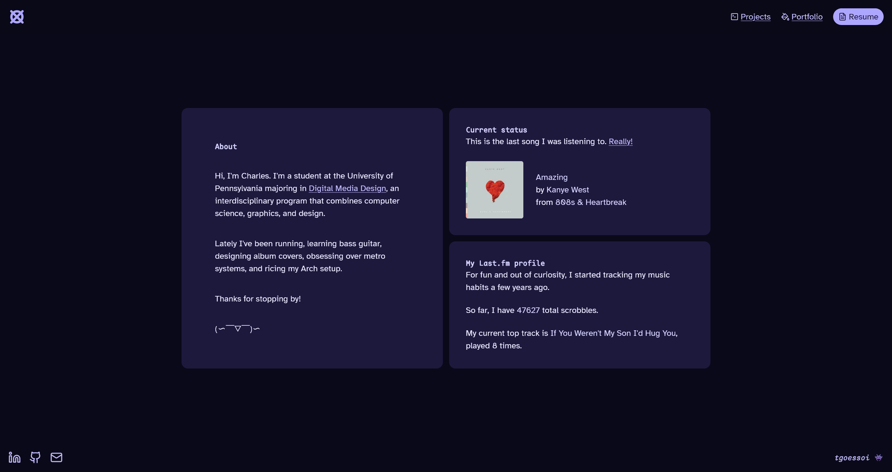

Hi, welcome to my little corner on the internet.

When I first started learning web dev, this was my first project. And what I've realized over time is that websites are never a finished product. They grow, evolve, and change, just like us.

With each successive version, my expectations, preferences, and goals for this website have changed. One central thing has remained the same, which is the desire _to express myself_ and _create things._ So, how do you go about designing and building your own site from scratch?

## A desire to express myself

I've always wanted a personal site. For one, it was a way of showing myself off. It's easy to think of the Internet™ as just Google, or Twitter, or YouTube, and forget that it's always been one computer, talking to another. You have unlimited control over how to present yourself, and in that way it was very freeing.

As a college student, I could also use it to showcase and talk about projects and work I've done (like this one). However, this has led to its own issues, with me torn between making my site look how I want it, and optimizing it for recruiters and employers.

Take `aczw.dev`, for instance. This was the first version of my site, and simultaneously looks completely different and very similar to what I have now.

> You can go visit it right now at [old.charleszw.com](https://old.charleszw.com) :\)

There are a lot of design elements that persist to this day: the purple color scheme, particular font choices, and an obsession with letting people know what song I last listened to.

The groundwork was laid for what's to come. Almost immediately though, there were things that dissatisfied me. On the technical side, I chose to use [Create T3 App](https://create.t3.gg) to jumpstart my site, which was overkill for so, so many reasons. The layout, while unique, also felt too busy and distracting.

> Also, I didn't realize how big my text would be! Turns out I made my Figma prototype way too large, and translated it over 1:1.

From this iteration, I tried to be more subtle and tone things down when not necessary.

## Switching frameworks

It was around this time that I discovered [Astro](https://astro.build/), which advertised itself as a framework that focused on content-first websites. That immediately caught my eye, and pretty soon I made the switch.

Here are some reasons that I decided to restart and use Astro instead:

- Reusable components with JSX syntax
- First-class support for transpiling Markdown/MDX files to HTML
- I was looking to learn more about web dev. I knew that React abstracted away many concepts and provided lots of syntactical sugar (like `onClick`), which might be helpful for someone more experienced, but gave me false impressions and ideas about the web.
- Support for multiple UI frameworks. This meant I could gradually learn and transfer everything over. It also enables cool features like [component islands](https://docs.astro.build/en/concepts/islands/).

With the technology chosen, I now wanted to condense the key components of my website into their own chunks. That's when I started experimenting with the idea of separating things into "blocks."

I liked the idea because it contained the chaos of the previous site. I liked the idea of content collapsing depending on the screen size, and I liked how organized the overall presentation was.

I also spent some time updating other things, like the limited color palette I was working with. I chose a wider range of purples that were... less pink. I was greatly inspired by, and continue to be inspired by the way [Material You](https://m3.material.io/) handles colors and design elements.

Building on the music links from before, I now make an API call to the Last.fm servers to fetch information about my account, including actual live data about what I was currently playing. Yes, I'm obsessed.

With the Astro docs open in another window, I started coding. The final result:

Everything looked exactly as I had imagined it. It was perfect, perfect, perfect... until it wasn't, again. In my quest to become quieter, I somehow jumped even further in the other direction.

## Rethinking what I want

What did I want out of my website? What did I want other people to see when they visit? The answers to these questions were often in conflict. It didn't help that I also wasn't sure what to show off to people.

- The music obsession has gone too far. I'm really using half of my homepage to display arguably useless information to the visitor. I could be using that space to talk more about myself and what I do.
- While the bento box layout seemed fine on paper, on practice it was difficult making the blocks look good on all screen sizes. I'm using CSS `grid` and sometimes this led to weird layouts on specific dimensions.
- The more I used Astro, the less I wanted to rely on external UI frameworks. For my purposes, sending this much JavaScript to the client felt _unnecessary_, and I knew I could do everything I wanted without it.

## Aside: how not to fetch data

In the past, in order to make requests to the Last.fm API, I used React and [SWR](https://swr.vercel.app/). For this React component to access my API key from the client, I chose to make it publicly available by prefixing it with `PUBLIC_`. Theoretically, anyone visiting my site could simply Ctrl+F it. Actually, I'll just show it:

Was I seriously expecting anyone to steal the key and use it maliciously? No, but it reflected my inexperience with data fetching and keeping things secure on the web.

> Another thing: I was also relying on React, a UI library, to fetch data. This was also inexperience on my part. Frameworks like Astro provide clean, native ways to [fetch data](https://docs.astro.build/en/guides/data-fetching/) irregardless of the UI you build.

I know better now. All the data fetching is performed on the server, which my API key will never leave. I use Astro's API routes to perform a `GET` request that separates the work from the component that is displaying it. This does mean you have to mark the pages that display this data as SSR only.

I've also gotten rid of the dependency on React and SWR.

## Doing some research and reflection

To aid my redesign, I wanted to see how other people interpreted the idea of a personal website. This included fellow people from DMD, my friends, and other websites that I found intriguing.

> You can find my notes about them [in the Vault.](https://vault.charleszw.com/Notes/Websites)

I realize now that what I need is _simplification_. I don't want to overwhelm any visitors with extraneous info. I've seen how you can show off your personality with constraint and in more subtle ways. Instead, I focused on crafting a design that I truly wanted people to see first.

- Instead of the weird bento box layout for the homepage, use a more standard layout. Text gets more space to exist, and I get to display sneakpeeks of my projects/posts.
- I liked the live music updates but deemphasized it, because it wasn't the main reason I directed people to my site. It's mostly for my own enjoyment, anyway.
- The header took up too much space, so I made it non-sticky. I don't have that much content to require an always visible nav bar.
- After a slight identity crisis, I combined `/projects` and `/portfolio`. The "portfolio" label never made much sense. My programming and design stuff are often one and the same.

I keep everything at fixed widths now. This was an intentional choice I took from the other sites I was ~~stalking~~ taking inspiration from. Reading becomes much easier when your eyes don't have to scan across a large horizontal distance.

## The cycle continues

What you're currently reading has been rewritten over and over as this place has developed and changed. Every new version meant I had to update past sections, and then add a new section explaining why everything before sucked. This went on for quite a while. But I'm kinda tired of it now! No more!

The revisions my site has gone through reflect how I've changed as a person, and will continue to change. I will start letting that speak for itself. So, thanks for reading!

## Colophon

This site was built with pure Astro and styled using Tailwind. It's currently deployed on Vercel's free plan, but uses Cloudflare DNS. All prototyping was done in Procreate and Figma.

Primary type is [Atkinson Hyperlegible](https://en.wikipedia.org/wiki/Atkinson_Hyperlegible). Code is written in [Berkeley Mono](https://berkeleygraphics.com/typefaces/berkeley-mono/). Icons are from [Lucide](https://lucide.dev/).
