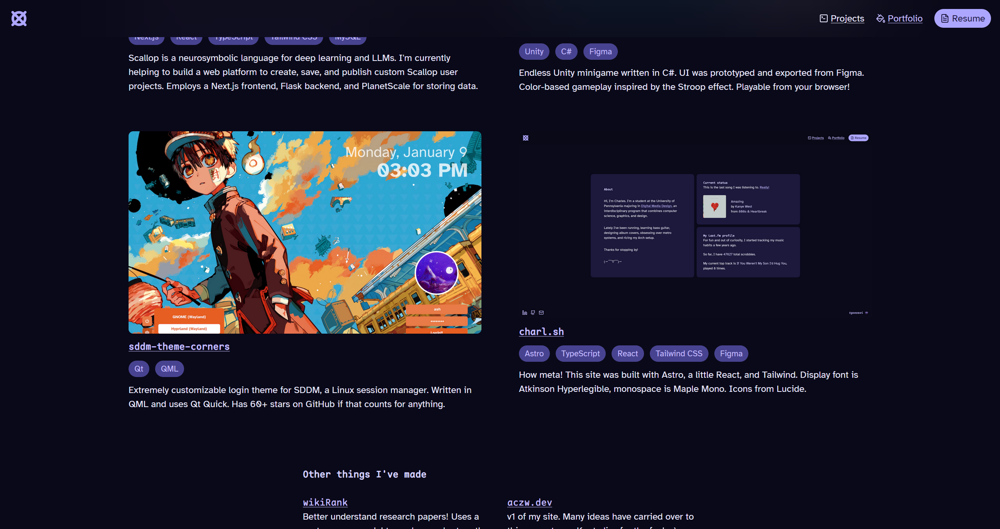
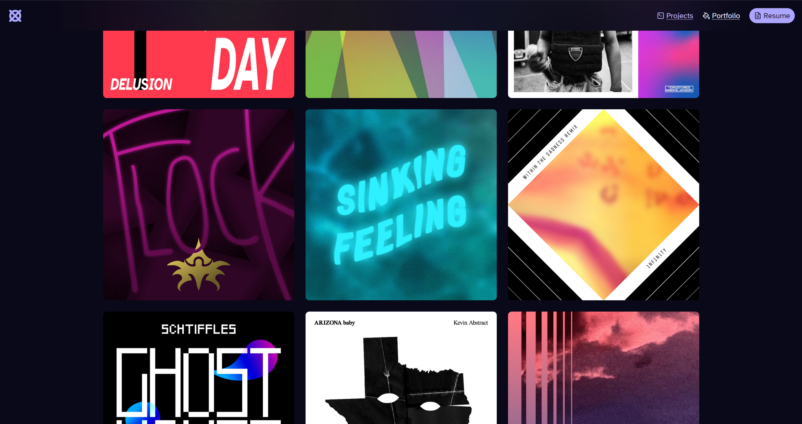

What you're currently reading right now has been rewritten over and over as this place has developed and changed. In past versions, I talked about wanting a place on the internet to call my own. I would then give some details about past versions, what I didn't like about theme, how they led up to this point, etc.

I agree with everything I've said before. But I cannot keep rewriting everytime my website changes!

What I've realized over the course of my journey through web dev is that websites are never a finished product. They grow, evolve, and change, just like us.

The revisions my site has gone through reflect how I've changed as a person. So, instead of concretely talking about each successive version of this site, I want to talk about the idea of _owning_ a website. And then, maybe also talk about designing and building one.

## A desire to express myself

I've always wanted a personal site. For one, it was a way of expressing yourself. It's easy to think of the Internet™ as just Google, or Twitter, or YouTube, and forget that it's always been one computer, talking to another. You have unlimited control over how to present yourself, and in that way it was very freeing.

As a college student, I could also use it to showcase and talk about projects and work I've done (like this one). However, this has led to its own issues, with me torn between making my site look how I want it, and optimizing it for recruiters and employers.

Take `aczw.dev`, for instance. This was the first version of my site, and simultaneously looks completely different and very similar to what I have now.


> You can go visit it right now at [old.charleszw.com](https://old.charleszw.com) :\)

There are a lot of design elements that persist to this day: the purple color scheme, particular font choices, and an obsession with letting people know what song I last listened to.

The groundwork was laid for what's to come. Almost immediately though, there were things that dissatisfied me. On the technical side, I chose to use [Create T3 App](https://create.t3.gg) to jumpstart my site, which was overkill for so, so many reasons. The layout, while unique, also felt too busy and distracting.

> Also, I didn't realize how big my text would be! Turns out I made my Figma prototype way too large, and translated it over 1:1.

From this iteration, I learned to be more subtle and tone things down when not necessary.

## Switching frameworks

It was around this time that I discovered [Astro](https://astro.build/), which advertised itself as a framework that focused on content-first websites. That immediately caught my eye, and pretty soon I made the switch.

Here are some reasons that I decided to restart and use Astro instead:

- Reusable components with JSX syntax
- First-class support for transpiling Markdown/MDX files to HTML
- I was looking to learn more about web dev. I knew that React abstracted away many concepts and provided lots of syntactical sugar (like `onClick`), which might be helpful for someone more experienced, but gave me false impressions and ideas.
- Support for multiple UI frameworks. This meant I could gradually learn and transfer everything over. It also enables cool features like [component islands](https://docs.astro.build/en/concepts/islands/).

With the technology chosen, I now wanted to condense the key components of my website into their own chunks. That's when I started experimenting with the idea of separating things into "blocks."


I liked the idea because it contained the chaos of the previous site. I liked the idea of content collapsing depending on the screen size, and I liked how organized the overall presentation was.

I also spent some time updating other things, like the limited color palette I was working with. I chose a wider range of purples that were... less pink. I was greatly inspired by, and continue to be inspired by the way [Material You](https://m3.material.io/) handles colors and design elements.


Building on the music obsession from before, I now make an API call to the Last.fm servers to fetch information about my account, including actual live data about what I was currently playing. Yes, I'm obsessed.

With the Astro docs open in another window, I started coding. The final result:






Everything looked exactly as I had imagined it. It was perfect, perfect, perfect... until it wasn't, again. In my quest to become quieter, I somehow jumped even further in the other direction.

### Rethinking what I want

I fetched my music data in an _extremely_ insecure method. To make requests to the Last.fm API, I brought in React and [SWR](https://swr.vercel.app/) for the job. For this React component to access my API key from the client, I chose to make it publicly available by prefixing it with `PUBLIC_`. Theoretically, anyone visiting my site could do a `Ctrl+F` search to find it. Actually, I'll show you.


This is more of a principle thing than anything; I wasn't seriously expecting anyone to steal my API key and use it. Still, it wasn't exactly _good_.

I also wasn't too happy pulling in an entire UI framework and fetching library just to display my most recently listened to music. Astro sent all of this unnecessary JavaScript to the client, increasing my site footprint more than it needs to be. I should've used Astro's built-in features for [data fetching](https://docs.astro.build/en/guides/data-fetching/) instead.

My final gripe is that the unique homepage design collapses weirdly on smaller screens. I spent a really long time optimizing it, and in the end basically had to redesign for mobile. This meant I had to maintain two completely different layouts for no real reason.

I needed to rethink how I approached this. This time, I seeked some more outside help.

I sought inspiration from others. Some ideas came from fellow DMD people, like [Elyssa Chou](https://www.elyssachou.com/) and [Thomas Shaw](https://tlshaw.me/). Some came from sites I discovered, like [nexxel.dev](https://www.nexxel.dev/), [nezu.world](https://nezu.world/), and [paco.me](https://paco.me/). Udara Jay's post about [reinventing their blog](https://udara.io/reinventing-this-blog) resonated with me as well.

I realize now that with each iteration, I stripped away more and more stuff, instead focusing on what I _truly wanted_ people to see first.

- Instead of the weird bento box layout for the homepage, use a standard header-content layout. Text gets more space to exist, and I get to display sneak peeks of my projects/posts.
- I liked the live music updates but deemphasized it, because it wasn't the main reason I directed people to my site. It's mostly for my own enjoyment, anyway.
- The header took up too much space, so I made it non-sticky. I don't have that much content to require an always visible nav bar.
- After a slight identity crisis, I combined `/projects` and `/portfolio`. The "portfolio" label never made much sense. My programming and design stuff are often one and the same.

I keep everything at a fixed width now (750px, to be exact). This was an intentional choice I took from the other sites I was ~~stalking~~ taking inspiration from. Reading becomes much easier when your eyes don't have to scan across a large horizontal distance.

### Going all in on Astro

Oh, and everything is now 100% built with Astro components. No more React dependency! This means I also had to update the way I fetch data, which is now handled much more securely.

First, I enabled SSR for my homepage, the place where the fetched data is displayed. Since the HTML is now rendered on-demand instead of at build time, I can just fetch data in the [component script](https://docs.astro.build/en/core-concepts/astro-components/#the-component-script) to get the latest information. I also made it a separate component to take advantage of [streaming](https://docs.astro.build/en/guides/server-side-rendering/#html-streaming).

My `<LastFm />` component basically looks like this:

```astro
---
// never leaves the server!
const key = import.meta.env.LASTFM_API_KEY;
const url = `https://lastfmapiurl.com/?api_key=${key}`;

// I define the schema here
const recentTracksSchema = z.promise(/* ... */);

const getRecentTracks = async () => {
  const data = await recentTracksSchema.parse(fetch(url).then((res) => res.json()));

  return data.recenttracks;
};

const recentTracks = await getRecentTracks();
---

<p class="...">The last song I listened to was {recentTracks[0].name}!</p>
```

I use Zod to parse the data I get back from Last.fm, so I can guarantee its shape and get some nice type hinting at the same time.

My `LASTFM_API_KEY` never leaves the server, because this code is only run on the server. While I could do this securely with SWR, I actually prefer this way more. It's a simple native `fetch` call and that's it!

I've barely mentioned [Content Collections](https://docs.astro.build/en/guides/content-collections/), which is Astro's solution for managing and querying the content you write. This is also new in `v3`. The current page you're looking at exists as a MDX file in the specialized `content/` directory, and is rendered to HTML automatically.

Clearly, I really like Astro. Between `v2` and `v3`, I've really come around to embrace it.

## Conclusion

`aczw.dev` was started in early summer 2023. As of writing, it's now mid-November. My site has changed _a lot_ in these past five months, and I've learned a lot about web dev as well as myself. I don't think there will be any significant changes from here on out.

Nailing what you want first try is very difficult. It's what you learn along the way that eventually guides you to something that you're satisfied with. I've had a lot of fun designing and redesigning the site, and don't regret either `v1` or `v2`. They helped me get to `v3`, after all.

Thanks for reading. Lemme know what you think about the website.

## Colophon

This site was built with Astro and uses no external UI frameworks. It's styled using Tailwind, with a few `<style>` tags here and there. It's currently deployed on Vercel's free plan, but uses Cloudflare DNS. All the prototyping was done in Procreate and Figma.

Primary type is [Atkinson Hyperlegible](https://en.wikipedia.org/wiki/Atkinson_Hyperlegible). Code is written in [Maple Mono](https://github.com/subframe7536/Maple-font). Icons are from [Lucide](https://lucide.dev/).
